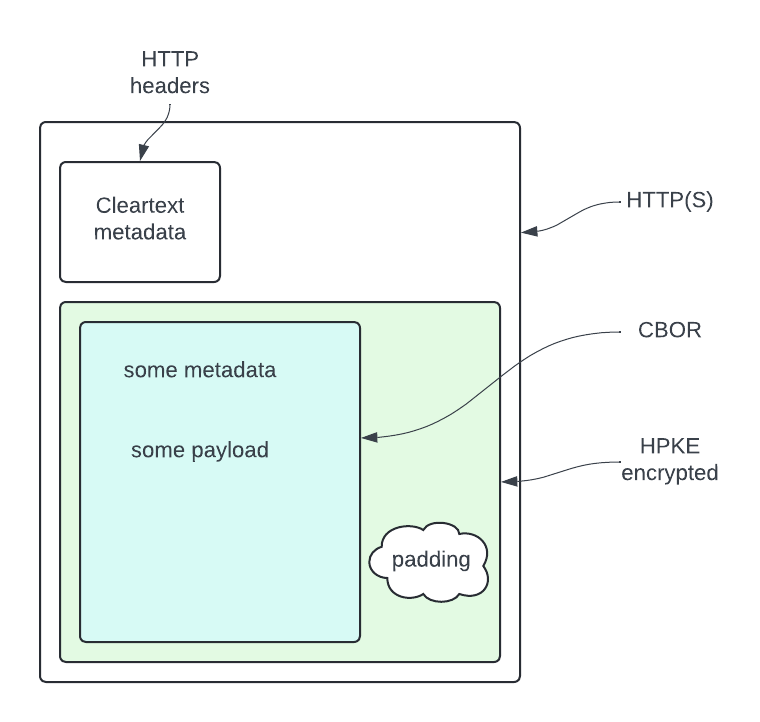
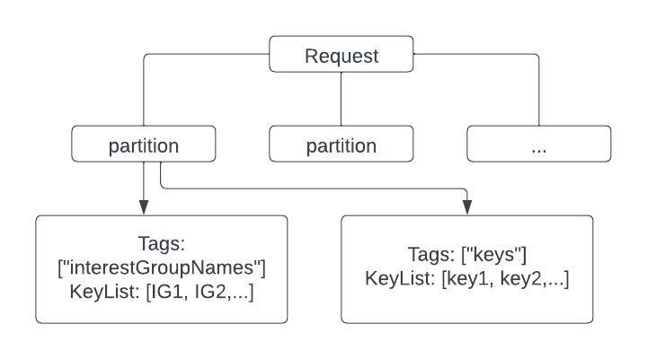
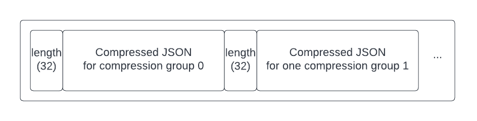

> FLEDGE has been renamed to Protected Audience API. To learn more about the name change, see the [blog post](https://privacysandbox.com/intl/en_us/news/protected-audience-api-our-new-name-for-fledge)

# FLEDGE Key/Value Server APIs Explainer

Authors:

* Peiwen Hu
* Russ Hamilton

## Summary

[FLEDGE](https://github.com/WICG/turtledove/blob/main/FLEDGE.md) is a privacy-preserving API that facilitates interest group based advertising. Trusted
servers in FLEDGE are used to add real-time signals into ad selection for both
buyers and sellers. The FLEDGE proposal specifies that these trusted servers
should provide basic key-value lookups to facilitate fetching these signals but
do no event-level logging or have other side effects.

This explainer proposes APIs for trusted servers. [The trust model explainer](https://github.com/privacysandbox/fledge-docs/blob/main/key_value_service_trust_model.md) covers
the service in more detail, including threat models, trust models, and
system design.

## Concepts

### Namespace

Keys may exist in different namespaces. The namespaces help the server identify
keys needed from request query strings and prevent potential key collision, even
though the keys may be unique across namespaces in today’s use cases.

*   For a DSP, there is only one namespace: `keys`.
*   For an SSP, there are `renderUrls` and `adComponentRenderUrls`.

The
[FLEDGE explainer](https://github.com/WICG/turtledove/blob/main/FLEDGE.md#31-fetching-real-time-data-from-a-trusted-server)
provides more context about these namespaces.

### Mode

The server can be configured to run in slightly different modes depending on
whether it is serving the DSP use case or the SSP use case.

### Hostname

During the query, the browser sets the hostname. This matches the hostname
described in the main explainer.

## Query API Version 1

### Description

This is the mechanism for the browser client to fetch real-time bidding signals.
The API is called during the ad auction process, as described in the
[FLEDGE explainer](https://github.com/WICG/turtledove/blob/main/FLEDGE.md#31-fetching-real-time-data-from-a-trusted-server).

The returned values are purely dependent on the keys (namespace + key + hostname),
except for advanced use cases explicitly agreed upon between browsers and ad
tech platforms. A potential advanced use case being discussed is how to provide
country-level IPGeo information to the bidders. The API provides read-only
access to the key/value data.

Possible data staleness may occur. Different values may be returned for the
same keys if reads happen during data updates, due to the distributed nature
of the system. But if the data is stable, requests are deterministic.

### Form

GET `https://www.kv-server.example/v1/getvalues`

### Examples

```
https://www.dsp-kv-server.example/v1/getvalues?hostname=publisher.com&keys=key1,key2&interestGroupNames=name1,name2
https://www.ssp-kv-server.example/v1/getvalues?renderUrls=url1,url2&adComponentRenderUrls=url3,url4
```

### Query parameters

<table>
  <tr>
   <td>Field
   </td>
   <td>Value Description
   </td>
   <td>Mode
   </td>
   <td>Original <a href="https://github.com/WICG/turtledove/blob/main/FLEDGE.md#31-fetching-real-time-data-from-a-trusted-server">FLEDGE explainer</a> description
   </td>
   <td>Required
   </td>
   <td>Type
   </td>
  </tr>
  <tr>
   <td>keys
   </td>
   <td>List of keys to query values for, under the namespace <code>keys</code>.
   </td>
   <td>DSP
   </td>
   <td><em>“keys” is a list of trustedBiddingSignalsKeys strings, perhaps coalesced (for efficiency) across any number of interest groups that share a trustedBiddingSignalsUrl.</em>
   </td>
   <td>Required
   </td>
   <td>List of strings
   </td>
  </tr>
  <tr>
   <td>renderUrls
   </td>
   <td>List of keys to query values for, under the namespace <code>renderUrls</code>.
   </td>
   <td>SSP
   </td>
   <td rowspan="2"><em>Similarly, sellers may want to fetch information about a specific creative, e.g. the results of some out-of-band ad scanning system. This works in much the same way, with the base URL coming from the trustedScoringSignalsUrl property of the seller's auction configuration object. However, it has two sets of keys: "renderUrls=url1,url2,..." and "adComponentRenderUrls=url1,url2,..." for the main and adComponent renderUrls bids offered in the auction.</em>
   </td>
   <td>Required
   </td>
   <td>List of strings
   </td>
  </tr>
  <tr>
   <td>adComponentRenderUrls
   </td>
   <td>List of keys to query values for, under the namespace <code>adComponentRenderUrls</code>.
   </td>
   <td>SSP
   </td>
   <td>Optional
   </td>
   <td>List of strings
   </td>
  </tr>
  <tr>
   <td>hostname
   </td>
   <td>The browser sets the hostname of the publisher page to be the value.
   </td>
   <td>DSP
   </td>
   <td><em>the hostname of the top-level webpage where the ad will appear. The hostname is provided by the browser.</em>
   </td>
   <td>Required
   </td>
   <td>String
   </td>
  </tr>
</table>

### JSON response

<table>
  <tr>
   <td>Parent Field
   </td>
   <td>Field
   </td>
   <td>Value Description
   </td>
  </tr>
  <tr>
   <td rowspan="3">namespace1
   </td>
   <td>key1
   </td>
   <td>Value corresponding to the key. Any JSON type
   </td>
  </tr>
  <tr>
   <td>key2
   </td>
   <td>Value corresponding to the key. Any JSON type
   </td>
  </tr>
  <tr>
   <td>…
   </td>
   <td>…
   </td>
  </tr>
  <tr>
   <td rowspan="3">namespace2
   </td>
   <td>key1
   </td>
   <td>Value corresponding to the key. Any JSON type
   </td>
  </tr>
  <tr>
   <td>key2
   </td>
   <td>Value corresponding to the key. Any JSON type
   </td>
  </tr>
  <tr>
   <td>…
   </td>
   <td>…
   </td>
  </tr>
</table>

### Example response

```
{
  "renderUrls": {
      "https://cdn.com/render_url_of_some_bid": <arbitrary_json>,
      "https://cdn.com/render_url_of_some_other_bid": <arbitrary_json>,
      ...},
  "adComponentRenderUrls": {
      "https://cdn.com/ad_component_of_a_bid": <arbitrary_json>,
      "https://cdn.com/another_ad_component_of_a_bid": <arbitrary_json>,
      ...}
}
```

Under each namespace, a list of key-value pairs is returned where the keys match
those specified in query parameters. If a key is not found by the server, it
will not be set in the response.

### Data-Version response header

As mentioned in the FLEDGE explainer, a `data-version` header may be optionally
returned. All key-value pairs updated during a particular period of time belong
to a version assigned by the system during the update, i.e, the version slowly
increments.

If the header is returned, all key-value pairs in the response are guaranteed to
belong to that version and the values will always be deterministic for a
version. This version cannot be specified in a request. The server makes the
decision on a best-effort basis to use versions as new as possible.

The server does not guarantee that the version will always be returned. It’s
much more likely when the number of keys in a request is small.

## Query API version 2

__Query versions 2 and beyond are specifically designed for the trusted TEE key/value service as part of the trust model, published here for explanatory purposes. BYOS servers do not need to implement these.__

### Background

In this version we present a protocol that enables trusted communication between Chrome and the trusted key/value service. The protocol assumes a functioning trust model as described in [the key/value service explainer](https://github.com/privacysandbox/fledge-docs/blob/main/key_value_service_trust_model.md) is in place, primarily that only service implementations recognized by Privacy Sandbox can obtain private decryption keys, and the mechanism for the client and service to obtain cryptographic keys is available but outside the scope of this document.

On a high level, the protocol is based on HTTPS + [Oblivious HTTP](https://datatracker.ietf.org/doc/draft-ietf-ohai-ohttp/)(OHTTP).

*   TLS is used to ensure that the client is talking to the real service operator (identified by the domain). FLEDGE enforces that the origin of the trusted server matches the config owner ([interest group owner](https://wicg.github.io/turtledove/#joining-interest-groups) for the trusted bidding signal server or [auction config’s seller](https://wicg.github.io/turtledove/#running-ad-auctions) for the trusted scoring signal server).
*   OHTTP is used to ensure that the message is only visible to the approved versions of services inside the trusted execution environment (TEE).
    *   The reason to use OHTTP is that the request must be encrypted and can only be decrypted by the trusted service itself. A notable alternative protocol is TLS which in addition to the domain validation, validates the service identity attestation. However, attestation verification as part of TLS can present performance challenges and is still being evaluated.

For more information on the design, please refer to [the trust model explainer](https://github.com/privacysandbox/fledge-docs/blob/main/key_value_service_trust_model.md).

### Overview



HTTP(s) is used to transport data. The message body is an encrypted binary HTTP message as specified by the Oblivious HTTP standard. The binary HTTP message, as it is encrypted, can contain sensitive information. The headers can be used to specify metadata such as compression algorithms. The body is an optionally compressed data structure of the actual request/response message. Padding is applied to the serialized binary HTTP message.

### Core data

Core request and response data structures are all in JSON.

The schema below is defined following the spec by https://json-schema.org/.

The API is generic, agnostic to DSP or SSP use cases.

#### Request

##### Request version 2.0

Requests are not compressed. Compression could save size but may add latency.  Request size is presumed to be small, so compression may not improve overall performance.  Version 2 will not use compression for the request but more experimentation is necessary to determine if compression is an overall win and should be included in future protocol versions.

In the request, one major difference from [V1](#query-api-version-1) is that the keys are now grouped. There is a tree-like hierarchy:

*   Each request contains one or more partitions. Each partition is a collection of keys that can be processed together by the service without any potential privacy leakage (For example, if the server uses User Defined Functions to process, one UDF call can only process one partition). This is controlled by the client. For example, Chrome may put all keys from the same interest group into one partition. With certain optimizations allowed, such as with [“executionMode: group-by-origin”](https://github.com/WICG/turtledove/blob/main/FLEDGE.md#12-interest-group-attributes), keys from all interest groups with the same joining site may be in one partition.
*   Each partition contains one or more key groups. Each key group has its unique attributes among all key groups in the partition. The attributes are represented by a list of “Tags”. Besides tags, the key group contains a list of keys to look up.
*   Each partition has a unique id.
*   Each partition has a compression group field. Results of partitions belonging to the same compression group can be compressed together in the response. Different compression groups must be compressed separately. See more details below. The expected use case by the client is that interest groups from the same joining origin and owner can be in the same compression group.



##### Available Tags

###### Version 2023.01

<table>
  <tr>
   <td>Tag category
   </td>
   <td>Category description
   </td>
   <td>Tag
   </td>
   <td>Description
   </td>
   <td>Restrictions
   </td>
  </tr>
  <tr>
   <td rowspan="2">Client awareness
   </td>
   <td rowspan="2">Each key group has exactly one tag from this category.
   </td>
   <td>structured
   </td>
   <td>Browser defines the format of this key/value pair and will use the results for internal purposes. An example use case is the <a href="https://github.com/WICG/turtledove/blob/main/FLEDGE.md#31-fetching-real-time-data-from-a-trusted-server">PerInterestGroupData</a> in the FLEDGE explainer.
   </td>
   <td>
   </td>
  </tr>
  <tr>
   <td>custom
   </td>
   <td>Browser is oblivious to the keys and directly passes the results to DSP/SSP javascript functions
   </td>
   <td>
   </td>
  </tr>
  <tr>
   <td rowspan="4">Namespace
   </td>
   <td rowspan="4">Each key group has exactly one tag from this category.
   </td>
   <td>groupNames
   </td>
   <td>Names of interest groups in the encompassing partition.
   </td>
   <td>The service expects the client to only pair this with ‘structured’ tag
   </td>
  </tr>
  <tr>
   <td>keys
   </td>
   <td><em>“keys” is a list of trustedBiddingSignalsKeys strings.</em>
   </td>
   <td rowspan="3">The service expects the client to only pair this with ‘custom’ tag
   </td>
  </tr>
  <tr>
   <td>renderUrls
   </td>
   <td rowspan="2"><em>Similarly, sellers may want to fetch information about a specific creative, e.g. the results of some out-of-band ad scanning system. This works in much the same way, with the base URL coming from the trustedScoringSignalsUrl property of the seller's auction configuration object.</em>
   </td>
  </tr>
  <tr>
   <td>adComponentRenderUrls
   </td>
  </tr>
</table>

If the restrictions are not followed by the client, for example due to misconfiguration, the service will still try to process the request as much as possible, rather than returning an error. The user defined function on the service would still receive the input and can decide what to return. A basic solution could be to ignore the invalid piece of input.

#### Schema of the request

```json
{
  "title": "Key Value Service GetValues request",
  "type": "object",
  "additionalProperties": false,
  "properties": {
    "metadata": {
      "description": "global metadata shared by all partitions",
      "type": "object",
      "additionalProperties": false,
      "properties": {
        "hostname": {
          "description": "The hostname of the top-level frame calling runAdAuction().",
          "type": "string"
        }
      }
    },
    "partitions": {
      "description": "A list of partitions. Each must be processed independently",
      "type": "array",
      "items": {
        "title": "Single partition object",
        "description": "A collection of keys that can be processed together",
        "type": "object",
        "additionalProperties": false,
        "properties": {
          "id": {
            "description": "Unique id of the partition in this request",
            "type": "number"
          },
          "compressionGroupId": {
            "description": "Unique id of a compression group in this request. Only partitions belonging to the same compression group will be compressed together in the response",
            "type": "number"
          },
          "arguments": {
            "type": "array",
            "items": {
              "description": "One group of keys and common attributes about them",
              "type": "object",
              "additionalProperties": false,
              "properties": {
                "tags": {
                  "description": "List of tags describing this group's attributes",
                  "type": "array",
                  "items": {
                    "type": "string"
                  }
                },
                "data": {
                  "type": "array",
                  "description": "List of keys to get values for",
                  "items": {
                    "type": "string"
                  }
                }
              }
            }
          }
        },
        "required": [
          "id",
          "compressionGroupId",
          "arguments"
        ]
      }
    }
  },
  "required": [
    "metadata",
    "partitions"
  ]
}
```

Example trusted bidding signals request from Chrome:

```json
{
  "metadata": {
    "hostname": "example.com"
  },
  "partitions": [
    {
      "id": 0,
      "compressionGroupId": 0,
      "arguments": [
        {
          "tags": [
            "structured",
            "groupNames"
          ],
          "data": [
            "InterestGroup1"
          ]
        },
        {
          "tags": [
            "custom",
            "keys"
          ],
          "data": [
            "keyAfromInterestGroup1",
            "keyBfromInterestGroup1"
          ]
        }
      ]
    },
    {
      "id": 1,
      "compressionGroupId": 0,
      "arguments": [
        {
          "tags": [
            "structured",
            "groupNames"
          ],
          "data": [
            "InterestGroup2",
            "InterestGroup3"
          ]
        },
        {
          "tags": [
            "custom",
            "keys"
          ],
          "data": [
            "keyMfromInterestGroup2",
            "keyNfromInterestGroup3"
          ]
        }
      ]
    }
  ]
}
```
#### Schema of the Response

##### Response version 2.0

The response is compressed. Due to security and privacy reasons the compression is applied independently to each compression group. That means, the response body will be a concatenation of compressed blobs in network byte order. Each blob is for outputs of one or more partitions, sharing the same compressionGroup value as specified in the request.

Each compressed blob has a prefix of a 32-bit unsigned integer also in network byte order to indicate the length of the compressed blob.



The schema of the JSON in one compression group:

```json
{
  "title": "Response object for a compression group",
  "type": "object",
  "additionalProperties": false,
  "properties": {
    "partitions": {
      "type": "array",
      "items": {
        "title": "Output for one partition",
        "type": "object",
        "properties": {
          "id": {
            "description": "Unique id of the partition from the request",
            "type": "number"
          },
          "keyGroupOutputs": {
            "type": "array",
            "items": {
              "title": "Output for one key group",
              "type": "object",
              "additionalProperties": false,
              "properties": {
                "tags": {
                  "description": "Attributes of this key group.",
                  "type": "array",
                  "items": {
                    "description": "List of tags describing this key group's attributes",
                    "type": "string"
                  }
                },
                "keyValues": {
                  "description": "If a keyValues object exists, it must at least contain one key-value pair. If no key-value pair can be returned, the key group should not be in the response.",
                  "type": "object",
                  "patternProperties": {
                    ".*": {
                      "description": "One value to be returned in response for one key",
                      "type": "object",
                      "additionalProperties": false,
                      "properties": {
                        "value": {
                          "type": [
                            "string",
                            "number",
                            "integer",
                            "object",
                            "array",
                            "boolean"
                          ]
                        },
                        "global_ttl_sec": {
                          "description": "Adtech-specified TTL for client-side caching, not dedicated to a specific subkey. In seconds. Unset means no caching.",
                          "type": "integer"
                        },
                        "dedicated_ttl_sec": {
                          "description": "Adtech-specified TTL for client-side caching, specific to the subkey in the request. In seconds. Unset means no caching.",
                          "type": "integer"
                        }
                      },
                      "required": [
                        "value"
                      ]
                    }
                  }
                }
              }
            }
          }
        }
      }
    }
  }
}
```

Example of one (trusted bidding signals server) response:

```json
{
  "partitions": [
    {
      "id": 0,
      "keyGroupOutputs": [
        {
          "tags": [
            "structured",
            "groupNames"
          ],
          "keyValues": {
            "InterestGroup1": {
              "value": {
                "priorityVector": {
                  "signal1": 1
                }
              },
              "dedicated_ttl_sec": 1
            }
          }
        },
        {
          "tags": [
            "custom",
            "keys"
          ],
          "keyValues": {
            "keyAfromInterestGroup1": {
              "value": "valueForA",
              "dedicated_ttl_sec": 120
            },
            "keyBfromInterestGroup1": {
              "value": [
                "value1ForB",
                "value2ForB"
              ],
              "dedicated_ttl_sec": 60
            }
          }
        }
      ]
    }
  ]
}
```

Example of one trusted scoring signals server response:

```json
{
  "partitions": [
    {
      "id": 1,
      "keyGroupOutputs": [
        {
          "tags": [
            "custom",
            "renderUrls"
          ],
          "keyValues": {
            "renderurls.com/1": {
              "value": "value3",
              "dedicated_ttl_sec": 120
            },
            "renderurls.com/2": {
              "value": "value4",
              "dedicated_ttl_sec": 120
            }
          }
        },
        {
          "tags": [
            "custom",
            "adComponentRenderUrls"
          ],
          "keyValues": {
            "adcomponents.com/1": {
              "value": "value1",
              "dedicated_ttl_sec": 120
            },
            "adcomponents.com/2": {
              "value": [
                "value2A",
                "value2B"
              ],
              "dedicated_ttl_sec": 60
            }
          }
        }
      ]
    }
  ]
}
```

#### Structured keys response specification

Structured keys are keys that the browser is aware of and the browser can use the response to do additional processing. The value of these keys must abide by the following schema for the browser to successfully parse them.

##### Response schema for tag GroupNames

```json
{
  "title": "Format for value of keys in groups tagged 'structured' and 'groupNames'",
  "type": "object",
  "additionalProperties": false,
  "properties": {
    "priorityVector": {
      "type": "object",
      "patternProperties": {
        ".*": {
          "description": "signals",
          "type": "number"
        }
      }
    }
  }
}
```

Example:

```json
{
  "priorityVector": {
    "signal1": 1,
    "signal2": 2
  }
}
```

#### Client-side caching TTL

Version 1’s API simply returns a key value pair for each key. In this version, each key maps to a JSON object which has 3 fields: value, global\_ttl\_sec and dedicated\_ttl\_sec:

*   The global\_ttl\_sec tells the client to cache the entry for no longer than this TTL under all request contexts.
*   The dedicated\_ttl\_sec indicates the same TTL behavior except it should only be applied to requests that contain the same subkey as this response is for.

#### Size limitation

For the K/V service, plaintext response payload before compression must not be more than 2MB. 2MB is a preliminary target and can be changed in the future if there is a need and no significant negative impact to the browser.

The service would only keep key-value pairs with a total size less than that. The rest of the key-value pairs will be discarded. The selection of discarded pairs will be arbitrary. 

If a single value is larger than the limit, the service should always discard it.

#### Error handling

If the server fails partially, such as failures to process one partition, the response will not contain the corresponding part and will not contain any error report. This could be revisited in the future versions as the privacy implications become clearer.

### [BinaryHTTP](https://datatracker.ietf.org/doc/rfc9292/): The packaging layer for HTTP k/v service requests

#### Request

The core request data is packaged by a binary HTTP request message. The method is PUT. The JSON is stored as the body of the message.

The service respects the following headers in the message:

<table>
  <tr>
   <td">Header
   </td>
   <td">Description
   </td>
  </tr>
  <tr>
   <td>Accept-Encoding
   </td>
   <td>What compression algorithm the client can accept
<p>
Optional.
   </td>
  </tr>
  <tr>
   <td>X-kv-query-request-version
   </td>
   <td>Request version used as specified in this document.
   </td>
  </tr>
</table>

#### Response

The core response data is packaged by a binary HTTP response message. The response is compressed and stored as the body of the message.

The service can set the following headers in the message:

<table>
  <tr>
   <td">Header
   </td>
   <td">Description
   </td>
  </tr>
  <tr>
   <td>Content-Encoding
   </td>
   <td>What compression algorithm the service used.
<p>
Set if the client specifies “Accept-Encoding” header.
   </td>
  </tr>
  <tr>
   <td>x-kv-query-response-version
   </td>
   <td>Response version used as specified in this document.
   </td>
  </tr>
</table>

### Padding

Padding is applied according to the Binary HTTP [padding specification](https://www.ietf.org/archive/id/draft-ietf-httpbis-binary-message-06.html#name-padding-and-truncation).

Padding is applied with sizes as multiples of 2^n KBs ranging from 0 to 2MB. So the valid response sizes will be [0, 128B, 256B, 512B, 1KB, 2KB, 4KB, 8KB, 16KB, 32KB, 64KB, 128KB, 256KB, 512KB, 1MB, 2MB].

### Encryption

We will use [Oblivious HTTP](https://datatracker.ietf.org/doc/draft-ietf-ohai-ohttp/) with the following configuration for encryption:

*   0x0020 DHKEM(X25519, HKDF-SHA256) for KEM (Key encapsulation mechanisms)
*   0x0001 HKDF-SHA256 for KDF (key derivation functions)
*   AES256GCM for AEAD scheme.

## Server Internal APIs and procedures

The system will provide multiple private APIs and procedures, for loading data and user-defined functions whose model is described in detail in the [Key/Value server design explainer](https://github.com/privacysandbox/fledge-docs/blob/main/key_value_service_trust_model.md#support-for-user-defined-functions-udfs).

These APIs and procedures are ACLs controlled by the ad tech operator of the system, for only the operator (and their designated parties) to use.

The key/value server code is available on its [Privacy Sandbox github repo](https://github.com/privacysandbox/fledge-key-value-service) which reflects the most recent API and procedures. As an example, the [data loading guide](https://github.com/privacysandbox/fledge-key-value-service/blob/main/docs/loading_data.md) has specific instructions on integrating with the data ingestion procedure. The procedure may be based on the actual storage medium of the dataset, e.g., the server can read data from data files from a prespecified location.

As the [FLEDGE API](https://github.com/WICG/turtledove/blob/main/FLEDGE.md) describes the client side flow, the APIs and procedures related to the server system design and implementation will have the specification posted and updated in the key/value server’s [github repo](https://github.com/privacysandbox/fledge-key-value-service).
