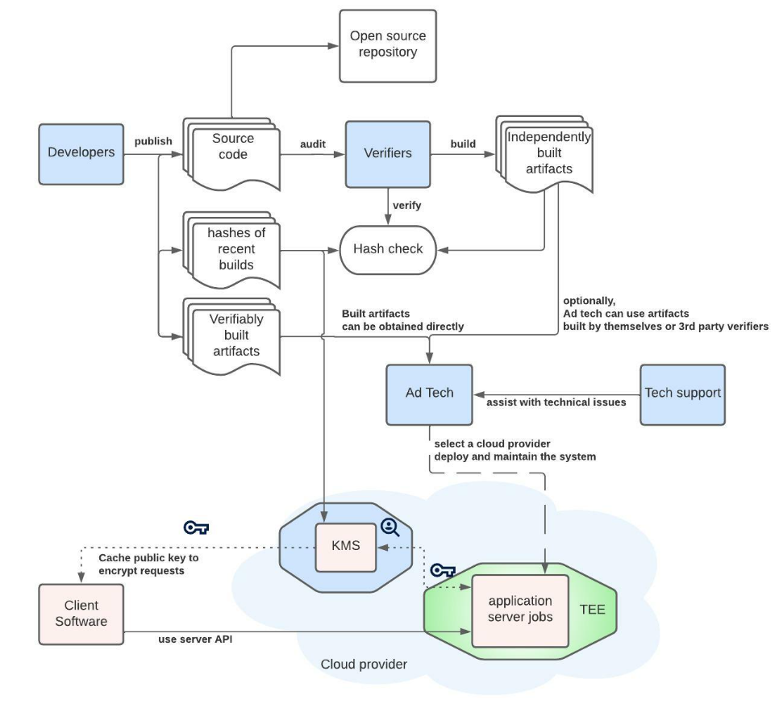

# FLEDGE Key/Value Server trust model

Authors:

*   Philip Lee [pjl@google.com](mailto:pjl@google.com)
*   Peiwen Hu [peiwenhu@google.com](mailto:peiwenhu@google.com) 

# Context

This explainer is the first step in the standardization process of the key/value server beyond the temporary BYOS model in the FLEDGE Origin Trial phase. It does not impact the ongoing Origin Trial, which is detailed [here](https://github.com/WICG/turtledove/blob/main/Proposed_First_FLEDGE_OT_Details.md#trusted-signals). 

The key/value service is not finalized. The service as described is subject to change as we incorporate ecosystem feedback and iterate.

# Introduction

[FLEDGE is a proposal](https://github.com/WICG/turtledove/blob/main/FLEDGE.md) for an API to serve remarketing use cases without third-party cookies. Trusted servers in FLEDGE add real-time signals into ad selection for both buyers and sellers.

Overall, this explainer proposes using similar techniques to the [Aggregation Service proposal](https://github.com/WICG/conversion-measurement-api/blob/main/AGGREGATION_SERVICE_TEE.md) for the Attribution Reporting API, while some specific areas may benefit from improvements in the future for better performance.

# Proposed design principles

The key/value service for the FLEDGE API intends to meet a set of privacy and security goals through technical measures. This includes:

1. Uphold the Privacy Sandbox design goals for privacy protections in FLEDGE.
2. Prevent inappropriate access to the lookup keys (or other intermediate data) and prevent logging/persistence of user data through technical enforcement.
3. Allow adtechs to retain control over the realtime data they serve.
4. Provide open and transparent implementations for any infrastructure outside of the client.

# Key terms

Before reading this explainer, it will be helpful to familiarize yourself with key terms and concepts. These have been ordered non-alphabetically to build knowledge based on previous terms. All of these terms will be reintroduced and further described throughout this proposal.

*   _Adtech_: a company that provides services to deliver ads. This term is used to describe the buyers and sellers who will use the key/value service, as described in the [FLEDGE explainer](https://github.com/WICG/turtledove/blob/main/FLEDGE.md#summary).
*   _Client software_: shorthand for the implementation of FLEDGE in a browser or on a device (such as a [Chrome browser](https://www.google.com/url?q=https://github.com/WICG/turtledove/blob/main/FLEDGE.md%2331-fetching-real-time-data-from-a-trusted-server&sa=D&source=docs&ust=1651077929049635&usg=AOvVaw2mNLZwBgIzzYL7iUKJTUwb) or an [Android device](https://www.google.com/url?q=https://developer.android.com/design-for-safety/ads/fledge%23ad-selection-ad-tech-platform-managed-trusted-server&sa=D&source=docs&ust=1651077929049793&usg=AOvVaw19U97RKrvuOGjGH-tIk98Y)).
*   _Attestation_: a mechanism to authenticate software identity, usually with [cryptographic hashes](https://en.wikipedia.org/wiki/Cryptographic_hash_function) or signatures. In this proposal, attestation matches the code running in the adtech-operated key/value service with the open source code.
*   _Trusted Execution Environment (TEE)_: a dedicated, closed execution context that is isolated through hardware memory protection and cryptographic protection of storage. The TEE's contents are protected from observation and tampering by unauthorized parties, including the root user.
*   _Key management service (KMS): _a centralized component tasked with provision of decryption keys to appropriately secured aggregation server instances. Provision of public encryption keys to end user devices and key rotation also fall under key management.

# Key/value server workflow

Adtechs use the key/value server to supply realtime information to the FLEDGE ad auction. This information could be used, for example, to add budgeting data about each ad. The proposed workflow is as follows:

1. Adtechs deploy and operate the key/value servers on a cloud provider with the necessary TEE capabilities.
2. Adtechs load key/value data into the servers, and retain the ability to push changes to this data at any time.
3. While running a FLEDGE auction, the client device sends the lookup request to the key/value server that was specified by the buyer or seller. The data in-transit is encrypted to make sure only the server job is able to see the cleartext.
4. To decrypt the requests, the adtech-operated key/value server uses the private keys, which it has previously obtained from the KMS by attesting that it is running an approved version of the code in the TEE. The KMS will not release the private keys to anything or anyone else. Other mechanisms to secure data in-transit may also be explored in the future.
5. The server looks up the matching data for the keys and returns it also in encrypted form.  [See the API explainer for details.](https://www.google.com/url?q=https://github.com/WICG/turtledove/blob/main/FLEDGE_Key_Value_Server_API.md&sa=D&source=docs&ust=1645211574244509&usg=AOvVaw3b_-LVRlUFTygnkUfCapYB)

# Privacy and security considerations

## Overall flow

The FLEDGE explainer outlines the following security/privacy goals for the key-value servers:

_The browser needs to trust that the server's return value for each key will be based only on that key and the hostname, and that the server does no event-level logging and has no other side effects based on these requests._

To meet these requirements, the proposed design for the key-value server relies on a combination of:

*   Attestation ensures that an adtech-operated key/value service runs an approved codebase.
*   Data in use:
    *   Lookup of key/value data happens within a secure and isolated Trusted Execution Environment. This prevents any party from learning the keys being requested.
*   Data in transit:
    *   Client devices will pre-load and periodically refresh the public encryption key signed by a KMS that the client devices recognize.
    *   The KMS only grants the private key to successfully attested servers. 
*   Data at rest:
    *   The server will never do per-request lookups to persistent storage for the key value data. Techniques such as pre-loading the dataset should be used.
*   Auditability:
    *   Open source implementations of the key/value service ensure that these systems are publicly accessible and can be inspected by a broad set of stakeholders.

## Threats

Ideally, the key-value server would never get access to any information that could be used to identify a specific client or user. However, in practice, request timestamps and other necessary metadata included in lookup requests make this idealized system impractical. 

The main threats that we’re concerned with are:

1. That the timestamp of the request could be used to correlate the lookup keys with the request of the top-level page and thus identify a user. This is mitigated by limiting the logs that are written.
2. During the FLEDGE auction, a client asks a key/value server about an assortment of keys that were previously stored on the client — perhaps including keys that were stored in multiple different contexts (different sites or different apps, via [Shared Storage](https://github.com/pythagoraskitty/shared-storage)).  That set of keys, therefore, risks leaking some information about the client's activity.  The privacy goal of key/value server design is to give the client confidence that the set of keys cannot be used for tracking or profiling purposes.  This threat is mitigated by the TEE protections to allow only pre-approved code.
    1. _Note that the values being stored in the key/value service are loaded by adtechs and expected to be publicly visible to clients. These are therefore not confidential._
3. The user’s IP address could be used for fingerprinting. This is mitigated by the logging requirements and TEE protections to allow only pre-approved code.
    2. We also have the option to route the traffic to these servers through [Gnatcatcher](https://github.com/bslassey/ip-blindness) to mask the user’s IP address.

### Side effects

There are a number of ways that visible side effects of request handling are possible in general with servers. Here’s how we plan to mitigate those effects:

1. _Monitoring metrics_ - Only noised aggregate metrics will be available for monitoring and alerting.  These will be aggregated to at least k size.
    1. For example, counting the approximate number of failed requests in the past n minutes is likely to be fine but doing so at millisecond granularity is not.
2. _Logging_ - No event-level logs will be written.
    2. Event-level logging that normally happens from any shared libraries we might use will be disabled.
3. _Outbound RPCs_ - These servers will make a small set of outbound RPCs that they initiate.
    3. They’ll do so to each other for load balancing and sharding of data. Requests will only be made to other key/value servers that are part of this system and that have the same protections in place. Attestation checks will be chained together.
    4. There are no outbound RPCs to other systems.
4. _Inbound RPC responses_ - As in the [API explainer](https://github.com/WICG/turtledove/blob/main/FLEDGE_Key_Value_Server_API.md), there are two sets of APIs.
    5. For the client device to read K/V data. The client will provide its own secure channel and user data is allowed to go back to the browser.
    6. For adtech server operators to mutate K/V data. These are private APIs that are only available to the server operator. The K/V server will acknowledge success or failure but not send other responses.

## Trusted Execution Environment

A Trusted Execution Environment (TEE) is a combination of hardware and software mechanisms that allows for code to execute in isolation, not observable by any other process regardless of the credentials used. The code running in a TEE will be open sourced and audited to ensure proper operation. Only TEE instances running an approved version of the key/value service code will be able to decrypt lookup requests.

The code running within a TEE performs the following tasks:

*   Look up the values for the keys being requested.
*   Handle error reporting, logging, crashes and stack traces, access to external storage and network requests in a way that aids usability and troubleshooting while protecting raw and intermediate data at all times.

Adtechs will operate their own TEE-based key/value service deployment on a cloud provider with the necessary TEE capabilities. Adtechs will also control the data that they load into the key/value service to be served. In addition to TLS, requests are encrypted by the client and decryption inside only the TEE ensures that the adtech will not see which keys are being requested.

## Attestation and cryptographic key management

The code running within the TEE is the only place in the system where the list of items to look up will be decrypted. The code will be open sourced so it can be audited by security researchers, privacy advocates, and adtechs.

The server releaser will periodically release binary images of the key/value server code for TEE deployment. A cryptographic hash of the build product (the image to be deployed on the TEE) is obtained as part of the build process. The build is reproducible so that anyone can build binaries from source and verify they are identical to the images released by Google. The way in which the list of authorized images is maintained has not yet been determined, please see the [Aggregation Service explainer](https://github.com/WICG/conversion-measurement-api/blob/main/AGGREGATION_SERVICE_TEE.md) for some ideas.

When a new approved version of the key/value service binary is released, it will be added to the list of authorized images. If an image is found in retrospect to contain a critical security or functional flaw, it can be removed from the list. Images older than a certain age will also be periodically retired from the list.

Public encryption keys are necessary for the client software to encrypt requests. Decryption keys are required for the key value server to process the requests. The decryption keys are released only to TEE images whose cryptographic hash matches one of the images on the authorized images list.

The encryption is bi-directional. Responses back to the client software are also encrypted.

# Initial experiment plans

The initial implementation strategy for the key/value service is as follows:

*   A subsequent update of the [API explainer](https://github.com/WICG/turtledove/blob/main/FLEDGE_Key_Value_Server_API.md) would incorporate new parameters to the Read API to facilitate secure communication, [Github issue here](https://github.com/WICG/turtledove/issues/294).
*   The TEE based key/value service implementation would be deployed on cloud service(s) which support needed security features. We envision the key/value service being capable of deployment with multiple cloud providers.

# Open questions

Explainers are the first step in the standardization process followed by The Privacy Sandbox proposals. The key/value service is not finalized. We anticipate community feedback which will lead to improved designs and proposed implementations. There are many ways to provide feedback on this proposal and participate in ongoing discussions, which includes commenting on the issues below, [opening new issues in this repository](https://github.com/WICG/turtledove/issues), or attending a [WICG meeting](https://github.com/WICG/turtledove/issues/88). We intend to incorporate and iterate based on feedback.

*   How will the open source project be managed and what will be the process for accepting contributions?
*   What feature set will this server grow to include?
*   What will the system architecture and design look like for sharding of large amounts of data to be stored?
*   What will the release schedule be and how will rollback work?
*   How will monitoring and alerting work?
*   How will debugging be supported?
