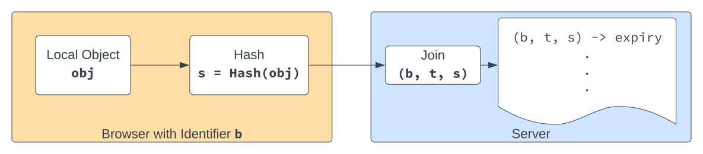
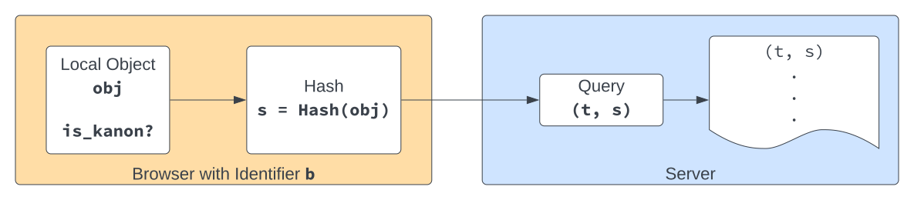
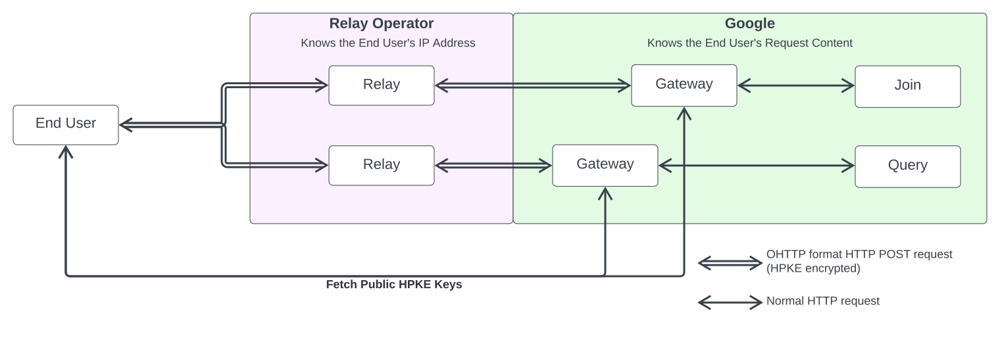

> FLEDGE has been renamed to Protected Audience API. To learn more about the name change, see the [blog post](https://privacysandbox.com/intl/en_us/news/protected-audience-api-our-new-name-for-fledge)

# Privacy Sandbox k-Anonymity Server

## What is k-anonymity?

[k-anonymity](https://en.wikipedia.org/wiki/K-anonymity) is a privacy concept
that provides some protection against users being individually reidentified
within a data set.  The concept itself is simple: for an object to meet a
k-anonymity threshold at least $k$ different users must be counted for the
object.

A data set in this context is quite general.  It might be a set of user
information published from a database or, in the case of the Privacy Sandbox,
it might be the set of users that are going to reveal some information to an
untrusted party.  k-anonymity provides an ability to _hide among the crowd_,
where the crowd consists of $k$ users.

## Use cases in the Privacy Sandbox

k-anonymity is applied to the `renderUrl` for ad creatives.  One of the
goals of [FLEDGE](FLEDGE.md) is to offer microtargeting protection; that is,
a user won't be shown an ad unless some minimum number, $k$, of other users
are also being shown the same ad.  This is accomplished by applying k-anonymity
thresholds to the `renderUrl` prior to showing the ad to the user.  In addition
to microtargeting protection of FLEDGE auctions, k-anonymity might in the
future also prevent user-identifying information from the embedding site from
being passed to an ad's fenced frame via parameters like `size`.  Adding `size`
to the k-anonymity check of the `renderUrl` is under discussion in [this
issue](https://github.com/WICG/turtledove/issues/312#issuecomment-1307471709).

k-anonymity is also applied at Reporting Time: if the buyer has provided a `reportWin`
function in the script available at `biddingScriptUrl`, the `browserSignals` argument
to the `reportWin` function call will include `interestGroupName` if the tuple of 
interest group owner, name, bidding script URL and ad creative URL is jointly 
k-anonymous (see 
[here](https://github.com/WICG/turtledove/blob/main/FLEDGE.md#52-buyer-reporting-on-render-and-ad-events)).

Previously the [FLEDGE](FLEDGE.md) proposal called for k-anonymity thresholds on 
Interest Group updates. The idea was a browser would not request an Interest Group 
update from an untrusted server unless there were at least $k$ other browsers also 
requesting the same Interest Group update. This meant a k-anon check was done on
the Interest Group's `dailyUpdateUrl`. After much discussion (in particular see
this comment on the proliferation of Interest Groups causing tradeoffs w/r/t latency
[here](https://github.com/WICG/turtledove/issues/361#issuecomment-1430069343), and
the bottom of section 1.2 discussing the `updateUrl` (`dailyUpdateUrl`) in the main explainer
[here](https://github.com/WICG/turtledove/blob/main/FLEDGE.md#12-interest-group-attributes)) 
it was decided to drop this requirement as the marginal cost to the auction was large
and the marginal benefit to privacy not enough.

Beyond FLEDGE there are also plans to use k-anonymity thresholds in [shared
storage](https://github.com/WICG/shared-storage).  The shared storage
`selectURL` API may require that the returned URL meets a k-anonymity
threshold.  Other browser features, like [`start_url` parameters for
progressive web apps](https://github.com/w3c/manifest/issues/399), might
benefit from applying k-anonymity thresholds as well.

## Server ownership

Each of these use cases is aggregating counts of users towards $k$ across
many browsers.  They require taking local browser state, i.e. data generated
within browser platform APIs, counting aggregates among the set of browsers
and users contributing to the counts, and reporting back to all interested
browsers the results of this counting.  This counting requires a central
server to take individual input from browsers and serve back aggregate counts.

This counting towards k-anonymity is a feature of the browser itself. Unlike
most browser features it needs to work on data generated across all
browsers, which means it needs to be implemented on a server.  The user
is the person that benefits from k-anonymity, and the browser is the
software that can choose to implement and enforce it.  For Chrome we're
implementing k-anonymity with a server, and as the provider of Chrome
we're planning to operate the k-anonymity server in a similar model to
how other server-based Chrome features operate: as a service offered
by Google Chrome.  Other Google Chrome services already in production
include [Safe Browsing](https://safebrowsing.google.com/) and [Chrome
Sync](https://support.google.com/chrome/answer/185277).  Unlike other [FLEDGE
services](https://github.com/privacysandbox/fledge-docs/blob/main/trusted_services_overview.md),
which are operated by adtech companies, the k-anonymity service will
not initially run inside of a Trusted Execution Environment (TEE)
with open, sourced code.  See the [other privacy enhancements we're
exploring](#privacy-enhancements-we-are-exploring).

In this explainer we'll discuss details of the system design, how we're
thinking about privacy, and the impact of our privacy decisions on advertisers.

## System design

Given the variety of use cases for k-anonymity thresholds, we intend to
implement a k-anonymity server that's quite general.  Let's define an object
as the browser-stored state (e.g. an interest group) that we wish to have a
k-anonymity threshold for.  We'll design the server to operate on integers
`s = Hash(object)`; that is, every **object** will be hashed consistently
across browsers.  On the server each hash will map to a single **set**,
where that set contains all the browsers that have told the server they have
the object as local browser-state.  To support different use cases, with
possibly different server-side behavior, we'll define a **type** for each set.

The diagram below shows the write path, which we call **`Join`**, from a
browser to the server.  The browser has an identifier or token, `b`, that is
used by the server for counting purposes.  The browser hashes the object,
computing a set hash `s`.  It sends these parameters, along with the type
of the set (e.g. "interest group"), `t`, to the server: `Join(b, t, s)`.
The server will store this membership and apply a type-defined TTL that's
configured on the server.  When the TTL expires, the server will stop
considering the browser `b` as part of `(t,s)` unless the browser sends
another `Join` request that resets the TTL for its membership.

The server also needs a read endpoint to expose back to the browser whether
a particular set is above the k-anonymity threshold.  We call this endpoint
**`Query`**, and it takes a type `t` and the set `s` to check: `Query(t, s)`.
It returns a boolean that is true if the set has met the k-anonymity threshold.

The list of sets above the threshold, each represented as `(t, s)` and used to
serve `Query` requests, is updated periodically with recent `Join` requests.
A given typed set $S$ is included in the update if the cardinality of the
set is at least $|S|\geq k\pm\epsilon$.  If the cardinality falls below this
threshold the set may be removed on the next update.

The browser will periodically call `Query` for its local objects and update
one bit per-object, `is_kanon`, with the result. This bit can be used by the
browser to enforce thresholds.  For example, the browser could only request
network updates for interest groups where `is_kanon == true` or only render
an ad if the stored `renderUrl` has the bit set.

This simple design implements the business functionality of the server,
but there are many other things we want to do to ensure the server protects
the privacy of Chrome users.

## How we're thinking about privacy

We recognize the sensitivity of the information being sent to this server:
the set hashes might represent browsing behavior, whether an interest group
or otherwise.  These are highly sensitive, and we don't want the server,
or someone interacting with the server, to be able to link set hashes back
to individual users.

In designing this server we're taking an iterative, privacy-focused approach.
Our initial design contains robust privacy protections that are outlined in
more detail below.  Over time we plan to further strengthen privacy protections
as research areas advance and new technologies and tools become available.

### What we're doing now

#### Oblivious HTTP

For requests to the k-anonymity server that are intended to be anonymous, such
as `Join` and `Query` requests described above, we plan to use an [Oblivious
HTTP](https://datatracker.ietf.org/doc/draft-ietf-ohai-ohttp/) relay so Google
is oblivious to the IP addresses of end users.  The payload for `Join` and `Query`
requests contain set hashes, which we consider sensitive browsing behavior,
so we'd like Google to know as little as possible about user requests.
Oblivious HTTP is well suited to this use case, where we have small, anonymous,
stateless, requests and we don't need the server that knows the browsing data,
i.e. the set hashes, privy to identifying information, including IP address,
of the user making the request.  To implement Oblivious HTTP we're engaging
a third-party company to operate a _relay_ resource on our behalf.  Chrome
browsers, when making `Join` or `Query` requests, send to this relay, in the
body of an HTTP `POST` message, an encrypted payload for the k-anonymity server.
The payload is a [Binary HTTP](https://datatracker.ietf.org/doc/rfc9292/)
message that has been encrypted using [Hybrid Public Key
Encryption](https://datatracker.ietf.org/doc/rfc9180/).    Chrome will encrypt
the message using keys fetched directly from the k-anonymity server (on the
Google domain, not through the relay).  The relay will forward the request
to a _gateway_ that will run on Google servers near the k-anonymity server.
The relay is therefore oblivious to the content of the request but privy
to the requestor's IP address and the k-anonymity server (and gateway)
are oblivious to the requestor but privy to the request content.

This design lets us separate between two entities user identifying data that
we can't remove by other means (such as the IP address) and the content of
the user's request.  No single entity sees both, and we expect a contractual
relationship that ensures these entities don't collude to share request data.

We evaluated several other proxying designs that could avoid Google becoming
privy to user IP addresses.  Among the other options we considered, Oblivious
HTTP stood out as offering a solution with the most coverage for Chrome users
in restrictive network environments, such as those with existing forward
proxies required to access the internet.  As a normal, small, `POST` request
to the relay, Oblivious HTTP traffic is expected to work in more restricted
environments than, say, HTTP CONNECT or MASQUE proxy requests.

#### Low-entropy identifiers

Next, we're taking a conservative approach to the browser identifier, `b`,
that is sent with `Join` requests.  Even the operator of the k-anonymity server
shouldn't be able to identify unique users calling `Join`.  If the operator
cheats, and examines the database stored by `Join`, we're protecting users
by only sending to `Join` a value `b` with entropy limited to $j$ bits.
We expect $8\leq j\leq 16$, meaning there are no more than 65,536 different
possible identifiers; which is far lower than the number of 1-day active
users of desktop Chrome.

With Oblivious HTTP, we have no way of distinguishing users that share a `b`
when they call `Join(b, t, s)`.  When we count the cardinality of a set on
the server, each distinct `b` will be counted only once, even if multiple
users join the same set with identical values of `b`.  This means that our
cardinality calculation may undercount and that we can only count up to a
limit of $2^j$.  We expect all the k-anonymity thresholds we need to enforce
will have $k\leq 2^j$.  Chrome code that calls `Join` will be part of the
Chromium open source codebase, and can enforce on the user's device that
`b` is not longer than $j$ bits.

#### Abuse and invalid traffic

Abusive or malicious writes to `Join` can undermine the k-anonymity thresholds,
misleading browsers into thinking they are members of a k-anonymous interest
group when, in fact, the other members of the group are not real.  It is
important that we protect `Join` against malicious write traffic, and,
to maintain privacy, that we do this in an anonymous way.

To protect this endpoint we will use [Private State
Tokens](https://github.com/WICG/trust-token-api).  Every write to Join will
require a one-time-use Private State Token be attached to the request, and tokens
will be bound to a specific low-entropy identifier, `b`.  Each browser will
be issued tokens with its assigned `b`, and it can spend those tokens as it
wishes to make `Join` calls to the server.

We will operate a Private State Token issuer specific to this server and these
tokens; we'll call this issuer **`Sign`**.  In our current proposal,
`Sign` will require, at least initially for desktop Chrome, that the user
be signed-in to Chrome with a Google Account.  Requiring sign-in lets us
rate limit the number of tokens issued to a given user, assign each user a
stable value for `b`, and prevent naive abuse of `Join` by anonymous users.
Even though the user is signed-in, and Google Account credentials are
used to issue Private State Tokens, the Private State Tokens received by `Join` [cannot be
linked](https://github.com/WICG/trust-token-api#cryptographic-property-unlinkability)
back to the Google Account they were issued to.  The Private State Token issuer can
learn which users join a large number of interest groups.  To guard against
this, we're exploring options that include having the client request tokens
at a constant rate and discard unused tokens.

`Query` is a read-only API, so it doesn't have the same abuse concerns as
`Join`. While we will not require Private State Tokens, or a Google Account,
for a browser to call `Query`, the Query Server will take certain measures
against set abuse to prevent the privacy of end users from being
compromised. If the Query Server has evidence indicating that a set is
corrupted and is more likely to leak identifying information about members,
it will report the k-anonymity status of the set to be `false` until the
risk to users' privacy has been addressed.

#### Differential privacy of public data

To protect the user data exposed through the `Query` server we use the
[AboveThresholdWithPeriodicRestartAlgorithm](FLEDGE_k_anonymity_differential_privacy.md)
algorithm to generate the server’s public output. The algorithm is differentially
private in the continual release setting. This means that we bound the ability of an
observer with access to the periodically updated k-anonymity status of a set — that is,
the stream of `Query` server outputs over time — to determine whether a user joined that set
in a given period.

A user joining a set may flip its k-anonymity status from “not k-anonymous” to
“k-anonymous”. Intuitively, observing the k-anonymity status of a set accurately
right before and right after the join event may infer exactly that a user has joined
a set. To reduce information leakage risks, the algorithm applies noise to the correct
evaluation of the k-anonymity query and limits the update frequency to period
intervals. The noise is carefully calibrated so that the total leaked information
from the continual observations of Query responses is bounded. The algorithm also
guarantees limits to the probability of false negative and false positive responses.

The algorithm for a single set is built upon the
[AboveThreshold](https://dl.acm.org/doi/10.1561/0400000042) (Theorem 3.23) algorithm
which is provably differentially private for a single monotone run, ending at the
first positive (“set is k-anonymous”) output. The noise used in the algorithm is
[truncated Laplace noise](https://proceedings.mlr.press/v108/geng20a.html). To provide
accurate k-anonymity evaluation in the streaming setting, [FLEDGE](FLEDGE.md) uses
the novel algorithm composed of serially executed AboveThreshold instances. An
AboveThreshold algorithm instance runs for a limited time period. If the algorithm
returns a positive k-anonymity status for a set during this period, the response
remains positive until the end of the AboveThreshold instance run. At the end of the
period, the instance is refreshed. The restart ensures that the k-anonymity query
for each set is noisily evaluated with a guaranteed minimum frequency, and past set
joins do not impact the set k-anonymity status for an unlimited period of time. The
complete details on the novel algorithm are available in
[Differentially Private Algorithms for 𝑘-Anonymity Server](DP_kanon_server.pdf).
This algorithm is related to our research on the more general problem of
differentially private estimation of counting queries in continual release. For
further details, see our [research paper](https://arxiv.org/abs/2301.05605).

### Privacy enhancements we are exploring

To build on the privacy protections we are implementing today, there are a
few different areas we're researching that could offer even better privacy
to Chrome users.  None of these approaches are ready for production today,
but we commit to continue investing in research, prototyping, and testing
in these areas.

#### Private information retrieval

The `Query` endpoint to this server receives sensitive information in
the form of set hashes that the browser wants to check the k-anonymous
property of.  If `Query` requests are batched, with multiple set
hashes in a single request, then that request contains cross-site data
known to be from a single browser.  [Private information retrieval
(PIR)](https://en.wikipedia.org/wiki/Private_information_retrieval) is a
technique that could allow the server to process `Query` requests, either
batched or unbatched, without the server knowing which set hashes are being
queried.  We're exploring both single-party PIR, which currently has a lot
of network and computational overhead, and multi-party PIR, which has less
overhead but the additional complexity of operating two non-colluding servers
with consistent copies of the dataset.

#### Anonymous Counting Tokens to replace low-entropy identifiers

We're working on researching and testing a privacy improvement to
[low-entropy](#low-entropy-identifiers) browser identifiers.  The $j$-bit
identifier, `b`, is constant for a given browser, which allows some inferences
to be made by the `Join` server, in spite of collisions between users.
To improve the privacy of this scheme and increase the accuracy of our
cardinality calculations, while maintaining our ability to prevent abusive
traffic, we're developing a new token scheme that we're calling _Anonymous
Counting Tokens_.

Anonymous Counting Tokens will allow a token issuer (the `Sign` server)
to issue tokens to a client that are associated with a value that the
client provides.  The issuer will be able to ensure that the client
can obtain only a single token for a given value without knowing
the value the client is requesting a token for, i.e. the tokens are
[blind](https://en.wikipedia.org/wiki/Blinding_(cryptography)).

The `Sign` server will use Anonymous Counting Tokens to issue tokens signed
for a single set hash, in contrast to the low-entropy identifier design
where tokens are signed for a value derived from a first party identity the
`Sign` server is given by the client.  Each user will be able to request
only a single token for each set hash and the `Join` server will verify, in
what will become a `Join(t, s)` call, that the token was issued for the set
hash `s` that the client is attempting to join.  It may be surprising that
this behavior is even possible without the token issuer learning anything
about the set hashes joined by a particular user.  See our
[research paper](https://eprint.iacr.org/2023/320) for the new cryptographic
protocol that makes this possible.

To support validity periods for the Anonymous Counting Tokens where each
client can get one token per value per period, we will have a registration
mechanism which will enable clients to refresh their parameters per TTL
period and obtain a fresh token for each period.

Similar to low-entropy identifiers, `Sign` will require with Anonymous Counting
Tokens that the server has a first party identity with the user (a Google
Account or other trusted identity provider) for the server to issue tokens.

#### Trusted execution environments

We are exploring approaches to transition components
of this server to run in [trusted execution environments
(TEEs)](https://en.wikipedia.org/wiki/Trusted_execution_environment) with open
source code.  TEEs implemented by chip manufacturers and cloud providers could
allow the browser to verify the server code executing matches the open source
project and offer encryption of the server's RAM while in-use, protecting
some of the server's data from insider access.  Combined with thoughtful
key management, TEEs could offer an opportunity to increase the privacy of
other server functions like counting cardinalities and persisting state.

#### Device attestations

Our initial reliance on Google Accounts to issue Private State Tokens
that authenticate writes is necessary partly because we
don't have other methods of authenticating a Chrome browser
to a server.  Some platforms, like Android with [SafetyNet
attestations](https://developer.android.com/training/safetynet/attestation),
can assure the server that a request originates from a legitimate device
and client application.  Desktop Chrome, however, runs on many different
platforms with varying degrees of platform-level security.  In the future we
hope to develop methods of attesting to our server that requests are from
a legitimate instance of desktop Chrome without necessarily requiring the
user to be signed-in to their Google Account.

## The impact of our privacy decisions on advertisers

The choices we are making here to protect user privacy impact the behavior
of the server, and the behavior of FLEDGE within Chrome.

By using low-entropy identifiers that intentionally collide among browsers
we by design undercount the cardinality of a given set hash.  This has the
potential to require more than k browsers to join a set before it is marked
k-anonymous.  Even if $n>k$ browsers join a given set, if all those browsers by
chance have the same `b`, then the set won't be marked k-anonymous.  We will
mitigate this by choosing a uniform distribution of `b` identifiers across
browsers.  Over time we hope to migrate from low-entropy identifiers to the
anonymous token scheme, which does not undercount cardinality in the same way.

To ensure differential privacy of the output data from this
server, i.e. the set of k-anonymous set hashes, we must
limit how frequently we update the data.  We must also [add
noise](https://en.wikipedia.org/wiki/Additive_noise_mechanisms) to the
membership of a given set hash in the output.  These restrictions mean that an
interest group will not be marked k-anonymous immediately after the $k^{\rm th}$
user joins; there may be some delay due to added noise.  This noise is expected
to be larger than the undercounting error from low-entropy identifiers.
Noise is required to provide a differentially-private output data set,
so we don't anticipate changing this behavior.

To prevent abuse of the `Join` API, we are only allowing writes from users
that are signed-in to Chrome.  Developers can still use FLEDGE for users
that aren't signed-in to Google within the Chrome browser, including making
calls to `Query` to check k-anonymity thresholds. However, we recognize that
the addition of those users to interest groups won't contribute to counts that
make a set hash k-anonymous. We recognize that this may bias the system against
interest groups that might be more popular with signed-out users. Over time
we expect to reduce, or otherwise eliminate, this potential bias by adding
support for device attestation or other approaches to device-level trust.

The Private State Token issuer, `Sign`, will enforce limits on token issuance to
each Google Account.  Tokens are one-time-use, so these limits will restrict
the number of `Join` calls a browser can make in a given period of time.
This doesn't necessarily limit the number of interest groups the browser can
join locally, only the number it will be considered a part of when computing
k-anonymity on the server.  This limit will be per-user, and the browser can
make decisions about which interest groups to spend its tokens on and make
`Join` calls for.
