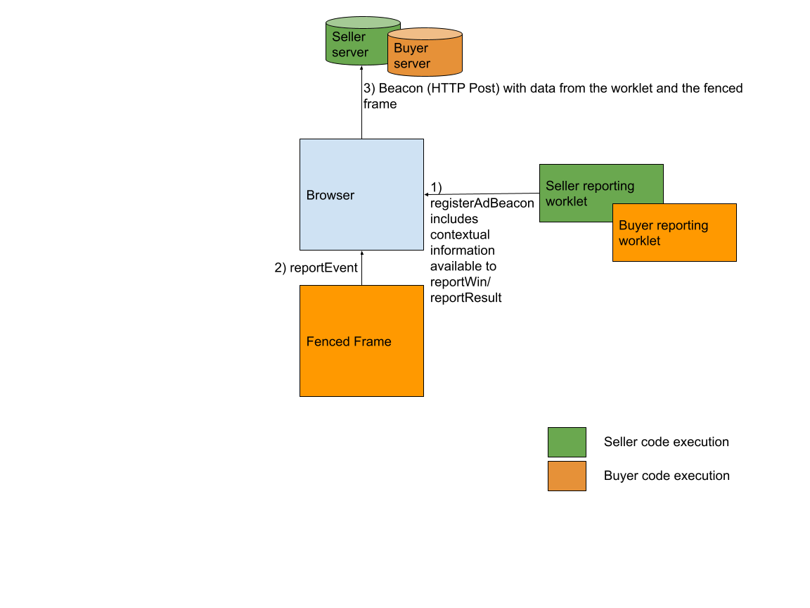

> FLEDGE has been renamed to Protected Audience API. To learn more about the name change, see the [blog post](https://privacysandbox.com/intl/en_us/news/protected-audience-api-our-new-name-for-fledge)

# Objective
  
As part of FLEDGE, interest based ads are [rendered in fenced frames](https://github.com/WICG/turtledove/blob/main/FLEDGE.md#4-browsers-render-the-winning-ad) which are special embedded frames that do not have any communication channels with the publisher page, unlike iframes. Since fenced frames do not have any contextual information, part of the reporting that ads require needs to be done via separate JS contexts called [reporting worklets](https://github.com/WICG/turtledove/blob/main/FLEDGE.md#5-event-level-reporting-for-now). The other part of the reporting which is based on user behavior in relation to the rendered ad comes from the fenced frame. There is thus a requirement from ads infrastructure to be able to correlate these two parts of reporting. Note that this correlation is required only for [event-level reporting](https://github.com/WICG/turtledove/blob/main/FLEDGE.md#5-event-level-reporting-for-now).

For invalid ad traffic detection, signals are collected about the publisher, the browser and the user behavior on the ad. Out of these three categories, signals about the publisher are available in the reporting worklet while those about the browser and user behavior are available inside the fenced frame. We therefore need a channel for signals within the fenced frame to be communicated to the reporting worklet.

Seller ad-tech reports the auction result via [reportResult()](https://github.com/WICG/turtledove/blob/main/FLEDGE.md#51-seller-reporting-on-render) and the buyer reports it via [reportWin()](https://github.com/WICG/turtledove/blob/main/FLEDGE.md#52-buyer-reporting-on-render-and-ad-events). These are implemented in the seller’s and buyer’s reporting worklets, respectively. These are already correlated with the contextual ad request but additionally, they need to be correlated with the events related to the fenced frame e.g. impressions, interactions and clicks. We therefore need a channel for events within the fenced frame to be correlated to the information in the reporting worklet and sent out on the network to support event-level reporting. In the long-term, these events could only be exfiltrated using an aggregate report. 

An ID provided to runAdAuction to identify a contextual query/ad cannot be passed on to the fenced frame because the reporting worklet has publisher information and that could be encoded and passed to the fenced frame defeating the [fenced frame’s privacy guarantees](https://github.com/shivanigithub/fenced-frame#goals). Therefore the higher level idea is for the browser to take the signals provided by the fenced frame and correlate it with the ID passed to it by the reporting worklet and send out the correlated data to the ad-tech server.

From a privacy perspective, it is also important to note that the additional information (from what the worklet already knows) that the fenced frame is sending to the browser and eventually to the ad-tech server, cannot contribute to identifying the user since the fenced frame does not have access to cookies/unpartitioned storage.


# Design

The following summarizes the sequence of events for the buyer and seller. Distinguishing these flows here, since in principle, one should be able to report without the help of the other.




## Seller (SSP) flow of events


1. SSP will generate an event identifier, say sellerEventId, at contextual ad request time.
2. SSP will provide the sellerEventId to the auction via auctionConfig, which will be available in the reporting worklet for the SSP.
3. In reportResult(), the sellerEventId, along with any other contextual response fields relevant for reporting, will be available so that the result can be joined to the corresponding contextual query.
4. Once the winning ad is rendered in the fenced frame, the fenced frame can also communicate other events to the browser e.g. what user interaction happened. Since the fenced frames run the buyer’s scripts, the buyer can also decide what information to be volunteered to the seller via the reportEvent API.
5. The solution proposed in this document allows the seller’s reporting worklet to register a URL to which data should be sent for events reported by the fenced frame.

## Buyer (DSP) flow of events


1. If the DSP participates in the contextual ad request, it will generate an event identifier, say buyerEventId, at contextual ad request/response time which is returned to the SSP as part of the perBuyerSignals, which the SSP in turn would specify in navigator.runAdAuction call. For DSPs that do not participate, buyerEventId could just be an ID that the worklet creates.
2. Browser will provide the buyerEventId to the reporting worklet for the DSP via reportWin() as part of the perBuyerSignals. This enables the result to be joined with the corresponding contextual query. 
3. Fenced frame can also communicate other events to the browser e.g. a click happened along with click coordinates.  
4. The solution proposed in this document allows the buyer’s reporting worklet to register a URL in reportWin(), to which data should be sent, when events happen in the fenced frame.


# APIs   

The following new APIs will be added for achieving this.


## reportEvent

Fenced frames can invoke the `reportEvent` API to tell the browser to send a beacon with event data to a URL registered by the worklet in `registerAdBeacon` (see below). Depending on the declared `destination`, the beacon is sent to either the buyer's or the seller's registered URL. Examples of such events are mouse hovers, clicks (which may or may not lead to navigation e.g. video player control element clicks), etc.

This API is available from same-origin frames within the initial rendered ad document and across subsequent same-origin navigations, but it's no longer available after cross-origin navigations or in cross-origin subframes. (For this API, for chains of redirects, the requestor is considered same-origin with the target only if it is same-origin with all redirect URLs in the chain.) This way, the ad may redirect itself without losing access to reporting, but other sites can't send spurious reports.

The browser processes the beacon by sending an HTTP POST request, like the existing [navigator.sendBeacon](https://developer.mozilla.org/en-US/docs/Web/API/Navigator/sendBeacon).


### Parameters

**Event type and data:** Includes the event type and data associated with an event. When an event type e.g. click matches to the event type registered in registerAdBeacon, the data will be used by the browser as the request body in the request sent to the registered URL.

**Destination type:** List of values to determine whose registered beacons are reported, can be a combination of the following destination types:

 * `buyer`: the bidder in the FLEDGE auction.

 * `seller`: the top-level seller that is running the auction.

 * `component-seller`: the seller for a component auction in a multi-level auction.

 * `direct-seller`: the seller that ran the auction that the `buyer` bid in, whether that was a top-level auction or a component auction.

One report will be processed for each destination specified. So if both
`component-seller` and `direct-seller` are both specified for a multi-level auction
then two reports will be processed for the seller from the component auction
(one for the `component-seller` destination and one for the `direct-seller`
destination).`

### Example

To send a request with the POST request body `'{"clickX":"123","clickY":"456"}'` to the URL registered for `buyer` and `seller` when a user click happens:
```
window.fence.reportEvent({
  'eventType': 'click',
  'eventData': JSON.stringify({'clickX': '123', 'clickY': '456'}),
  'destination':['buyer', 'seller']
});
```


To send a request with the POST request body `'an example string'` to the URL registered for `component-seller` when a user click happens:
```
window.fence.reportEvent({
  'eventType': 'click',
  'eventData': 'an example string',
  'destination':['component-seller']
});
```


To send a request with the POST request body `''` to the URL registered for `buyer` when a user click happens:
```
window.fence.reportEvent({
  'eventType': 'click',
  'destination':['buyer']
});
```


Note `window.fence` here is a new namespace for APIs that are only available from within a fenced frame. In the interim period when FLEDGE supports rendering the winning ad in an iframe, `window.fence` will also be available in such an iframe.

## registerAdBeacon

A similar API was initially discussed here: https://github.com/WICG/turtledove/issues/99 for reporting clicks. The idea is that the buyer and seller side worklets are able to register a URL with the browser in their reportWin and reportResult APIs. A beacon will be sent to the registered URL when events are reported by the fenced frame via reportEvent.


### Parameters

A map from event type to reporting URL, where the event type corresponds to the `eventType` value passed to  `reportEvent()`. The event type enables worklets (for buyer, seller, or component seller) to register distinct reporting URLs for different event types. The reporting URL is the location where a beacon is sent once the fenced frame delivers the corresponding event via `reportEvent()`.

Worklets can add a buyer event identifier, seller event identifier, or any other relevant information as query parameters to this URL.

### Example


```
registerAdBeacon({
 'click': 'https://adtech.example/click?buyer_event_id=123',
});
```

## Support for Attribution Reporting 
### Goals
*   While fenced frames still have unrestricted network access and FLEDGE supports event-level reporting, the solution below takes advantage of the `registerAdBeacon`/`reportEvent` information flow to enable [registering attribution sources](https://github.com/WICG/attribution-reporting-api/blob/main/EVENT.md#registering-attribution-sources). [ARA attribution triggering](https://github.com/WICG/attribution-reporting-api/blob/main/EVENT.md#triggering-attribution) is unchanged for registered FLEDGE impressions.
*   Improve the ergonomics of triggering ad beacons based on clicks.

**The changes below will be available in Chrome starting M112.**

### registerAdBeacon

The `reportResult` and `reportWin` worklet code will be able to register an event called `reserved.top_navigation` via `registerAdBeacon`. 

```
registerAdBeacon({
 'reserved.top_navigation': 'https://adtech.example/click?buyer_event_id=123',
});
```

The new event, if registered, implies that an automatic beacon will be sent by the browser to the registered URL when a top-level navigation is invoked from within the fenced frame and the navigation was preceded by a call to [window.fence.setReportEventDataForAutomaticBeacons](#api-to-populate-event-data-for-reservedtop_navigation). This will impact top-level navigation initiated from the fenced frame in the same tab (via [unfencedTop target](https://github.com/WICG/fenced-frame/blob/master/explainer/integration_with_web_platform.md#top-level-navigation)) or in a different tab. Note that this beacon is gated on a transient user activation. More details about the beacon are below.


### reportEvent

The beacons that are generated from a `reportEvent` invocation or via the automatic `reserved.top_navigation` event will now be automatically eligible for attribution, i.e. the browser appends the `Attribution-Reporting-Eligible` HTTP request header. The beacon responses can then register attribution sources as usual, as described [here](https://github.com/WICG/attribution-reporting-api/blob/main/EVENT.md#registering-attribution-sources).

#### Redirects

As mentioned in the explainer above, `reportEvent` beacons are POST requests and carry `eventData` in the request's body. The same will be true for automatic `reserved.top_navigation` requests. Note that for any server redirects of the initial request, the browser sends a GET request and does not include the initial request's body. For attribution registration flow, if the `eventData` needs to be used as part of the redirected request, it must be explicitly passed on as part of the redirect URL.

### API to populate event data for reserved.top_navigation

Since the `reserved.top_navigation` beacons are automatically generated by the browser, there needs to be some way for those beacons to be associated with a destination and include event data, as it happens in `reportEvent` generated beacons. To achieve this, a new `setReportEventDataForAutomaticBeacons` API can be invoked from within the fenced frame:


```
window.fence.setReportEventDataForAutomaticBeacons({
  'eventType': 'reserved.top_navigation',
  'eventData': 'an example string',
  'destination': ['seller', 'buyer'],
});
```


Currently, the only `eventType` that `setReportEventDataForAutomaticBeacons` allows is `'reserved.top_navigation'`. Note that the script invoking this API can volunteer this information to a given destination type or not, similar to `reportEvent`, using the `destination` field.

If invoked multiple times, the latest invocation before the top-level navigation would be the one that’s honored.

`eventData` is optional, and can be empty. If `eventData` is not specified, or is empty, the automatic beacon will still be sent but without an event data body in the HTTP request.

If `setReportEventDataForAutomaticBeacons` is not invoked, the browser will not send an automatic beacon because the `destination` is unknown.

An automatic beacon can be manually cleared out by calling `setReportEventDataForAutomaticBeacons` with an empty destination list.
```
window.fence.setReportEventDataForAutomaticBeacons({
  'eventType': 'reserved.top_navigation',
  'destination': [],
});
```

`setReportEventDataForAutomaticBeacons` can also be invoked in the click handler of an anchor tag, and will be sent on navigation:

```
<script>
function addBeaconData(element) {
  const data = element.id + " was clicked.";
  let beacon_event = {
    eventType: "reserved.top_navigation",
    eventData: data,
    destination: ["buyer"],
  }
  window.fence.setReportEventDataForAutomaticBeacons(beacon_event);
}
</script>
<a onclick="addBeaconData(this)" id="link1" href="somesite.com" target="_blank">Click me!</a>
```

The beacon data will be in place by the time that the navigation starts. When the navigation commits, the automatic beacon will be sent out with event data set to "link1 was clicked.".

The dictionary passed into `setReportEventDataForAutomaticBeacons` also takes an optional `once` boolean that defaults to false. If `once` is set to true, the automatic beacon will only be sent for the next `reserved.top_navigation` event. Beacons will not be sent for subsequent `reserved.top_navigation` events until `setReportEventDataForAutomaticBeacons` is invoked again. When used with a click handler, this can be used to send beacons only for specific top-level navigations, rather than for every top-level navigation.

For example, if a frame has multiple links that can perform top-level navigations, but only one of the links should have an automatic beacon associated with it, `setReportEventDataForAutomaticBeacons()` can be called in that link's click handler with `once` set to true. This will ensure that, if another link is clicked after the link with the associated automatic beacon, that other link will not result in a beacon being sent out.

```
window.fence.setReportEventDataForAutomaticBeacons({
  'eventType': 'reserved.top_navigation',
  'eventData': 'an example string',
  'destination': ['seller', 'buyer'],
  'once': true,
});
```

# Support for Ad Components
## Goal
When a rendered ad is composed of [multiple pieces](https://github.com/WICG/turtledove/blob/main/FLEDGE.md#34-ads-composed-of-multiple-pieces), it is useful to detect user clicks that happened on ad components.

## Design
### Event Type and Reporting Destination
For fenced frames rendering the ad components under the top-level ad fenced frame, the `reserved.top_navigation` event type and corresponding reporting destination registered for the top-level fenced frame are reused when beacons are sent from the ad component fenced frames.

### Restricted to send `reserved.top_navigation` beacons only
* Invocation of the `reportEvent` API from an ad component fenced frame is disallowed.
* The only supported beacon to be sent from an ad component fenced frame is the `reserved.top_navigation` automatic beacon. Note this beacon is gated on a user activation (e.g. click).
* To ensure that there is no arbitrary data that can be received at the server from the component ad, the `eventData` field via `window.fence.setReportEventDataForAutomaticBeacons`, if specified, will be ignored. This ensures that information from the component ad URL is not revealed in the event report, or else it could lead to the join of two independently k-anonymous URLs (parent and component ad) at the receiving server.
* To send the beacon from a component fenced frame, `window.fence.setReportEventDataForAutomaticBeacons` must be invoked within the ad component fenced frame with `eventType` set to `'reserved.top_navigation'`. The beacon will be sent when there is a user activation (e.g. click) on the ad component fenced frame, which results in a top-level navigation.

```
window.fence.setReportEventDataForAutomaticBeacons({
  'eventType': 'reserved.top_navigation',
  'destination':['seller', 'buyer']
});
```
