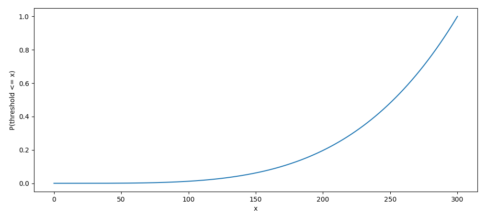
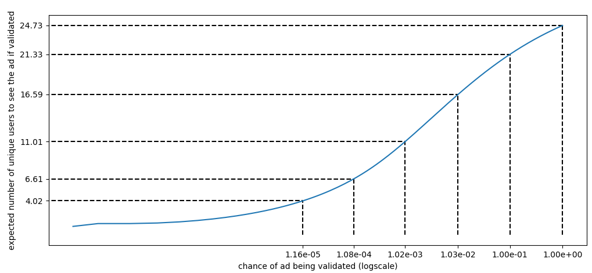

# Outcome-based TURTLEDOVE

## Summary

One of the objectives of TURTLEDOVE is to prevent the so-called **microtargeting** [[1](https://github.com/WICG/turtledove#browsers-joining-interest-groups)].

The approach taken so far has been **input based**: analyze and restrict bidding inputs and logic, so that microtargeting is not possible / not practical. The primary restriction is for bidding signals to be identical for all members of an interest group [[2](https://github.com/WICG/turtledove#api-example-flow)], but there are others [[3](https://github.com/WICG/turtledove/issues/5), [4](https://github.com/WICG/turtledove/issues/44)].

We propose a new, **outcome-based approach: monitor and validate bidding outcomes, not inputs**.

Benefits:
* [More accurate bidding](#more-accurate-bidding)
    * In particular, we propose the addition of **userSignals** - custom bidding data saved during a call to joinAdInterestGroup.
* [Decoupling of microtargeting prevention and bidding mechanisms](#decoupling-of-microtargeting-prevention-and-bidding-mechanisms)
* [Mathematical microtargeting prevention guarantees](#mathematical-framework-for-microtargeting-prevention)

## Outcome-based TD

The outcome-based approach builds on:
* Each ad being either "validated" or "not validated".
* The browser being able to discard a winning bid, if the corresponding ad is not validated. (Let's call such a discarded win a "ghost win".)
* A server-side privacy infrastructure ("Privacy Infrastructure") that observes the sequence of ghost wins across browser instances for each ad and uses it to implement the validation logic.
    * // Note that a similar server-side privacy infrastructure was first mentioned in the original (input-based) TURTLEDOVE explainer [[1](https://github.com/WICG/turtledove#browsers-joining-interest-groups)], where its role would be to track the membership size of each interest group.

Intuitively, if the Privacy Infrastructure sees only a single user for whom an ad wins ghost bids, it would not allow that ad to be shown. Conversely, if there are consistently a lot of users with ghost wins for a specific ad, the Privacy Infrastructure would quickly decide to mark that ad as validated.

In a further section we formalize this intuition with a detailed proof of concept outcome-based validation algorithm and analyze its microtargeting properties.

## More accurate bidding
``

Currently TURTLEDOVE takes an input-based approach to make microtargeting infeasible - it enforces bidding signals to be identical for each member of an interest group. Effectively, even for ads intended for larger audiences (when microtargeting is not an issue), the bidding accuracy will suffer. This is especially true for performance bidders like RTB House who try to leverage all available signals in order to optimize bidding accuracy.

As an analysis performed at RTB House shows, with the outcome-based approach it is possible to retain bidding accuracy - while still protecting against microtargeting. The bidder should be able to calculate precisely how much a bid is worth, and a particular ad should be shown to the users only if enough unique users would win bids for that ad.

In more detail, paying attention to auction outcomes rather than inputs, makes it possible to give the bidder full access to a wider range of bidding signals:

* **userSignals**: We propose to allow the Bidder to store custom bidding signals during a call to joinAdInterestGroup.

    We stress that these signals would be kept browser side and used solely for bidding. They would never be shared with publishers or included in network requests, and are in line with the TURTLEDOVE's current privacy guarantees.
<pre>
const myGroup = {'owner': 'www.wereallylikeshoes.com',
                 'name': 'athletic-shoes',
                 'readers': ['first-ad-network.com',
                             'second-ad-network.com'],
                 <b>'userSignals': {  # custom, DSP-provided
                   'ConversionRate': 0.07,
                   'ConversionValue': 12.04,
                 }</b>
                };
navigator.joinAdInterestGroup(myGroup, 30 * kSecsPerDay);</pre>
* recentAdEvents: proposed in [https://github.com/WICG/turtledove/issues/44](https://github.com/WICG/turtledove/issues/44). With the outcome-based approach, there should be no need to restrict, bucketize and/or add noise to this signal.

Inclusion of these signals would allow ad networks to preserve the accuracy of the current performance bidding systems. Taking other considerations aside (how much computing power is available on the browser, how to train the models using aggregated data), the main difference would be the decentralized nature of the bidding process.

Experiments conducted at RTB House indicate that this decentralized evaluation model would account for only a minute drop in bidding accuracy - we retained **99.98%** of [AUC](https://developers.google.com/machine-learning/crash-course/classification/roc-and-auc), a metric used to assess our CTR model (a drop from .86751 to .86736). In our experience such a drop is nearly negligible.

## Decoupling of microtargeting prevention and bidding mechanisms

In the input-based approach the microtargeting prevention mechanisms and bidding logic are tightly coupled. This causes long term maintenance and development issues:
* If a microtargeting-enabling loophole is discovered, fixing it will require amending or further restricting bidding signals. This will require coordinating with bidders to adapt their bidding algorithms, and may hurt bidding performance.
* Similarly, if there is a request for a novel bidding signal, it will have to be analyzed in detail from the microtargeting perspective. Afterwards, it may have to be restricted or even rejected altogether.

Bidders will strive to fully leverage all available bidding signals, and the bidding algorithms can be expected to heavily rely on all of them.

In the outcome-based approach, bidding and microtargeting prevention mechanisms are fully independent. Thus, the browser has no need to understand and police bidding signals, and has full flexibility to implement and adjust microtargeting prevention mechanisms over time. Doing so will impact bidders ability to show rare ads, but will not impact the overall bidding accuracy.

## Mathematical framework for microtargeting prevention

We present a **proof of concept** validation algorithm and analyse its microtargeting prevention aspects. The purpose of the algorithm is to show that, within outcome-based TURTLEDOVE, it is possible to reason with mathematical precision about microtargeting prevention guarantees.

We show how to make sure each ad, if validated, is expected to reach a certain number of users at least once. The browser teams may choose to enforce different properties of the bidding ecosystem (see [Final remarks](#final-remarks)).

### Setting

Let's focus our attention on the following actors in the bidding ecosystem:
* Bidders
    * A bidder controls the bidding behavior for certain ads for a group of users.
* Privacy Infrastructure
    * Has a global view of the ecosystem, and decides when an ad becomes "validated".
    * For example, in input-based TURTLEDOVE, the Privacy Infrastructure approves an ad if sufficiently many unique users are assigned to the ad's interest group.

### Assumptions

* Privacy Infrastructure may observe the sequence of ghost wins in real time, for each ad.
* If an ad is validated, but has not yet produced impressions for k unique users, we call this state "preliminary validation". We assume that the bidders are not able to change their bidding behavior based on the fact that an ad has been preliminarily validated.
    * In practice, that means the Privacy Infrastructure has to detect and block bidders' attempts to learn that status by means of creating synthetic users (bots) that win auctions.
* Creative rendering is isolated and does not depend on the bidding signals, context, **time**. We rely on the fact that each time we show an ad, the same message is displayed. (For example, we don't want the message to change after preliminary validation.)

### Algorithm (proof of concept)

Definition: A sequence is **k-diverse**, if every contiguous subsequence of length `k` has exactly `k` unique values.
* `[1, 2, 4, 2, 5]` is 2-diverse. It is not 3-diverse, as there is a length-3 contiguous subsequence with only 2 unique values: [2, 4, 2].
* `[1, 2, 3, 4, 2, 3, 4, 1]` is 3-diverse.

For every creative *c*, Privacy Infrastructure may assume the following strategy:
* Randomly pick an integer `threshold` from a distribution `p(threshold)` over `[1, L]`, and assume a fixed `k`. (`L` and `k` are fixed parameters, for example: `L=300`, `k=30`.)
* Observe the chronological sequence of ghost wins for *c*: `[user17, user22, user3302, ...]`
    * // Note that we don't really need user ids, and using `hash(user_id, interest_group) mod m`, for some `m>=k` would be enough.
* Out of it, compute in an online fashion the longest k-diverse subsequence *LKS*.
    * For example, if Privacy Infrastructure sees ghost wins for users:
        <pre>[1, 2, 3, 2, 4, 1, 4, 4, 3, 2, 5, ...]</pre>
        The LKS, for `k=3`, would be:
        <pre>[1, 2, 3,    4, 1,       3, 2, 5, ...]</pre>
        It can be shown that LKS can be updated greedily by appending every newly seen value if it has not appeared in the most recent `k-1` positions.
* If `len(LKS) >= threshold`, for every win, notify the user's browser that the creative has been validated (so it becomes an impression). (*Preliminary validation)*
* If the number of unique users who saw the ad is higher than `k`, publicly declare the creative as validated. (*Public validation*)

### Microtargeting analysis

Intuition: if Privacy Infrastructure sees that there is a lot (>=k) of different users that bid consistently, it picks a random moment in time to validate the creative. In order to microtarget a chosen user, a Bidder would have to guess when that happens.

More strictly, the Bidder may choose to produce any sequence of (ghost) wins for the users it controls. Let's call such a sequence a "bidding strategy". (Note that we are granting the Bidder much more flexibility in controlling the bids than it'd have in the real world.) For a fixed bidding strategy, let's take a look at its longest k-diverse subsequence. If its length is infinite, k users will regularly see the ad.

Let's consider the case when the length is finite and equal to *n*. Then:
* chance of the ad being seen by someone = `p(threshold <= n)`
* chance of showing the creative to exactly one user <= `p(threshold == n)`
* chance of showing the creative to less than k users <= `p(n-k < threshold <= n)`

By adopting k=30, L=300, and P(threshold) that's small for small values of threshold:

We obtain the following guarantees:

How to read the graph: the bidder may assume a bidding strategy for which the probability of validating the ad is ~0.1%. If the ad gets validated, the total expected number of unique users who see the ad will be at least 11.01.

The guarantees above were calculated by observing that from the perspective of Privacy Infrastructure the only important aspect of a bidding strategy is the length of its longest k-diverse subsequence. For every such len(LKS), we may then calculate:
* probability of validation: `P(threshold <= len(LKS))`
* expected number of unique users to see the ad if validated: `E[min(len(LKS) - threshold + 1, k) | len(LKS); threshold <= len(LKS)]`

Algorithm's properties:
* The higher the number of unique users, the quicker the ad will be validated.
* After Lth unique user wins a (ghost) bid, the ad is guaranteed to be validated.
* For highly popular items, the validation will be almost instantaneous.

Note that, in contrast to input-based TURTLEDOVE, it is the creative (not the interest group) that is subject to validation. Therefore, if the creative changes (for example due to price / availability change), the ad will have to be validated anew. In order to mitigate this, we may consider a mechanism of **fallback creatives** - upon a ghost win, if a creative has not yet been validated, we may allow an impression of a bidder-chosen fallback creative (that's subject to validation itself).

The analysis above applies to a bidding strategy using a single creative. A malicious bidder could try to perform such a bidding strategy multiple times, for multiple creatives (multiple interest groups) in order to increase the chances of reaching a given user. For this reason, the maximal number of interest groups per user should be limited, and it should be taken into account when choosing validation algorithm's parameters (k, L, p(threshold)).

### Final remarks
* Note that the algorithm is a proof of concept, and its purpose is to show that we can reason with mathematical precision about microtargeting properties in outcome-based TURTLEDOVE.
* The browser may implement additional validation rules in order to obtain other guarantees. For example: invalidating an ad that hasn't seen enough unique impressions over a period of time.
* The microtargeting analysis above grants the Bidder much more control than he will have in the real world. Therefore, a more relaxed validation logic may actually be feasible.
* Thanks to the [Decoupling of microtargeting prevention and bidding mechanisms](#decoupling-of-microtargeting-prevention-and-bidding-mechanisms), the validation policy and implementation may be changed in time, if there is a need to do so.
* Outcome-based and [product-level](PRODUCT_LEVEL.md) proposals are compatible, but we defer a detailed discussion for a later time.
* In order to keep the PoC algorithm simple, we didn't try to optimize for the additional ad showing latency caused by the need to consult Privacy Infrastructure. In practice, if an ad is validated, we may cache that information in the browser. Further optimizations can be pursued.
