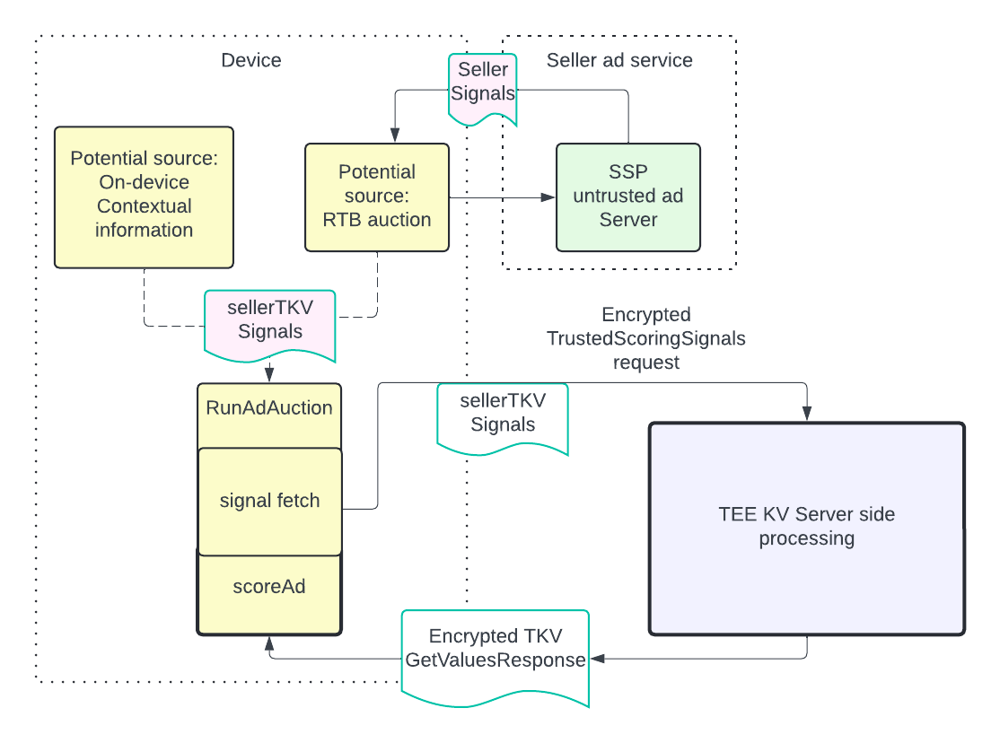
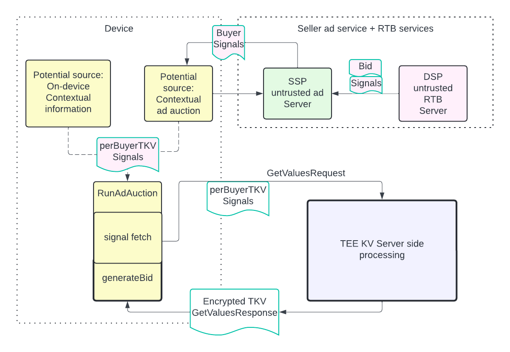

# Contextual Signals to Trusted Key-Value Server

Authors:

-   Peiwen Hu
-   Matt Menke
-   Lusa Zhan

## **Introduction**

Auctions are often used to select relevant advertisements to show to users on the web and in apps.
The Privacy Sandbox has developed privacy improving technology to run these auctions, namely
[Protected Audience (PA) on Chrome](https://github.com/WICG/turtledove/blob/main/FLEDGE.md) and
[Android](https://developers.google.com/privacy-sandbox/private-advertising/protected-audience/android).
Sellers in these auctions can provide signals about the context in which these auctions are run,
i.e. about the web page or app in which the selected advertisement will show, by specifying
`perBuyerSignals` and `sellerSignals` in the auction configuration. The content of these contextual
signals can come from various sources including real-time bidding auction responses and information
on the page or app. But today these signal fields are only available to bidding and scoring logic,
e.g. `generateBid()` and `scoreAd()`, not key-value (KV) services used to look up real-time bidding
and scoring signals. There is only very
[limited contextual information](https://github.com/WICG/turtledove/blob/main/FLEDGE.md#31-fetching-real-time-data-from-a-trusted-server)
sent in the real-time bidding and scoring signals request, namely the hostname and ad slot size.

The existing design introduces potential inefficiencies by limiting contextual signal processing to
the later stages of the auction in `generateBid()` and `scoreAd()` rather than in KV:

-   **Wasted real-time bidding processing**: Server side contextual information processing can only
    happen during the real-time bidding auction, whose results may not actually be used if the
    subsequent PA auction finds the user has no interest groups present. This means the processing
    is wasted if the results are unused.
-   **Restricted KV functionality**: The KV server can run some logic that is impossible to run in
    `generateBid()` or `scoreAd()` as this logic may depend on large amounts of data, frequently
    updated data, or private logic/data. This potential cannot be fully realized if the KV server
    doesn't have access to contextual signals.
-   **Increased `generateBid()` or `scoreAd()` complexity**: Contextual signals are currently only
    available to `generateBid()` or `scoreAd()`. The burden of processing contextual signals falls
    on `generateBid()` and `scoreAd()`. This additional complexity may increase latency and require
    more compute and battery usage when executed on mobile devices.
-   **Inefficient data flow**: The logic in `generateBid()` or `scoreAd()` may depend on both
    contextual signals and input from the KV response. This means KV must transmit that input as
    part of its response so it can be passed to `generateBid()` or `scoreAd()`, leading to an
    increased KV response payload. Passing contextual signals to KV directly could result in a
    smaller KV response payload and reduce overall network traffic despite the overhead of adding
    the signals to the KV request.

The list is not exhaustive.

## **Overview**

Trusted Key Value servers (TKVs) offer additional isolation and protection of data processing that
allow us to safely pass them additional contextual signals. To address the above shortcomings and
enable improved ad selection within TKV by leveraging contextual data, we introduce two new string
fields in the auction configuration:

1. `perBuyerTKVSignals`. This field could convey contextual signals to the buyer's TKV, which could
   use them as inputs to the buyer's user defined function (UDF).
2. `sellerTKVSignals`. This field could convey contextual signals to the seller's TKV, which could
   use them as inputs to the seller's UDF.

## **On-device auction `sellerTKVSignals` design**

_Diagram: example flow related to the seller's KV server_

The seller sets the `sellerTKVSignals` field when constructing the auction configuration. It will be
available to the
[User Defined Function](https://github.com/privacysandbox/protected-auction-services-docs/blob/main/key_value_service_user_defined_functions.md)
running in the seller's trusted scoring key value server. The details will be updated in the
[KV API doc](https://github.com/WICG/turtledove/blob/main/FLEDGE_Key_Value_Server_API.md) once the
implementation is complete.

**If the field is set in the auction configuration but the seller uses a BYOS (Bring your own
server) Key Value server, the field will not be set in the request.**

The rest of the flow stays as it is today.

## **On-device auction `perBuyerTKVSignals` design**

_Diagram: example flow related to the buyer KV server_

The seller sets the `perBuyerTKVSignals` field when constructing the auction configuration. It will
be available to
[User Defined Functions](https://github.com/privacysandbox/protected-auction-services-docs/blob/main/key_value_service_user_defined_functions.md)
running in buyers' TKV. The details will be updated in the
[KV API doc](https://github.com/WICG/turtledove/blob/main/FLEDGE_Key_Value_Server_API.md) once the
implementation is complete.

The content of `perBuyerTKVSignals` may originate from a combination of different sources. It may
purely be from the publisher site (e.g. a potentially redacted version of the publisher site's URL),
but can also come from the response from the real-time bidding auction, or something else.

**If the field is set in the auction configuration but the buyer uses a BYOS (Bring your own server)
Key Value server, the field will not be set in the request.**

The rest of the flow stays as it is today.

### **Compatibility with providing signals asynchronously in Protected Audience**

Today there is an important performance optimization that enables signals to `generateBid()` or
`scoreAd()`to be fetched
[asynchronously](https://github.com/WICG/turtledove/blob/main/FLEDGE.md#211-providing-signals-asynchronously).
For example, the real-time bidding auction can happen in parallel to the real-time bidding signal
request, processing, and response (“parallelization”).

Including `perBuyerTKVSignals` in the TKV request can impact the parallelization: If the signals
depend on the real-time bidding auction response, the TKV request will need to wait for the
real-time bidding auction to finish, forgoing the parallelization feature. Specifically,
`perBuyerTKVSignals` cannot be a Promise in that case. On the other hand, if `perBuyerTKVSignals`
contains just information available on the page, such as a potentially redacted publisher page URL,
the parallelization can still be effective.

The sellers and buyers need to make a tradeoff between the utility of having more contextual signals
available in their TKV and the utility of the latency reduction from parallelization.

Possible mechanisms to isolate the tradeoff and place it under each buyer's own control, without
impacting other buyers or the auction overall, are currently
[under discussion](https://github.com/privacysandbox/protected-auction-key-value-service/issues/72).

### **Caching considerations on Chrome**

For on-device auctions, the Chrome browser has a caching layer for the KV response.

Trusted bidding signals may be reused by a given interest group across multiple auctions when the
publisher hostname is the same, and the interest group is substantially the same (name, joining
origin, signals URL, and keys haven't changed), and the ad slot size data included in the auction
configuration is the same. All of those will typically be the same for multiple auctions run on the
same page with the same bidder participating, except possibly the slot size parameter. The
[ad slot size](https://github.com/WICG/turtledove/blob/main/FLEDGE.md#311-trusted-signals-server-with-byos-model)
may be a list of all sizes on one page to allow caching of KV responses across auctions for ad slots
of different sizes.

Adding `perBuyerTKVSignals` to key value fetches will add yet another field that must match in order
to reuse TKV response data between auctions. If it varies between ad slots, or multiple sellers in
the same auction, that means a reduced cache hit rate and/or larger network requests, resulting in
more latency and bandwidth usage.

When deciding what, if anything, to provide in `perBuyerTKVSignals`, SSPs will need to consider the
tradeoff between lower cache hit rates and providing bidders with slot-specific and page-specific
information.

`sellerTKVSignals` have similar considerations.

## **Bidding & Auction service auctions contextual TKV signals design**

Currently, the Bidding & Auction services can receive `perBuyerSignals` from the seller's ad service
and pass them to KV. This is possible because the contextual ad auction generally completes before
the B&A auction today.

In the future, should Bidding & Auction services support a flow in which these two auctions run in
parallel, these `perBuyerSignals` will not be available at the time B&A calls TKV. In that case,
`perBuyerTKVSignals` and `sellerTKVSignals` can be added to
[SelectAdRequest.AuctionConfig](https://github.com/privacysandbox/bidding-auction-servers/blob/68c22a0c61d8320b655328dcfe0b28c59fd69475/api/bidding_auction_servers.proto#L758).

-   [SelectAdRequest.AuctionConfig.PerBuyerConfig](https://github.com/privacysandbox/bidding-auction-servers/blob/68c22a0c61d8320b655328dcfe0b28c59fd69475/api/bidding_auction_servers.proto#L789)
    will have a string field `buyer_tkv_signals` for `perBuyerTKVSignals`.
-   `SelectAdRequest.AuctionConfig` will have a string field `seller_tkv_signals`.

Similar to the on-device auction, the signals will then be set in the request to the TKV.

## **Privacy properties**

**This information is only available in the request to the
[TEE-based implementation of the KV server](https://github.com/privacysandbox/protected-auction-key-value-service/tree/main).
BYOS KV servers will not have access to this additional information.**

The existing privacy properties remain unchanged when passing `perBuyerTKVSignals` and the
`sellerTKVSignals` to the TKV as these signals are already available in `generateBid()` and
`scoreAd()` and do not expose additional data to the existing parties. The security and privacy of
these signals are ensured by the existing
[TKV trust model](https://github.com/privacysandbox/protected-auction-services-docs/blob/main/key_value_service_trust_model.md);
this model requires the TKV service running in a TEE and the TKV request
[protocol](https://github.com/WICG/turtledove/blob/main/FLEDGE_Key_Value_Server_API.md), which is
responsible for maintaining the trust by the browser using protections such as encryption.
