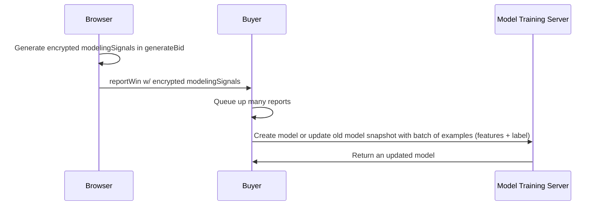

# Private model training

_Note: This document describes possible new functionality for Protected Audience. It is not necessarily a feature that will ship in the near future, but we are considering it as an optional backwards-compatible potential API improvement. While this new functionality is being researched, we still highly encourage feedback on the ergonomics of such a system._


# Introduction

This document outlines a system for improving the efficacy of `modelingSignals` output in Protected Audience, as well as the `recency` and `joinCount` fields with private model training (PMT).

Currently, these fields contain a compressed, [noisy](https://github.com/WICG/turtledove/blob/main/FLEDGE.md#521-noised-and-bucketed-signals) encoding of sensitive information transmitted from `generateBid` to `reportWin`, intended for the [bidding optimization use-case](https://github.com/WICG/turtledove/issues/1017). We want to improve them to better match modern supervised learning techniques, which require much higher dimensional feature vectors.

This document outlines an alternative approach: where noise is not added locally to these signals, but rather in a separate server-side component that can add noise more intelligently. We can specifically design the noise addition to improve utility for model training while maintaining a similar privacy guarantee. The high level approach is to encrypt an unrestricted version of `modelingSignals` (which can also contain arbitrary information about recency and join count) so it can be used in a trusted service for training a differentially private model and sharing the model in the clear. The architecture is similar to the existing [Private Aggregation API](https://github.com/patcg-individual-drafts/private-aggregation-api) where the service is an offline, batch job that computes on the encrypted data.

Note: while supporting model training for auction _losers_ is a worthwhile goal, it is currently out of scope for this initial design due to the unique privacy considerations for this use-case.


# Exposing encrypted modeling signals


## Contributing to the encrypted modeling signals byte vector

Within `generateBid`, the buyer can supply an arbitrary JSON-serializable output (`aggregateWinSignals`), which can be processed later on into an encrypted report.


```javascript
function generateBid(...) {
  ...
  let mySignals = [1.3, 12.19, ...]
  ...
  return {
    ...,
    aggregateWinSignals: mySignals
  };
}
```


## Configuring the encrypted payload and emitting it in `reportWin`

In order to avoid the length (and other metadata) about the payload being a privacy leak vector, it cannot be configured based on protected cross-site data (e.g. from within `generateBid`). We propose enabling this kind of configuration from within `reportWin`,
which will configure a new function (`reportAggregateWin`) to run. This new function will have access to the `aggregateWinSignals` returned from `generateBid`.

```javascript
function reportWin(...) {
  ...
  if (useNewMLTrainingAPI) {
    // Queues up the function reportAggregateWin which is executed immediately after this function.
    queueReportAggregateWin({
      modelingSignalsConfig: {
        destination: "https://ad-tech.example/id=123",
        aggregationCoordinatorOrigin: "...",
        payloadLength: 256, // payload will be padded with null bytes
      }, // Extensible for future configs (e.g. for Private Aggregation API)
    });
  } else {
    // The status quo locally noised signals (recency, joinCount, and modelingSignals)
    // can still be used. If they are read we will disallow the generation of the encrypted
    // private modeling signals later on.
  }
}

function reportAggregateWin(aggregateWinSignals, modelingSignalsConfig, <reportWinInputs>) {
  // Allow processing outside of the critical bidding path.
  let processedModelingSignals = process(aggregateWinSignals);

  // Will POST the encypted modeling signals to the specified destination in modelingSignalsConfig.
  // The format of this input is still TBD.
  sendEncryptedModelingSignals(processedModelingSignals)

  // The Private Aggregation API may be used here.
}
```

## Payload format

The POST payload format is still up in the air and is subject to change with feedback. Currently we are considering encoding it in [CBOR](https://cbor.io/) with the following format:

```javascript
{
  // shared_info is used for privacy budgeting purposes, used as authenticated data in
  // the encrypted payload. Similar to aggregatable reports in Private Aggregation API.
  "shared_info": "<bytes>", // format unspecified for now, but likely nested CBOR
  "aggregation_coordinator_origin": "...",
  "aggregation_service_payload": {
    "payload": "<raw encrypted bytes>",
    "key_id": "[string identifying public key used to encrypt payload]",
  }
}
```

# Training private models with `encryptedModelingSignals`

Just like in the Aggregation Service, we can support a query interface where encrypted reports are processed in a trusted server. Unlike Aggregation Service, the functionality provided by this Trusted Execution Environment (TEE) server will not compute aggregate histograms, but rather machine learning models.

The exact query interface is still to be determined, but we expect the TEE based model training system to take inputs of the following form:


*   **Collection of training data examples stored in a cloud bucket**: includes cleartext data collected in APIs like `reportWin` and ciphertext blobs like `dynamicModelingSignals` as emitted from the browser. 
*   **Encrypted features extraction config**: Responsible for defining how to extract different features from a decrypted version of `dynamicModelingSignals` visible in TEEs.
*   **Model configuration & initialization config**: Allows defining structure of models one would like to use. We imagine gradually expanding supported model types, starting with generalized linear models and deep neural networks, specified with some API like [`tf.saved_model`](https://www.tensorflow.org/api_docs/python/tf/saved_model) and [torch.jit.script](https://pytorch.org/docs/stable/generated/torch.jit.script.html#torch-jit-script) (with no custom op support). This will also allow one to provide pre-trained weights checkpoint as input for supporting use cases like incremental online learning.
*   **Model Training config**: Covers model loss function, reporting metrics (AUC loss, Poisson log loss, etc), optimizer, hyperparams and privacy params like privacy budget to consume. We expect the types of reporting metrics, loss function, optimizers to be a small open-sourced constrained set, focusing on options that are compatible with differential privacy.
*   **Output file paths**: Cloud bucket path to egress the output of PMT pipeline like path to save the DP trained model in cleartext, path to stream model training metrics, etc. The model can then be served in downstream inference systems (which can be on-device or hosted in trusted servers).

In addition to the above key pieces, we are exploring potential options for unlocking other key ML lifecycle use cases like feature exploration, model exploration and hyperparam tuning (including exploring privacy param settings) within a privacy budget constrained environment. This might involve setting up a black box mode to run the private model training binary without egressing models but only sharing differentially private model training metrics. Longer-term we plan to explore how the private model training design can be integrated into popular production scale ML devops frameworks like [Kubeflow](https://www.kubeflow.org/), [TFX](https://www.tensorflow.org/tfx), etc. to simplify adoption and improve performance.

In terms of supported hardware configurations, we expect the API to leverage CPU only environments (including some support for built-in accelerator technologies like Intel AMX whenever available) in the early days. Longer-term we expect this support to extend to advanced confidential hardware accelerators like GPUs and distributed model training setups across multiple CPUs and GPUs.

Here is a (simplified) sequence diagram of the flow:





We will flesh out more details about the private training mechanism in a future update, but we welcome any feedback about desired features or training flows.


# Key scenarios


## Predicted click-through rate (pCTR) training with ad beacons

In the current design for Protected Audiences, the design for ad beacons allows learning noiselessly which displayed ads were clicked. This means that it should be possible for buyers to create an example of the form:


*   Known features (`perBuyerSignals`, signals derived from render URL, etc)
*   Encrypted modeling signals
*   The binary click label

Crafting the example in this case would require joining together (for example, with a view ID) the modeling signals POST request with the rest of the information from the ad beacon request(s).


## Predicted conversion rate (pCVR) training with the Attribution Reporting API

The [Attribution Reporting API](https://github.com/WICG/attribution-reporting-api) (ARA) primarily supports model training with noising the _label_ directly, and exposing event-level identifiers which can be used to join with highly granular features. While this approach can be integrated with TEE-based training by supplying the pre-noised label (similar to the pCTR example above), it will not be the most efficient use of the privacy budget, and we could likely add noise more intelligently (e.g. to the gradient during backpropagation).

We hope to add more functionality to ARA to allow for event-level reports to egress from the browser in encrypted form, to be compatible with more advanced forms of private model training. This will allow the buyer to form examples of the form:


*   Known features (`perBuyerSignals`, signals derived from render URL, etc)
*   Encrypted modeling signals
*   Encrypted labels with ARA event level reports

Given that this requires cross-API compatibility, support for this enhancement may come at a later point.


## Doing inference on a privately trained model

After training a model in a differentially private manner, it is returned back to the caller and can be used arbitrarily for inference. This can be done either on-device (i.e. training a small model that can do inference within `generateBid`) or with more advanced mechanisms like the [Bidding and Auction Services](https://github.com/privacysandbox/protected-auction-services-docs/blob/main/bidding_auction_services_api.md) which can support larger models.

Note, because the model is trained privately, it will be released "in the clear" to API consumers.


# Detailed design discussion


## Alternative: adding more intelligent local noise

We hypothesize that the existing modeling signals have a non-optimal noising mechanism (k-ary randomized response) for the purposes of machine learning. One main flaw is that the randomized response mechanism does not scale well to high dimensions (for fixed privacy parameters). We have done preliminary research and think the mechanism can be improved, e.g. by looking at L2-bounded vector aggregation techniques ([Bhowmick et al 2018](https://arxiv.org/abs/1812.00984)'s PrivUnit, or some variant of the Gaussian Mechanism e.g. in [Du et al 2023](https://arxiv.org/pdf/2309.06746.pdf)).

Still, while we think those techniques would improve the status quo, we do not expect they will perform as well as centralized mechanisms like the one we propose above, which typically require adding much less noise to outputs. While the API here is extensible to alternative mechanisms which output locally noised signals, we plan on prioritizing centralized mechanisms first.


## Alternative configuration options

A goal of the design was to allow some configuration for the mechanism to expose the modeling signals. This would include:


*   Parameters for a mechanism (e.g. the length of the encrypted payload, which coordinator origin to choose, etc)
*   Which mechanism to choose (e.g. randomized response vs. encryption)

These choices are inevitably and noiselessly leaked when the output is finally exposed, so they cannot be made with cross-site information without introducing a privacy issue. This section details some alternative options.


### At interest-group join time

We could configure encrypted reports at the per-render URL level:


```javascript
// AuctionAdInterestGroup
{
  ...
  // Default mechanism across all renderURLs in ads. Can consider granular extensions
  // per renderUrl. Supports a list of mechanisms to be extensible in case we want to
  // expose multiple outputs.
  'modelingSignalsPrivacyMechanisms': [{
    // default is 'randomized-response', the status quo mechanism.
    'type': 'encrypted-bytes',
    'id': 'myEncryptedModelingSignals',
    'params': {
      'length': 1500, // bytes 
      'aggregationCoordinatorOrigin': 'https://trusted-server.example'
    }]
  }
}
```


**Pros**: can be made fully backwards compatible with the existing signals. Allows `generateBid` to know the configuration.

**Cons**: 


*   Requires passing the configuration to the k-anon server, increasing complexity. This is because the configuration itself could be used to pass more advertiser-side information into `reportWin` beyond the render URL and interest group (e.g. log2(# of configurations) of advertiser ID).
*   Has more “action at a distance” which could be less ergonomic
*   May need a different config per render URL, which is cumbersome to configure. This is because the buyer may want to have different ads having different configurations (e.g. experimenting with private model training on only a subset of campaigns)


### At auction start time

We could generate the configuration based on contextual information before the auction starts.

**Pros**: Allows `generateBid` to know the configuration.

**Cons**: There are no existing secure paths to allow the _buyer_ to configure the auction using contextual data. We would either need to build a new path (complexity, bandwidth, and latency concerns), or trust the seller to do this on the buyer’s behalf (possible security and ergonomic concerns).


### At `generateBid` time

This alternative is also possible, but it makes the _configuration itself_ a possible cross-site leak vector. To mitigate this would require introducing some server that aggregates reports which share a config, which introduces a large amount of complexity. We can consider this in a follow-up, especially in the state when `reportWin` and event-level win reporting are no longer generally available.


# Privacy considerations

The primary privacy goal of this work is to ensure that any extensions made to `modelingSignals`, `recency`, and `joinCount` could be made without regressing privacy, and to unlock opportunities to reduce the privacy leakage in the future. We can measure privacy in terms of two notions:


*   Differential privacy epsilon (measured at a per-auction privacy unit)
*   Per auction information gain (i.e. bits leaked per auction)

Here is how the current mechanisms stand:


*   `modelingSignals` satisfies per-auction ~12.9-differential privacy, and leaks ~11.9 bits when modeled as a q-ary symmetric channel
*   `recency` satisfies per-auction ~8.1-differential privacy and leaks ~4.9 bits
*   `joinCount` satisfies per-auction ~7.4-differential privacy and leaks ~3.9 bits

In total, the mechanisms here are ~28.4-DP and leak ~20.7 bits of information per auction.

This write-up describes a TEE based unified mechanism for optionally replacing the 3 individual signals, allowing improved performance from the signals for model training, without compromsing the existing privacy protections.

The primary techniques for achieving this will be adopting state-of-the-art techniques for differentially private model training. The most common techniques here (e.g. [DP-SGD](https://arxiv.org/abs/1607.00133)) are well-studied and supported in major frameworks like [Tensorflow](https://www.tensorflow.org/responsible_ai/privacy/tutorials/classification_privacy), [Pytorch](https://github.com/pytorch/opacus). The Protected Audience setting has some characteristics (that only a subset of features need to be private) which may enable better algorithms too. Recent research (e.g. [Chua et al 2024](https://arxiv.org/abs/2401.15246), [Krichene et al 2023](https://arxiv.org/abs/2310.15454)) explores this and we plan on investigating these results to maximize the utility of these algorithms.