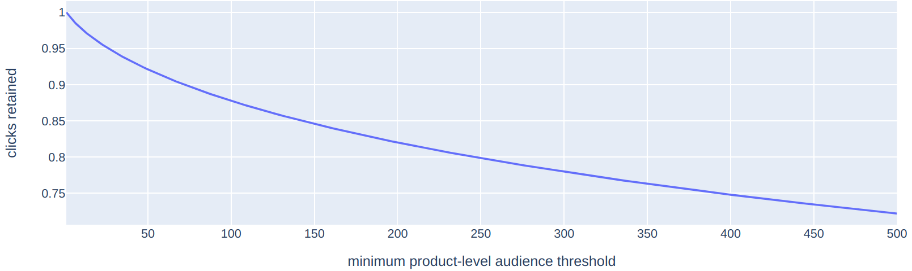

# Product-level TURTLEDOVE\*
\*We focus on TURTLEDOVE for the sake of discussion, a "Product-level [SPARROW](https://github.com/WICG/sparrow)" is also feasible.

## Summary

In **ecommerce retargeting**, the majority of creatives consist of a collection of products:

[TURTLEDOVE](https://github.com/WICG/turtledove) is oblivious to the existence of products in creatives, and imposes minimal audience thresholds on the latter. This introduces a novel, fundamental difficulty in the area of useful product recommendation. Recommendation systems will have to shift from working with a single user to working with sets of users.

We argue that in ecommerce it is the **product**, not the creative (a collection of products), that would be the most natural conceptual unit behind TURTLEDOVE mechanisms.

If, in TURTLEDOVE, we **apply the idea of minimal audience size at product level**, we can:
* retain the flexibility and effectiveness of the current state-of-the-art recommendation systems,
* ease the adoption of TURTLEDOVE in ecommerce,
* easily analyze the impact of minimal audience size on revenue, and
    * early research at RTB House indicates it may be possible to retain even **~94.5%** of the current click through rate level with product-level audience threshold of **30**
* keep TURTLEDOVE privacy guarantees.

In addition, this product-level focus brings greater clarity into areas that need to reason "what's inside the ad":
* TURTLEDOVE UI,
* publisher brand safety,
* native ads, and
* auditability.

The proposed change is an extension of TURTLEDOVE, and supports all use cases that were supported originally.

## Technical details

* When calling `joinInterestGroup`, the advertiser may choose to supply a list of particular products that would be the most useful for the user.
<pre>const myGroup = {
            'owner': 'www.wereallylikeshoes.com',
            'name': 'athletic-shoes',
            'readers': [
                'first-ad-network.com',
                'second-ad-network.com'
            ]<b>
            'product_ids': [
                'nike_air_force_1',
                'adidas_gym_trainers_17',
                'adidas_gym_trainers_33',
                'reebok_running_shoes_93'
            ],</b>
};
window.navigator.joinAdInterestGroup(myGroup, 30 * kSecsPerDay);</pre>
* In requests to `../.well-known/fetch-ads` endpoint browser fetches ads for specified interest groups as previously. However, it also fetches the corresponding products' web_bundles - packages with assets necessary for rendering the product's presentation. This can be done in separate requests if needed. 
* Ad rendering works as previously. However, if product_ids were supplied for the interest group that won the bid, the corresponding products' web_bundles are passed to the IG's web_bundle. This way, the usage of `product_ids` becomes entirely optional.

## Impact on core metrics

<b>Note: this section describes analysis conducted at [RTB House](https://www.rtbhouse.com/).</b>

How will the adoption of product-level TURTLEDOVE affect recommendation quality?

This is a question we (RTB House) haven't been able to answer for "creative-level" TURTLEDOVE. In product-level TURTLEDOVE, however, we can apply a fairly straightforward and informative analysis.

Methodology:
* We focus on a period of 28 days, (more than 1.4e8 clicks).
* The analysis is performed on the entire corpus of RTB House's web advertisers. This means 1.5k+ advertisers from around the world, ranging from small businesses to leading ecommerce platforms.
* Within that period, for each product, we determine the "product's audience size" - how many distinct users were served an impression with that product.
* We inspect the impact of product-level minimal audience threshold. For a given threshold, we discard all clicks on products with `product_audience_size < threshold`.

Caveats:
* The analysis takes a simplified perspective on calculating the "product's audience size". We ignore the dynamic nature of interest group memberships, and pick the period length of 28 days somewhat arbitrarily.
* In order to calculate the product's audience size in a more principled way, we would need to better understand the details of how the browser will enforce minimal audience thresholds.
* We don't account for the opportunity of showing other products in place of the discarded rare products.
* As we are working on understanding the impact on core metrics in more detail, we think it worthwhile to share early high level insights, even if imperfect.

Results:

* Number of clicks retained as a function of threshold

* How `product_level_threshold = 30` impacts advertisers

How to read the graph: "90% of RTB House's advertisers would retain at least 74% of the current CTR level."

## TURTLEDOVE adoption in e-commerce

In addition to **core-metric impact estimates**, another important factor in TURTLEDOVE adoption is **research and engineering effort required**.

The product-focused approach is compatible with many recommender systems employed in ecommerce retargeting today. Many state of the art systems follow the approach of scoring an item's usefulness to a single user. On the other hand, research on recommender systems working on clusters of users is scarce.

At RTB House, adopting product-level focus will allow us to continue to use the recommender systems of today nearly as-is. There are some details, of course, but conceptually, we just need to get rid of very rare products and then just run the old algorithm. This greatly cuts the amount of effort required to adopt to TURTLEDOVE. The current recommender systems are a result of many years of development of teams of engineers and data scientists.

In vanilla, creative-level TURTLEDOVE, the recommender systems will likely have to be designed and built from scratch. The minimal audience threshold applied on the creative level is a difficult restriction. So far, no estimate is available on the impact it will have on recommendation quality and CTR, but we believe it would be very high.

## Creative construction

In bringing creative construction to the device, we would like to retain two major objectives:

1. Avoid enabling novel attack vectors on user's privacy.
2. Retain the flexibility of creative formats.

We believe both goals can be met with the "strict" approach described below. We provide this approach as a minimal viable discussion starter. However, we believe there is value in seeking a more relaxed approach.

Strict approach:
* The ad template comes in `interest_group`'s web bundle. It is subject to minimum audience thresholds itself.
* The browser wraps each product's web bundle in an opaque iframe (first introduced in TD's original explainer), and shuffles them before they are passed to the "template" web bundle.
* This way, the template is free to set its own layout for items, move them, zoom in on mouse hover, display them in turn, etc. However, it is not able to peek inside the products. Each is an identical, opaque handler that can be positioned and resized.

This way:
* We prevent ordering-based pranks, like assembling text from individual images.
* The ad template cannot reason about the user's identity based on the collection of products the user is assigned to.
* From the privacy perspective, product-level TURTLEDOVE shouldn't be much different from seeing multiple single-product ads in creative-level TURTLEDOVE. (The latter, however, would be much less effective in terms of core metrics.)

A more relaxed approach would be valuable for:
* more flexible creation rendering; and potentially
* opening up the possibility of serving native ads by structuring and standardizing the format of product assets.

## TURTLEDOVE UI

On the UI level, showing the product interest groups may be much more understandable to the user.
* Showing individual products is self explanatory. "wereallylikeshoes.com thought you'd be interested in Nike Air Force 1 Basketball Shoes <picture> <link> when you visited wereallylikeshoes.com/womensneakers.html"
    * Note that the availability of a product-level web bundle ensures a level of readability that won't be achieved with custom, freetext interest group names. (There's a fair chance these will just be random identifiers.)
* Optionally, we also get a higher granular user control. The user could now be able dismiss individual products (or product categories).

## Auditability

TURTLEDOVE assumes an audience-size approach to ensuring user privacy and comfort. By bringing more structure to the creative, an additional approach is possible:

* Advertiser making all product web_bundles available for public inspection (e.g. via ".well-known" resources)
* The browser ensuring that each component (products and template) of the ad has been publicly available before an impression
* If we structure the product assets as well, we may also enforce more granular auditability: of the images, landing pages, text.

This way:

* Minimal audience thresholds could be lowered or even eliminated. This enables rare-item recommendations.
* With no audience thresholds, the browser does not need to keep track of interest group sizes.
* The product and template web bundles can be inspected and audited for unsafe content and PII.
* There is the additional burden of the audit itself.
    * SSPs may perform an audit to protect publishers (See: Ad Quality)
    * Browsers may choose to perform audits to protect the users from malware and unsafe content.

## Ad Quality

More structure in the ad makes the task of ensuring ad quality easier. SSPs would now be able to perform the task product-level.
* Tasks like "categorizing the ad into product-category" make much more sense on the product level.
* There is no need to flag down the entire creative if there is a single disallowed product.
