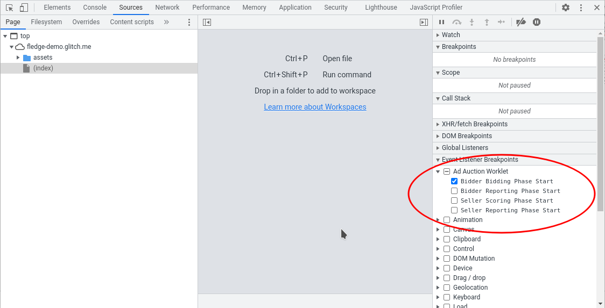
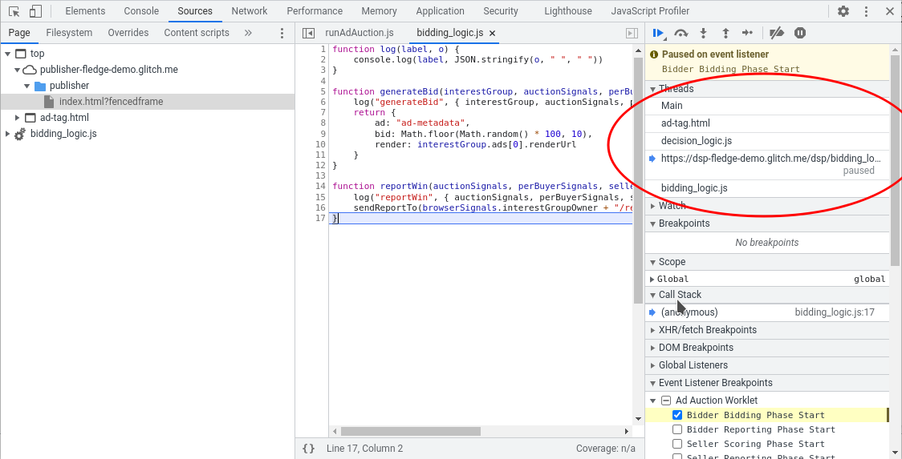

> FLEDGE has been renamed to Protected Audience API. To learn more about the name change, see the [blog post](https://privacysandbox.com/intl/en_us/news/protected-audience-api-our-new-name-for-fledge)

# Proposed First FLEDGE Origin Trial Details

## Summary

This document seeks to propose more details about a Chrome browser Origin Trial (OT) for the FLEDGE API. **These proposed details pertain to the first FLEDGE OT (FOT#1) and are not indicative of further OTs or of a shipping version of FLEDGE.**

## Intended Audience

This document is meant for those wishing to participate in the FOT#1, that is author web site components that call the FLEDGE APIs.

## Non-goals

This document is intended only to discuss FOT#1, and there are a number of important topics that are out of scope for this document that will be covered elsewhere:

-   This document does not propose changes to FLEDGE. That should be done by filing FLEDGE issues at [https://github.com/WICG/turtledove/issues](https://github.com/WICG/turtledove/issues)
-   This document does not propose a timeline for the FOT#1. Timelines for Privacy Sandbox proposals are located at [https://privacysandbox.com/timeline](https://privacysandbox.com/timeline)
-   This document does not pertain to future FLEDGE Origin Trials beyond the FOT#1 or shipping versions of FLEDGE.
-   This document does not propose or discuss user controls or transparency for FLEDGE that a browser might surface.
    

## Recommended Reading

To better understand the context of this document it’s recommended to review:

-   [The FLEDGE Explainer](https://github.com/WICG/turtledove/blob/main/FLEDGE.md)
-   [The Chrome Origin Trial Explainer](https://github.com/GoogleChrome/OriginTrials/blob/gh-pages/explainer.md)
-   [The Privacy Sandbox timeline](https://privacysandbox.com/timeline)
    

## Common Motivations

The [Details section](#details) below elaborates on which FLEDGE details are proposed to be included or not included in the FOT#1 and the motivation for these choices. It’s worth elaborating on some common motivations:

#### Promoting accurate measurement of FLEDGE effectiveness.

The first listed motivation for an OT is [“encouraging developers to try features and provide feedback”](https://github.com/GoogleChrome/OriginTrials/blob/gh-pages/explainer.md#a-sketch-of-a-solution). To try out an API like FLEDGE that is [”a privacy advancing API to facilitate interest group based advertising”](https://chromestatus.com/feature/5733583115255808), it’s critical to give developers the tools to accurately measure its effectiveness at facilitating interest group based advertising. In particular, requiring the use of related technologies, e.g. Fenced Frames, trusted key-value servers, or aggregate reporting, would require testers to distinguish between and debug differences in the new measurement and rendering technologies versus FLEDGE. To that end, it’s necessary to give developers a way to test FLEDGE separately from other experimental, under development, or not yet proven technologies, so that they can accurately measure FLEDGE and provide feedback based on these accurate measurements.

#### Availability of other technologies.
According to [privacysandbox.com/timeline](https://privacysandbox.com/timeline), certain other technologies have overlapping Testing periods with FLEDGE. In an effort to mitigate complexity and interdependence, we prefer to keep the various origin trials separate from each other. So our FOT#1 choices are intended to make it possible to experiment with FLEDGE without the need to simultaneously experiment with other Privacy Sandbox technologies. The plan is for future FLEDGE OTs to allow testing in combination with other Privacy Sandbox technologies, e.g., Fenced Frames.

## Details

#### High Level API

The FOT#1 will include functional `joinAdInterestGroup()`, `leaveAdInterestGroup()`, and `runAdAuction()` implementations as documented in the explainer. The browser will store and maintain the list of interest groups the user is a member of. The browser will load interest groups participating in on-device advertisement auctions, and execute the appropriate bidding and scoring worklets to select the winning advertisement.

  

The explainer indicates that sellers may invoke `runAdAuction()` with a config that specifies `'interestGroupBuyers': '*'` to let all Interest Groups participate. FOT#1 will not support this wildcard, and will instead require buyers to be listed explicitly. (This restriction is needed to avoid giving interest group owners information that they might not get without the API — for example, information about page visits where the interest group owner is not a participant in the conventional 3rd-party-cookie-based ad auction).

  

#### Reporting

As the FLEDGE explainer talks about, the FOT#1 will include event-level reporting for the winning bid. This includes executing the `reportWin()` and `reportResult()` worklets as documented in the explainer. Implementations of these worklets, provided by the buyer and seller in the auction, may call a `sendReportTo()` API which takes a single string argument representing a URL. The URL is fetched after the reporting worklet completes.

  

The FOT#1 will include event-level reporting for both winning and losing bids. Implementations of the `generateBid()` and `scoreAd()` worklets, provided by the buyers and sellers respectively in the auction, may call a `forDebuggingOnly.reportAdAuctionLoss()` API which takes a single string argument representing a URL. The text placeholders below will be replaced with the corresponding value from the auction when found in the reporting URL's query parameters (note that due to http://crbug.com/1338233, prior to Chrome version 107.0.5286.0, the replacements only took place in the path of the URL)

*   “${winningBid}” - The value of the winning bid.  In component auctions, this value comes from the component auction and not the top-level auction.
*   “${madeWinningBid}” - A boolean value representing whether the owner of this interest group made the winning bid, either via this interest group, or another interest group with the same owner.  In component auctions, this value comes from the component auction and not the top-level auction.
*   “${highestScoringOtherBid}” - The value of the bid  that was scored as second highest by the seller’s scoreAd script. Note that this may not be the second highest bid value, since scores and bids may be independent.  In component auctions, this value comes from the component auction and not the top-level auction.
*   “${madeHighestScoringOtherBid}” - A boolean value representing whether the owner of this interest group made the ${highestScoringOtherBid} bid, either via this interest group, or another interest group with the same owner.  In component auctions, this value comes from the component auction and not the top-level auction.
*   “${topLevelWinningBid}” - The value of the bid that won the top-level auction.  This value is only reported in component auctions.
*   “${topLevelMadeWinningBid}” - A boolean value representing whether the owner of this interest group made the bid that won the top-level auction, either via this interest group, or another interest group with the same owner. This value is only reported in component auctions.

If the bid being generated or scored loses the auction, the URL will be fetched. These worklets may also call a `forDebuggingOnly.reportAdAuctionWin()` API which operates similarly to `forDebuggingOnly.reportAdAuctionLoss()` API but only fetches the URL after a winning bid or score.

As of Chrome version 108, if a seller rejects a bid from participating in an auction, the seller can optionally add a `rejectReason` field to its `scoreAd()` return object to convey to the bidder a more detailed reason why the bid was rejected. The buyer can learn about the reject reason by calling the `forDebuggingOnly.reportAdAuctionLoss()` API in `generateBid()` and including `${rejectReason}` in the report URL's query string. A component auction's bidders only get reject reasons from its component seller, but not reject reasons from the top-level seller. The reject reason returned by `scoreAd()` should be one of:
*   "not-available"
*   "invalid-bid"
*   "bid-below-auction-floor"
*   "pending-approval-by-exchange"
*   "disapproved-by-exchange"
*   "blocked-by-publisher"
*   "language-exclusions"
*   "category-exclusions"

The default value will be "not-available", in cases where a bid was not rejected, it was rejected but the seller doesn't provide a reject reason, or the reason provided wasn't one of the above values.

The FOT#1 will not include aggregate auction result reporting support for FLEDGE auctions. This is due to motivations relating to [promoting accurate measurement](#promoting-accurate-measurement-of-fledge-effectiveness.) and [availability of aggregate reporting technologies](#availability-of-other-technologies.). As discussed above, event-level reporting will be provided to winning and losing bids during the FOT#1. We’ll look to add support for aggregate reporting in a future version.

#### Trusted Signals

The FOT#1 will include browser support for fetching trusted bidding and scoring signals as documented in the explainer. These signals are fetched prior to the corresponding bidding or scoring worklet being executed; the fetched signals are then passed into the corresponding worklet.

  

The FOT#1 follows a “Bring Your Own Server” (BYOS) model as the FLEDGE explainer talks about: [“As a temporary mechanism during the First Experiment timeframe, the buyer and seller can fetch these bidding signals from any server, including one they operate themselves (a "Bring Your Own Server" model).”](https://github.com/WICG/turtledove/blob/main/FLEDGE.md#31-fetching-real-time-data-from-a-trusted-server) Allowing a BYOS model initially helps [promote accurate measurement](#promoting-accurate-measurement-of-fledge-effectiveness.) by not conflating FLEDGE performance with complexities of operating a trusted server, and is due to availability of accepted server trust technologies.

#### Interest Group Updating

The FOT#1 will include a manual interest group update API, `navigator.updateAdInterestGroups()` that updates interest groups owned by the calling frame that haven’t been updated in the last 24 hours. This updating will be done using the interest group’s `dailyUpdateUrl` setting as the explainer discusses.

  

The FOT#1 will also include a mechanism to update interest groups that have just had the chance to participate in an auction initiated by `navigator.runAdAuction()`. The updating will happen shortly after the auction and will update interest groups that haven’t been updated in the last 24 hours. This updating will be done using the interest group’s `dailyUpdateUrl` setting as the explainer discusses.

  

The FOT#1 will not include a periodic background interest group update mechanism.

#### Advertisement Rendering

The FOT#1 will include an implementation of `navigator.runAdAuction()` that returns Promises that resolve to URLs that are opaque to the caller, as the explainer discusses.

  

The FOT#1 will include temporary support for rendering these opaque URLs in iframes. This [promotes accurate measurement](#promoting-accurate-measurement-of-fledge-effectiveness.) by not conflating FLEDGE performance with Fenced Frame rendering differences.

  

In the FOT#1, rendering these opaque URLs only in Fenced Frames will temporarily not be required, and they can instead be rendered in iframes as mentioned above. When [Fenced Frames are available for testing](#availability-of-other-technologies.), these opaque URLs will be renderable in Fenced Frames. At a later date, the ability to render opaque URLs in iframes will be removed.

  

The FOT#1 will include temporary support for `navigator.deprecatedURNToURL(urn, sendReports)`, a method that takes as an argument an opaque URL resolved from a Promise returned from `navigator.runAdAuction()` and returns the URL of the auction winning ad creative. If `sendReports` is true, reports will be sent just as if the URN were loaded in a frame. Note that the `sendReports` parameter is only respected in Chrome since versions 109.0.5414.16 and 110.0.5433.0. This is included to [promote accurate measurement](#promoting-accurate-measurement-of-fledge-effectiveness.) and comparison of FLEDGE API utility by allowing auction winning URLs to be treated and used as they are in today’s ad auctions.

#### Permissions-Policy

The FOT#1 will include support for two Permissions-Policy strings: `join-ad-interest-group` and `run-ad-auction`. `join-ad-interest-group` controls access to APIs `navigator.joinAdInterestGroup()`, `navigator.updateAdInterestGroups()` and `navigator.leaveAdInterestGroup()`. `run-ad-auction` controls access to the `navigator.runAdAuction()` API. The APIs are only accessible if the corresponding Permission-Policy is enabled.

For the FOT#1, the [default allowlists](https://w3c.github.io/webappsec-permissions-policy/#default-allowlist) of the two features are temporarily `'*'`. This allows usage of FLEDGE APIs in documents in top-level browsing contexts by default, and when allowed, in child browsing contexts by default as well. Having the temporary default of `'*'` in the FOT#1 allows developers to try out the FLEDGE APIs at a time when iframe allowlists may not have had a chance to include the FLEDGE Permission-Policies yet. As the FLEDGE explainer says, the intention is eventually having the default allowlist set to `'self'`, to disable access by default in cross-site iframes. During the FOT#1, use of the FLEDGE APIs in cross-site iframes without explicitly allowing them via the corresponding Permission-Policies will trigger a Chrome Developer tools JavaScript console warning message to help facilitate adding the appropriate Permission-Policy.

The two Permissions-Policies can be enabled/disabled separately.

Access to FLEDGE APIs can be disabled completely in first-party contexts by specifying the permissions policy in an HTTP response header:

`Permissions-Policy: join-ad-interest-group=(), run-ad-auction=()`

Usage in iframe can be disabled by adding the allow="join-ad-interest-group 'none'" attribute to an iframe element:

`<iframe src="https://example.com" allow="join-ad-interest-group 'none'; run-ad-auction 'none'"></iframe>`

The FOT#1 also supports, since Chrome version 104, delegating interest group access via a .well-known URL as the explainer describes.

#### K-anonymity Enforcement

The FOT#1 will not include enforcement of k-anonymity thresholds. This is done for three reasons:

1.  To accurately measure the effects of k-anonymity enforcement, the values that have been talked about for k ([the explainer mentions 100](https://github.com/WICG/turtledove/blob/main/FLEDGE.md#12-interest-group-attributes)) would need to be scaled down as [Origin Trials are limited to small slivers of the total population](https://github.com/GoogleChrome/OriginTrials/blob/gh-pages/explainer.md#a-sketch-of-a-solution) like 1%. Scaling 100 by 1% would mean a k value of 1 which doesn’t require enforcement.
    
2.  Enforcing k-anonymity requires a server to privately calculate the number of users in each interest group and who have been shown an ad. Doing this privately may require relying on some of the aggregation server primitives which [may not be available at the time of the FOT#1](#availability-of-other-technologies.).
    
3.  Participants in the FLEDGE Origin Trial can count how many people are placed in interest groups or shown ads to measure the implications of the FLEDGE API’s k-anonymity requirements without the browser yet enforcing these requirements. We’ve seen folks involved in the FLEDGE API’s design already measuring effects of the k-anonymity requirements before the Origin Trial has even begun, e.g. see “audience threshold” analysis [here](https://github.com/WICG/turtledove/blob/main/PRODUCT_LEVEL.md#impact-on-core-metrics).
    

#### Mobile Devices

The FOT#1 will only run on desktop computers. Mobile devices offer an order of magnitude less computational and storage resources when compared to desktop devices. Storing, loading, parsing, compiling and executing the JavaScript bidding and scoring worklets is slowed down by the fewer available resources. The Chrome team continues to investigate and improve FLEDGE performance on mobile devices, but has decided to not include these devices in the FOT#1 until this work has progressed further.

#### Debugging

For the FOT#1, Chrome’s Developer tools panel will support setting breakpoints in worklets. These breakpoints can be set via a new category in the event listeners panel:

  

When the breakpoint triggers, the worklet will be paused before the first statement of the top-level of the worklet script. At this point regular breakpoints or step commands can be used to get to the bidding/scoring/reporting functions themselves.

  

Live worklet scripts will also show up under the Threads panel:

Since some worklets may run in parallel, multiple threads may end up in the "paused" state there; the thread list can be used to switch between them and resume or inspect them more closely as appropriate.

  

The FOT#1 will support FLEDGE bidder and seller worklets calling [console.log()](https://developer.mozilla.org/en-US/docs/Web/API/Console/log) and having these logging messages appear in the Chrome Developer tools JavaScript console log.

#### Ads Composed of Multiple Pieces (Product-level Ads)

The FOT#1 will support ads composed of multiple pieces, also known as product-level ads. The ad components can be specified in interest group’s `adComponents` field and `generateBid()`’s `adComponents` output. The frame rendering the ad can access the components via the `navigator.adAuctionComponents()` method. This is described in [section 3.4 of the explainer](https://github.com/WICG/turtledove/blob/main/FLEDGE.md#34-ads-composed-of-multiple-pieces).

#### Multi-seller/SSP Auctions

The plan is for the FOT#1 to include support for multi-seller/SSP auctions. This support has been proposed and discussed in multiple WICG FLEDGE calls and in FLEDGE github issues #59, #73 and #202. As per the latest discussion, the auction configuration passed to `navigator.runAdAuction()` can contain auction configurations for each seller/SSP.

#### Flags to mimic these details

To make Chrome’s FLEDGE implementation function as described in this document, use a very recent version of Chrome, e.g. Chrome Canary, and pass this parameter to Chrome on the command line:

`--enable-features=InterestGroupStorage,AdInterestGroupAPI,Fledge,AllowURNsInIframes,BiddingAndScoringDebugReportingAPI`

#### Privacy Limitations of FOT#1

Unlike third-party cookies which are readable across sites, FLEDGE intends to keep interest group information from being exposed to sites. For example this is why there is no `navigator.getAdInterestGroups()` API. FLEDGE worklets, which can read individual interest groups, are isolated and cannot access the network, access storage or `postMessage()` to other contexts. As this document discusses, FOT#1 will not initially enable all of the isolation and privacy controls in order to ease developer testing. Over time, these privacy protections will be added as we introduce new releases. To protect user privacy and honor user choice, we will not enable FOT#1 for users that have disabled 3rd party cookies. We anticipate that this will also help ad-techs to more realistically compare their existing ad selection methods relying on third-party cookie availability.
