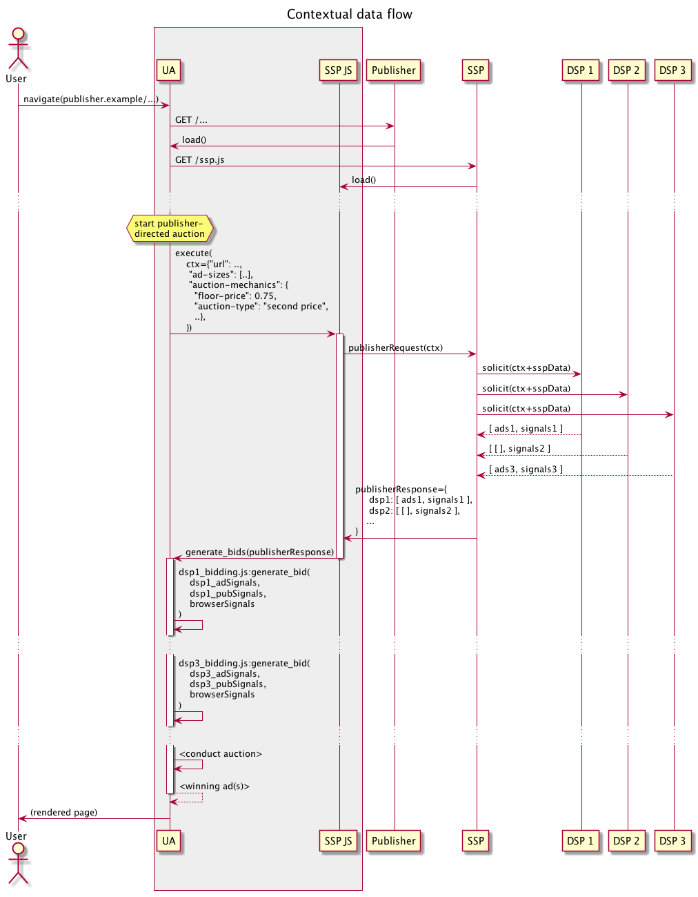

# TERN
TURTLEDOVE Enhancements with Reduced Networking

----------------

## Table of Contents

- [Introduction](#introduction)
- [Operating Principles](#operating-principles)
- [Authors](#authors)
- [Stakeholder Feedback / Opposition](#stakeholder-feedback--opposition)
- [Definitions](#definitions)
- [0. Before Advertising Begins](#0-before-advertising-begins)
- [1. On the Advertiser's Site](#1-on-the-advertisers-site)
  - [a. Faster delivery of ads](#a-faster-delivery-of-ads)
  - [b. Elimination of minimum interest group sizes](#b-elimination-of-minimum-interest-group-sizes)
  - [c. Reduced networking](#c-reduced-networking)
  - [d. Writing multiple interest groups](#d-writing-multiple-interest-groups)
  - [e. Multiple ad formats](#e-multiple-ad-formats)
  - [f. Ad categories](#f-ad-categories)
  - [g. SSP tokens](#g-ssp-tokens)
    - [i. Pre-approval](#i-pre-approval)
    - [ii. Delayed-approval](#ii-delayed-approval)
  - [h. Products](#h-products)
  - [i. More refined bidding signals and reporting signals](#i-more-refined-bidding-signals-and-reporting-signals)
  - [j. DSPs control bidding](#j-dsps-control-bidding)
  - [k. Preserving third-party tag functionality](#k-preserving-third-party-tag-functionality)
- [2. In the Background](#2-in-the-background)
  - [a. Download ad web bundles](#b-download-ad-web-bundles)
  - [b. Fetch ads request](#c-fetch-ads-request)
  - [c. Reporting](#d-reporting)
- [3. Publisher Data](#3-publisher-data)
  - [a. The publisher/contextual request](#a-the-publishercontextual-request)
  - [b. The SSP](#b-the-ssp)
  - [c. Contextual interest groups](#c-contextual-interest-groups)
- [4. Browser Signals](#4-browser-signals)
  - [a. Recency](#a-recency)
  - [b. Frequencies](#b-frequencies)
  - [c. Impression Recencies](#c-impression-recencies)
- [5. Generating Bids](#5-generating-bids)
- [6. The Auction](#6-the-auction)
  - [a. Triggering the auction](#a-triggering-the-auction)
  - [b. Thoughts on dynamics and privacy](#b-thoughts-on-dynamics-and-privacy)
- [7. Rendering the Ad](#7-rendering-the-ad)
- [Considered Alternatives](#considered-alternatives)
  - [a. TURTLEDOVE](#a-turtledove)
  - [b. Product-level Turtledove](#b-product-level-turtledove)
  - [c. Outcome-based Turtledove](#c-outcome-based-turtledove)
  - [d. SPARROW](#d-sparrow)
  - [e. PARRROT](#e-parrrot)
  - [f. Dovekey](#f-dovekey)
  - [g. FLoC](#g-floc)
- [FAQ](#faq)
  - [a. Where does machine learning fit in?](#a-where-does-machine-learning-fit-in)
  - [b. How do I apply frequency caps or optimization?](#b-how-do-i-apply-frequency-caps-or-optimization)
  - [c. How does advertiser brand safety work?](#c-how-does-advertiser-brand-safety-work)
  - [d. Publisher FAQ](#d-publisher-faq)
    - [i. Brand Safety](#i-brand-safety)
    - [ii. Publisher Fulfillment](#ii-publisher-fulfillment)
    - [iii. Publisher Floors](#iii-publisher-floors)
    - [iv. Competitors in Different Slots](#iv-competitors-in-different-slots)
    - [v. Price Adjustments](#v-price-adjustments)
    - [vi. Regulatory Requirements](#vi-regulatory-requirements)
- [Summary of needed platform features](#Summary-of-needed-platform-features)
  - [a. Permissioned siloed shareable objects](#a-permissioned-siloed-shareable-objects)
  - [b. writeAdvertisementData()](#b-writeadvertisementdata)
  - [c. Awareness of interest-based advertisement objects](#c-awareness-of-interest-based-advertisement-objects)
  - [d. matchingAdvertisements()](#d-matchingadvertisements)
  - [e. runDecisionLogic()](#e-rundecisionlogic)
  - [f. activateSandbox()](#f-activatesandbox)
  - [g. render()](#g-render)
  - [h. Background ad bundle fetching](#h-background-ad-bundle-fetching)
  - [i. Background interest group ad fetching](#i-background-interest-group-ad-fetching)
  - [j. Background reporting](#j-background-reporting)
  - [k. Verified content rendering](#k-verified-content-rendering)

----------------

## Introduction

The purpose of this document is to capture a variety of GitHub issues and repos that seek to alter
the main [TURTLEDOVE](https://github.com/WICG/turtledove) proposal. By collating industry experience
and feedback into a single document containing a more complete specification, we believe that more
productive discussion will ensue, and that these consensus-based enhancements will more easily be
applied to the original proposal.

We intend to enhance TURTLEDOVE in the following privacy-preserving ways:

- Clarifying the necessary inputs to participate in an auction
- Clarifying how to deal with multiple ad formats
- Reducing networking overhead by streamlining the data which flows through SSPs
- Eliminating the need for thresholds on interest group sizes
- Reducing the time to potentially deliver an impression
- Better supporting dynamic creative and product recommendation use cases
- Supporting some functionality of third-party tags
- Further specifying auditability of delivered ad creatives
- Enabling brand safety for both advertisers and publishers
- Creating a mechanism for trackability metrics
- Adding a `privateData` object that can never escape the browser, but improve bidding signals (among potential other use cases)
- Specifying a mechanism to support creating interest groups based on publisher browsing behavior
- Allowing publishers to retain control of auction dynamics, while encouraging second-price auctions
- Specifying frequency capping and optimization
- A monosyllabic acronym that is still thematically avian

These ideas are drawn from many authors. Inspiration is taken from discussions in:

- [TURTLEDOVE](https://github.com/WICG/turtledove/)
- [TURTLEDOVE Issue #5 - Ad Signals in the auction and group membership](https://github.com/WICG/turtledove/issues/5)
- [TURTLEDOVE Issue #36 - Dynamic Creative Use Case](https://github.com/WICG/turtledove/issues/36)
- [TURTLEDOVE Issue #37 - Clarification on Entities](https://github.com/WICG/turtledove/issues/37)
- [TURTLEDOVE Issue #38 - Contextual Bid](https://github.com/WICG/turtledove/issues/38)
- [TURTLEDOVE Issue #46 - Limit on Number of Interest Groups / Web Bundles](https://github.com/WICG/turtledove/issues/46)
- [Product-level Turtledove](https://github.com/jonasz/product_level_turtledove)
- [Outcome-based Turtledove](https://github.com/jonasz/outcome_based_turtledove)
- [Frequency Capping and Optimization](https://github.com/W3C/web-advertising/blob/master/frequency-capping-and-optimization.md)
- [PARRROT](https://github.com/prebid/identity-gatekeeper/blob/master/proposals/PARRROT.md)
- [FLoC](https://github.com/jkarlin/floc)
- [TERN Issue #2 - SSP creative review needs to support per-publisher restrictions](https://github.com/AdRoll/TERN/issues/2)

Reading through the original TURTLEDOVE proposal is a prerequisite to understanding this document.

----------------

## Operating Principles

While writing this proposal and thinking through the technical problems herein, we kept three principles
in mind:

1. Lacking an agreed-upon problem statement, we took it as a constraint that we don't want any third party
having access to users' general browsing patterns on the web as a whole.
2. Given this constraint, and only this constraint, how can we maximize and retain the functionality that
currently exists for the ad tech industry today?
3. Since each browser vendor is the ultimate arbiter of what happens in the browser, and this proposal is
modeled after [TURTLEDOVE](https://github.com/WICG/turtledove/), we are trying to stay close to the nature
of TURTLEDOVE as originally proposed.

We aim to be accepting to GitHub issues, PRs, or other proposed changes that fall under this set of
principles.

----------------

## Authors

- [Andrew Pascoe](https://github.com/appascoe)
- [Valentino Volonghi](https://github.com/dialtone)
- [Mike Watters](https://github.com/zerth)

If you would like to contribute, please feel free to open a PR. Our preference is to make
this a dynamic document to build consensus.

----------------

## Stakeholder Feedback / Opposition

This section summarizes stakeholder sentiment and any feedback; link each to most recent discussion
or outcome.

| Stakeholder | Sentiment | Discussion      |
| ----------- | --------- | --------------- |
| NextRoll    | In favor  | (this document) |

----------------

## Definitions

Many of the examples and diagrams in this document presume a world in which DSP, SSP, and publisher
entities exist largely as they do now, but the platform features we propose do not specifically
require this arrangement.  Here are the major entities described in this document:

### Advertiser

An entity desiring to advertise some specific product, service, and so on.

### Publisher

A seller of advertising space.  May sometimes sell directly to advertisers.  Selling is often
mediated by a collection of SSPs.

### DSP

[Demand-side platform](https://en.wikipedia.org/wiki/Demand-side_platform); a buyer of advertising
space.  Clients are advertisers.  A DSP buys ad space on behalf of its advertiser clients.  The
buying is often mediated by SSPs.

### SSP

[Supply-side platform](https://en.wikipedia.org/wiki/Supply-side_platform); to DSPs, a seller of
access to publisher advertising space.  To publishers, a seller of access to buyers such as DSPs.
Curates both sides of the marketplace and conducts auctions or other business logic to complete
transactions.

### Owner

As in TURTLEDOVE, an `owner` is responsible for managing interest groups.  While it may sometimes
be an individual advertiser, we expect most advertisers will delegate ownership to DSPs.

An owner must provide a `.well-known/fetch-ads` endpoint as described in [c. Fetch ads
request](#c-fetch-ads-request), as well as
bidding logic when participating in publisher/SSP ecosystem auctions (with special platform support
as described below).

### Reader

In TURTLEDOVE a `reader` is responsible for answering uncorrelated interest-group requests,
returning an ad and metadata for later use.

In TERN a `reader` is only able to trigger interest group ad candidate production for each `owner`
for which it is a reader.  Unlike in TURTLEDOVE, a reader in TERN can't directly perceive an
owner's groups (only ads associated with them in an auction), and is not responsible for selecting
ads relevant to an interest group.

----------------

## 0. Before Advertising Begins

[Outcome-based Turtledove](https://github.com/jonasz/outcome_based_turtledove) suggests a mechanism
for SSPs to audit ads before they are delivered. While a bit more complex than described here, it
essentially boils down to the proposal that an ad must _attempt_ to reach a sufficient number of users
before it can be shown. Unfortunately, this will have drastically deleterious effects for smaller
advertisers and merchants.

Consider, for example, a local pizza shop attempting to advertise through a platform like Yelp. This
is a situation where advertising may be very effective to drive a user to conversion, particularly
if there are discounts on the table. However, being a local business, it is unlikely to reach a
particularly large audience. If there are time-sensitive offers or products available, the shop may
not even be able to reach the threshold before the offer has expired.

In lieu of this, we propose an optional auditing mechanism that is more in line with how creative
review operates today.


An SSP can offer an endpoint:

```
https://ssp.example/ad-review
```

where a DSP can provide an object of the sort:

```
{
  'advertiser': 'https://advertiser.example',
  'dsp': 'https://dsp.example',
  'name': 'ad-123456789',
  'ad-cbor-url': 'https://dsp.example/ads/ad-123456789.wbn',
  'categories': ['cat1', 'cat2', 'cat3'],
  'formats': ['1024x768', '512x384']
}
```

This gives the SSP an opportunity to review the content of the ad, confirm that it belongs to
the declared advertiser, and adheres to its declared categories (for brand safety), etc.
Once review is completed, the DSP can query:

```
https://ssp.example/check-review
```

with

```
{
  'name': 'ad-123456789'
}
```

and receive back

```
{
  'token': 'review-token-123879',
  'categories': ['cat4', 'cat5']
}
```

The DSP can associate this response with its advertisements and make it available for later use by
the SSP to enforce that creative review and validation occurred before display. If a DSP has a good
relationship with an SSP (for example, by having its own creative review process that is robust
enough to the SSP's standards), the SSP could also immediately provide a review token on the first
request without a need for the DSP to follow up on the `/check-review` endpoint. This trusted
pre-approval is how creative review processes tend to function today.

The `categories` allow an SSP to inject its own set of categories for the ad which can be used to
enforce per-publisher creative restrictions that the SSP is responsible for managing.  This field
can be an empty list `[]`.  Note that the DSP and SSP can each provide their own distinct
`categories` values.  The SSP can later read the DSP's `categories` in other contexts if allowed to
do so as a `reader` (as described elsewhere).

Perhaps the review token could be computed as something like (we'll talk more about this later):

```
content-hash = hash(ad-content),size(ad-content)

review-token = content-hash +
    sign(ssp_secret_key, hash(dsp, ad-cbor-url, <dsp>categories, <ssp>categories, content-hash))
```

By including the `ad-content` here, we ensure that the DSP cannot change the images or behavior of
the creative to something else after approval.

We believe this will ensure bad actors are audited and removed from the online ad ecosystem while
also keeping the wheels oiled for trustworthy players.

----------------

## 1. On the Advertiser's Site

When a browser lands on an advertiser's site, it represents an opportunity to store private
information in the browser about interest groups and any related ads (possibly for multiple
advertisers) relevant to the user.  The advertiser can initiate a call to some script (such as one
provided by the DSP to which it has delegated responsibility) to achieve this.


The browser exposes an API:

```.writeAdvertisementData(input)```

The advertiser or DSP script produces an `input` of the form:

```
{
  'owner': 'https://dsp.example',
  'advertiser': 'https://advertiser.example',
  'readers': {'https://ssp-1.example': ['categories', 'ssp-1', 'content-hash'],
              'https://ssp-2.example': ['categories', 'ssp-2', 'content-hash']},
  'groups': { 'interest-group-1': duration1,
              'interest-group-2': duration2 },
  'third-parties': {'https://third-party-1.example': 'https://third-party-1.example/js/metrics.js',
                    'https://third-party-2.example': 'https://third-party-2.example/js/metrics.js'},
  'decision-logic-url': 'https://dsp.example/js/bidding.js',
  'ads': [{'name': 'ad-123456789',
           'formats': [{ 'aspect_ratio': '16:9',
                         'min_height': 400,
                         'max_height': 800 }],
           'ad-cbor-url': 'https://dsp.example/ads/ad-123456789.wbn',
           'content-hash': 'd41d8cd98f00b204e9800998ecf8427e,262144',
           'ssp-1': {'token': 'review-token-12345',
                     'categories': ['ssp-cat1', 'ssp-cat2']},
           'categories': ['cat1', 'cat2', 'cat3'],
           'cache-lifetime-secs': 21600,
           'max-times-per-minute': 1,
           'max-times-per-hour': 6,
           'products': {'product-id-1': 'https://dsp.example/products/product-id-1.wbn',
                        'product-id-2': 'https://dsp.example/products/product-id-2.wbn'},
           'privateData': { ... } },
          {'name': 'ad-987654321',
           'formats': ['1024x768', '512x384'],
           'ad-cbor-url': 'https://dsp.example/ads/ad-987654321.wbn',
           'content-hash': 'dbb56e1ce1ed8d4605426e8e096c1f0e,123456',
           'ssp-1': {'token': 'review-token-54321',
                     'categories': ['ssp-cat3']},
           'ssp-2': {'token': 'review-token-09876',
                     'categories': []},
           'categories': ['cat4', 'cat5'],
           'cache-lifetime-secs': 86400,
           'max-times-per-minute': 1,
           'max-times-per-hour': 12,
           'products': {'product-id-3': 'https://dsp.example/products/product-id-3.wbn',
                        'product-id-4': 'https://dsp.example/products/product-id-4.wbn'},
           'privateData': { ... } }]
}
```

As in TURTLEDOVE, the executing origin must match `owner` for this call to succeed.  (For the DSP
case, a helper iframe could be used.)

The browser should record whether `.writeAdvertisementData(input)` accepts this object. There may
be instances where the user is willing to accept first-party data from the advertiser, or
advertising from other advertisers managed by the owner, but rejects advertising for this
particular advertiser. The browser can report whether it accepted advertising from this advertiser
through the [Aggregate Reporting API](https://github.com/csharrison/aggregate-reporting-api).
Receiving this feedback in an aggregate report will allow advertisers and DSPs to track metrics on
trackability.  Advertisers frequently require some high-level metrics on how many of their users
are reachable in order to plan for budgeting and the like.

This object is significantly more complex than what is required in the `.joinAdInterestGroup()`
call in TURTLEDOVE, but it is not without cause. We list the reasons for each component
below. However, after receiving the object, the browser proceeds to act as largely described in
TURTLEDOVE: it adds the browser to all of the interest groups in the object (for auditing by the
user and the potential follow-up [interest group
requests](#c-fetch-ads-request) later),
caches what it needs from the ad and product web bundles, and so on.

We propose that these objects be namespaced by the value of `(owner, advertiser)`. Browsers are
going to have natural limits on the amount of storage the user is willing to tolerate; these issues
are discussed further in [TURTLEDOVE Issue #46 - Limit on Number of Interest Groups / Web
Bundles](https://github.com/WICG/turtledove/issues/46). In the event of reaching some global or
per-`owner` limit, the browser could apply some fair eviction policy which properly balances these
storage concerns.

While it may have been intended in TURTLEDOVE, we make explicit here that _the_ `'advertiser'` _field value
does not need to match the current site_. Advertisers will enter into co-ops that permit them to target
each other's users. For example, a pet _food_ store may wish to cross-target with a pet _toy_ store.
Knowing that a user is browsing cat food implies that they may be interested in cat toys, and vice versa.
Note that this is not a violation of privacy: the identity of the user isn't disclosed to a third party.
It only provides an opportunity for the third party to have a more effective upper funnel campaign than
may be available through contextual targeting alone.

We expect the `ads` value to have some industry-standard form (e.g., defined via IAB specs), and to
be largely opaque to the browser, but that the browser may have or gain awareness of specific
fields as part of some future improvement.

The browser could apply a policy decision (e.g., based on the outcome of a periodic privacy or W3C
compliance audit of `owner`) as to whether to accept `ads` outside of an uncorrelated interest
group request context, which could greatly reduce traffic for many participants, while still
potentially allowing participation without the permission of a gatekeeping entity.

The `'readers'` value is similar to the same-named field in TURTLEDOVE, but each `reader` has a
different role than in TURTLEDOVE.  Here, we are specifying which reader origins (SSPs) may access
which fields of interest-based advertisement objects created by `owner`.  This is further explained
in [c. Awareness of interest-based advertisement
objects](#c-awareness-of-interest-based-advertisement-objects).

### a. Faster delivery of ads

We combine writing interest groups along with the web bundles for ads. This means that, in principle,
ads can be delivered nearly immediately after browsing away from the site.


Recency is an important factor in the efficacy of ads. At NextRoll, we see that ad requests that
come ten minutes after the browser has been on the site produce bids (roughly corresponding to
utility) that are ~40% lower than requests that come one minute after the browser has visited the
site. TURTLEDOVE suggests a later interest group request as much as four hours after being added to
an interest group (losing ~70% of the utility as shown in the above graph). We expect that this
would dangerously decrease publisher revenues.

### b. Elimination of minimum interest group sizes

Also by combining interest groups with ad web bundles, we no longer need to worry about minimum
sizes for interest groups at this stage. Since the browser is on the advertiser's site, its set of
interest groups already can be known in full to the advertiser through first-party cookies, and
thus there is no reduction in privacy.  Microtargeted interest groups are mitigated by opaque
sandboxed rendering and ARAPI.

This is a critical feature for small advertisers and merchants, and also for advertisers that
wish to perform product recommendation for rare or highly specific products. Refer to [section 0](#0-before-advertising-begins)
for a descriptive example of such an advertiser. A discussion is covered in [TURTLEDOVE Issue #36](https://github.com/WICG/turtledove/issues/36).

### c. Reduced networking

With well-behaved participants, there's no particular need for the browser to make follow-up calls
when it's already on the advertiser's site. We anticipate one follow-up call in the case of an
advertiser delegating interest group management to a DSP. This should reduce the amount of
background network calls the browser will need to make. (However, we will still maintain some
interest group request, as described below, but this can be optional and much less frequent.)

### d. Writing multiple interest groups

Rather than writing one interest group at a time, we can write multiple. Accordingly, each needs to
have its own TTL specified (as a duration). We expect the browser to record the current time the
user was added to an interest group and to make available a value derived from that (recency) as
described later in this document.  (Time zone note: as we only provide a duration, the browser can
use any time zone as long as its use is consistent.)

TURTLEDOVE appears to allow multiple interest groups to be added to the browser, but it seems to
require multiple calls to `.joinAdInterestGroup()`. This is unnecessary.

### e. Multiple ad formats

Similarly, we also write multiple ad web bundles at a time and allow specifying the sizes (and/or
aspect ratios) at which an ad bundle knows how to render itself. This is necessary because we do
not know the size of ad slots that will later be up for auction on a publisher's site. When it
comes time to perform the on-device auction, we can eliminate the evaluation of ads that are not
compatibly sized.  If the browser itself has or gains awareness of the ad formats being auctioned
(e.g., IAB standard ad units), it could quickly do this itself.

We also note here that the `ads` object can be an empty list `[]`. It is possible that a campaign
or set of ads have not yet been created in order to target a set of interest groups. Ads can also
be provided later during the fetch ads request [described
below](#2-in-the-background) as in
TURTLEDOVE.

### f. Ad categories

As part of the optional validation process described in [section
0](#0-before-advertising-begins), ads may
declare their categories so publishers can decide whether they would want such an ad on their
site. However, publishers need to trust that the declared categories are not a lie. This is the
purpose of the SSP review tokens. SSPs are also able to provide their own list of categories for
each creative, which enables a tighter integration of publisher brand safety between the publisher
and SSP.  The browser itself can remain mostly unaware of this validation concept.

### g. SSP tokens

During [section 0](#0-before-advertising-begins),
we described a mechanism through which SSPs can perform a validation process for
creatives. As the market functions today, there are two ways of doing this: with a pre-approval
process, and approving some time after the first bid is made (delayed-approval). We consider both
options here:

#### i. Pre-approval

We stated earlier that the SSP provides a token to the DSP of the sort:

```
review-token = content-hash +
    sign(ssp_secret_key, hash(dsp, ad-cbor-url, <dsp>categories, <ssp>categories, content-hash))
```

During a later SSP-controlled auction, its script running in the browser can read its own review
token from DSP-provided metadata, plus the `content-hash` property, and compute:

```
expected-hash = hash(dsp, ad-cbor-url, <dsp>categories, <ssp>categories, content-hash)
```

and verify this hash against the signed review token using an `ssp_public_key` bundled with the SSP
script.

The auction can then select winning advertisements only after validating their review tokens (and
applying brand safety checks, etc).

Later, the SSP/publisher can use a new browser facility (described in [k. Verified content
rendering](#k-verified-content-rendering))
for content-validated rendering of web bundles; e.g,. create

```
<fenced-iframe src="http://dsp.example/ads/ad-123456789.wbn",
               content-digest="d41d8cd98f00b204e9800998ecf8427e",
               content-size="262144"/>
```

which will only be rendered if the digest and size of the bundle content match the declared
attributes.

If the content does not match, the ad will not display; this incentivizes good behavior among all
participants claiming use of a creative review process.

Note that in this scheme, only the SSP has to download the content before this validation check
(this is why the `ad-content` is part of the hash on the SSP's side). In the end, the SSP can set
its own review policy, token format, and so on.

#### ii. Delayed-approval

In a delayed-approval situation, the DSP has a relationship with the SSP that allows their ads to
be run without an in-depth initial creative review before display. In this case, the SSP needs the
ability to revoke prior automatic approvals.

This can be achieved by including a time component in the review token, and requiring that DSPs
refresh tokens periodically to maintain approval status.  The time component should be shorter than
that of a normal pre-approval, but longer than any periodic `fetch-ads` refresh interval performed
by browsers.

Otherwise, to avoid violating user privacy an additional platform facility would be needed to
support revocation of prior review tokens.

### h. Products

We incorporate a set of product IDs with their associated web bundles a la [Product-level Turtledove](https://github.com/jonasz/product_level_turtledove).
These are at the ad level because different creatives may want to incorporate different product sets.
This element of the object is optional if delivering a static ad.

TURTLEDOVE doesn't appear to support dynamic creative out of the box, and this addition either
actually provides a mechanism, or makes it explicit.

### i. More refined bidding signals and reporting signals

We also incorporate a `privateData` object a la [Outcome-based Turtledove](https://github.com/jonasz/outcome_based_turtledove).
Note that Outcome-based Turtledove calls this object `userSignals`. We think this element can be used
for a variety of signals that we wouldn't want to escape from the browser that can be used in the
bidding function, perhaps not even necessarily related to the user. Examples include metadata about the campaign,
advertiser, or the ad itself. This is also a good place to add additional metadata not just for the
bidding function, but to feed into the [Aggregate Reporting API](https://github.com/csharrison/aggregate-reporting-api).
The `privateData` object can also contain information to remove the ad from contention if an
interest group expires due to its TTL.

An explicit example of a `privateData` field could be `bucketed-probability`, which, through the
Aggregate Reporting API, could help make sure enough users are added to the bucket and provide
a feedback signal to DSPs that their models are well-calibrated for advertising in the wild, rather
than just relying on holdout test datasets.

### j. DSPs control bidding

A clearer distinction between SSP and DSP, which TURTLEDOVE lacks. This will be important later
for reducing networking, but as seen here, the `bidding.js` file is provided by the DSP. Many DSPs prefer
to control their own bidding logic; if necessary, an SSP that also sometimes functions as a DSP can simply
repeat the SSP's URLs in the DSP fields.

For sophisticated DSPs, the primary benefit of SSPs is the management of publisher networks, not collecting user signals
or providing bidding algorithms. A discussion on this topic occurs in [TURTLEDOVE Issue #37 - Clarification on Entities](https://github.com/WICG/turtledove/issues/37).

### k. Preserving third-party tag functionality

TURTLEDOVE does not have a mechanism for third-party tags, such as impression beacons, to be attached
to ads. Of course, granular impression beacons are off the table in order to maintain privacy, but we
should find some way of preserving aggregate data for third parties; it's important for auditing and
providing some choice on the market for advertisers who may want to use analytics tools that are
separate from the SSP and DSP responsible for showing impressions.

We suggest that the reporting metrics specified by a third-party script can be used in the Aggregate
Reporting API (ARAPI), but in a separate storage than what the DSP or SSP may want to track. ARAPI
would then function as usual, just with these new third-party entities as additional consumers of reports.
This is really nothing more than an additional namespace.

This is more apropos to ARAPI, but we include it here for convenience and completeness. ARAPI currently
specifies as an example:

```
const entryHandle = window.writeOnlyReport.get('campaign-123');
entryHandle.set('country', 'usa');
entryHandle.append('visits', '1');
entryHandle.reportAfter(2 * kMsecPerDay);
entryHandle.expireAfter(7 * kMsecPerDay);
```

which would then later generate a report like:

```
{
  'entryName': 'campaign-123',
  'country': 'usa',
  'visits': '1'
}
```

ARAPI does not clearly specify to whom this report would be sent, but we presume it would be sent
to the DSP and SSP in an encrypted format, to be aggregated and decrypted by a helper service, as
discussed in the [Multi-Browser Aggregation Service Explainer](https://github.com/WICG/conversion-measurement-api/blob/master/SERVICE.md).
We suggest a minor change to ARAPI that declares who's performing the in-browser aggregation and
will receive the report:

```
const dspHandle = window.writeOnlyReport.get('https://dsp.example', 'campaign-123');
const thirdPartyHandle = window.writeOnlyReport.get('https://third-party.example', 'campaign-123');
```

These URLs effectively define separate namespaces where reports can have different keys or methods
of computing metrics. For example:

```
dspHandle.set('country', 'usa');
dspHandle.append('visits', '1');
dspHandle.reportAfter(2 * kMsecPerDay);
dspHandle.expireAfter(7 * kMsecPerDay);

thirdPartyHandle.set('region-type', 'suburban');
thirdPartyHandle.append('news-domain-visits', '1');
thirdPartyHandle.reportAfter(1 * kMsecPerDay);
thirdPartyHandle.expireAfter(3 * kMsecPerDay);
```

From here, the browser would generate two reports:

```
{
  'entryName': 'campaign-123',
  'country': 'usa',
  'visits': '1'
}

{
  'entryName': 'campaign-123',
  'region-type': 'suburban',
  'news-domain-visits': '1'
}
```

The first would be sent to the DSP and the second to the third party. The two reports cannot be
mixed, and are encrypted separately to be sent to different servers. We believe this maintains
privacy while still keeping third-party tags in the ecosystem.

----------------

## 2. In the Background

The browser has a variety of functions to perform in the background. Here's what we see as valuable:


### a. Download ad web bundles

Each potential ad (or product) to be shown has a URL for the ad web bundle to be downloaded. Given
the number of advertising entities on the web, and also given the number of potential ad sizes a
browser would have to cache for delivery, storage in the browser could be a significant issue
(e.g., for mobile browsers).

We suggest that web bundles can _also_ be downloaded at win time in the eventual internal auction.
At first blush, this may seem like a violation of privacy, but if the browser is consistently
making requests to download ad web bundles, such requests at win time would be indistinguishable
from a background request.

### b. Fetch ads request

This largely functions the same as in the TURTLEDOVE proposal. We keep the same nomenclature as in
TURTLEDOVE with an endpoint `/fetch-ads`, but the response just contains URLs to ad web bundles,
and the fetch target is the `owner` of the related interest groups, not an intermediary "ad
network". The actual downloading of the bundles is described above in [section
2b](#b-download-ad-web-bundles).  Here, the
browser queries

```
https://dsp.example/.well-known/fetch-ads
```

with

```
{
  'advertiser': 'https://advertiser.example',
  'groups': ['interest-group-1', 'interest-group-2']
}
```

and receives

```
{
  'owner': 'https://dsp.example',
  'advertiser': 'https://advertiser.example',
  'readers': {'https://ssp-1.example': ['categories', 'ssp-1', ...],
              'https://ssp-2.example': [...]},
  'ads': ...
}
```

Note that the set of groups in this request, in contrast to the set written in [section
1](#1-on-the-advertisers-site) would be
subject to privacy guidelines such as k-anonymity and/or differential privacy as discussed in the
original TURTLEDOVE proposal. Since the browser is off the advertiser's site, first-party data is
no longer available, and we should not reveal too much about the user.  The browser will only send
groups in which the user is still a member (i.e., if past a previously-specified TTL for a group,
that group won't appear here).

The DSP responds with the same object as described in [section 1](#1-on-the-advertisers-site).
This may seem redundant, but we include it for a couple of reasons.

One, the DSP may have a desire to update the object that was supplied on the advertiser's site.
This could be because certain ads or campaigns have been paused, creatives could have been refreshed,
or there may be a new offer or sale that would interest the user.

Two, it's possible that the DSP has added the browser to interest groups that do not have creatives
available at the time on the advertiser's site. They may be in the process of being validated by an
SSP, or an advertiser is waiting to launch a sale, etc.

The browser can set policies here on how often this fetch request needs to be made. If no ads have
been provided, it may call more frequently, versus following the web bundle guidelines on
expiration.

Another difference from TURTLEDOVE is that this call explicitly goes to the DSP. This was part of
a discussion in [TURTLEDOVE Issue #37 - Clarification on Entities](https://github.com/WICG/turtledove/issues/37).
Given that these signals are all produced by the DSP, and the DSP has no desire to reveal its
interest group to SSPs, there is no reason to pass through an SSP first. Any concerns about creative
validation are covered by [section 2a](#a-validate-ads). This should
significantly reduce network traffic on the internet so requests don't have to go to an SSP only to be
forwarded to a DSP.

### c. Reporting

As in [Aggregate Reporting API](https://github.com/csharrison/aggregate-reporting-api).

----------------

## 3. Publisher Data

This section discusses what calls are made to produce publisher data for bidding signals.  Some of
these actions must occur in specific contexts (e.g., helper iframes, which are omitted from the
diagram).



### a. The publisher/contextual request

When the browser lands on a publisher page, an SSP script is run that queries the SSP with a
`publisherRequest` object, an example of such request is below and we include mostly the main
fields we believe to be important:

```
{
  'url': 'https://publisher.example/path/to/page',
  'ad-slot-id': '1234',
  'ad-sizes': ['320x480', '1024x768', '1920x1080'],
  'restricted-categories': ['cat1', 'cat2'],
  'auction-mechanics': {'floor-price': 0.75,
                        'auction-type': 'second price',
                        'deal-ids': ['1098', '2501']},
  'metadata': {'page-categories': ['cats', 'dogs'],
               'above-the-fold': true,
               ...
               'published-date': '2020-09-19'}
}
```

The required fields are strictly what's necessary to determine which ads would even be
valid for the slot. The `floor-price` lets the publisher declare how much it's willing to
let the slot go for, the `auction-type` declares to the DSP how their bidding functions should
operate, and the `deal-ids` allow DSPs to take advantage of [pre-arranged deals](https://support.google.com/admanager/answer/7630763?hl=en)
with the publisher. Finally, metadata is a catch-all object where the publisher can declare
whatever it desires about the page to SSPs; the fields present above are just potential examples.

All of these fields can be used in [generating bids](#5-generating-bids)
and [evaluating auctions](#a-the-auction-js-script).

### b. The SSP

The SSP, on its own and/or by forwarding the publisher request to its integrated
DSPs is responsible for sending back to the browser a `publisherResponse` object:

```
{ 'dsps': { 'https://dsp-1.example': { 'ads': [ { 'advertiser': 'https://advertiser-1.example',
                                                  'third-parties': {'https://third-party-1.example': 'https://third-party-1.example/js/metrics.js',
                                                                    'https://third-party-2.example': 'https://third-party-2.example/js/metrics.js'},
                                                  'decision-logic-url': 'https://dsp-1.example/js/bidding.js',
                                                  'name': 'ad-123456789',
                                                  'formats': [{ 'aspect_ratio': '16:9',
                                                                'min_height': 400,
                                                                'max_height': 800 }],
                                                  'ad-cbor-url': 'https://dsp-1.example/ads/ad-123456789.wbn',
                                                  'ssp-token': {'token': 'review-token-12345',
                                                                'isPreApproved': true,
                                                                'categories': ['ssp-cat1']},
                                                  'categories': ['cat1', 'cat2', 'cat3'],
                                                  'cache-lifetime-secs': 21600,
                                                  'max-times-per-minute': 1,
                                                  'max-times-per-hour': 6,
                                                  'products': {'product-id-1': 'https://dsp-1.example/products/product-id-1.wbn',
                                                  'product-id-2': 'https://dsp-1.example/products/product-id-2.wbn'},
                                                  'privateData': { ... }
                                                }
                                              ],
                                       'publisherSignals': { 'groups': { 'group1': ttl1, 'group2': ttl2 },
                                                             'signature': 'aGVsbG8sIHdvcmxkIQo=',
                                                             ... }
                                     },
            'https://dsp-2.example': { 'ads': [ { 'advertiser': 'https://advertiser-2.example',
                                                  'third-parties': {'https://third-party-3.example': 'https://third-party-3.example/js/metrics.js'},
                                                  'decision-logic-url': 'https://dsp-2.example/js/bidding.js',
                                                  'name': 'ad-987654321',
                                                  'formats': ['1024x768', '512x384'],
                                                  'ad-cbor-url': 'https://dsp-2.example/ads/ad-987654321.wbn',
                                                  'ssp-token': {'isPreApproved': false},
                                                  'categories': ['cat4'],
                                                  'cache-lifetime-secs': 86400,
                                                  'max-times-per-minute': 3,
                                                  'max-times-per-hour': 30,
                                                  'products': {'product-id-3': 'https://dsp-2.example/products/product-id-3.wbn'},
                                                  'privateData': { ... }
                                                }
                                              ],
                                       'publisherSignals': { ... } }
          }
}
```

Clearly, a good chunk of these data come from integrated DSPs (recall that an SSP can function
like a DSP, if it so chooses).

This response is a modified version of what we saw in [section 1](#1-on-the-advertisers-site).
The SSP is already known and therefore there's no need for a set of SSP trust tokens within each ad.

Interest groups are no longer required, but can be useful. We explain this in [more detail
below](#c-contextual-interest-groups).

Given that during the publisher request, there is no access to the interest groups or
ads already in the browser, it is unknown to the SSP, or its integrated DSPs, whether the
browser is primed to bid on any ads already. This means that 1) the SSP must communicate with
all of its DSPs for every publisher request, and 2) DSPs will want to respond to every such
publisher request _even if they don't have a contextual ad to show_. That means the `ads` field
in each DSP object can be an empty list.

Each `ad` has a `privateData` object that can provide signals about the ad, campaign, etc. as before.
However, in addition, even if no ad is present in the DSP's object, there is a higher level
`publisherSignals` object where the DSP can provide signals that will be passed into its `bidding.js`
function. This object can contain signals from the `publisherRequest` object or additional signals
that the SSP chooses to provide the DSP when querying them. The point is to provide additional
flexibility to SSPs and DSPs when it comes time to bid. In particular, the publisher's `auction-mechanics`
object is a very important field for the `bidding.js` function. Of course, `publisherSignals` can
be an empty object.

To the point that `publisherSignals` can be an empty object, we suggest that it be acceptable that
a `publisherResponse` is _not_ required (though probably recommended) to [generate a
bid](#5-generating-bids). This could cut down
on overall network traffic if a DSP is not required to respond, but as stated, it's likely that the
`publisherSignals` will always be valuable.

Another distinction from TURTLEDOVE is that this response does not contain any computed bids.
While the TURTLEDOVE proposal on the surface seems reasonable in supplying an actual bid back, this
really isn't particularly feasible, because the price of ads depends highly on how often the user
has already seen a particular ad, or ads from the same advertiser. We'll address how those signals
can be provided later, but the point is, pricing is very dynamic. For this reason, every ad
returned here links to a `bidding.js` function, and the `ads` object from each DSP is a list.
(Although we expect bidding logic to be shared in some way among a DSP's ads; e.g., all ads for a
particular advertiser could reference the same bidding logic.)

Note that because the SSP has neither pre-computed bids nor access to each DSP's `bidding.js`
function, it is unable to perform any internal auction to select a winner. All potential ads must
be sent back to the browser for evaluation.

Many of these issues are discussed in [TURTLEDOVE Issue #38 - Contextual Bid](https://github.com/WICG/turtledove/issues/38)
and [TURTLEDOVE Issue #37 - Clarification on Entities](https://github.com/WICG/turtledove/issues/37).

### c. Contextual interest groups

As seen [above](#b-the-ssp), we allow for
DSPs to send back ad-specific data as well as general data in `publisherSignals`.

This field could be used to add the user to interest groups based on the context of the current
site, if allowed by that publisher and SSP.  For example:

```
'publisherSignals': { 'groups': { 'group1': ttl1, 'group2': ttl2 },
                      'signature': 'aGVsbG8sIHdvcmxkIQo=',
                      ... }
```

A DSP's `bidding.js` (`decision-logic-url`) will have a signature of:

```
generate_bid(adSignals, publisherSignals, browserSignals) {
  ... // all sorts of logic
}

update_interest_groups(publisherSignals, browserSignals) {
  ...
}
```

`update_interest_groups` and `generate_bid` will be called in a private sandbox context established
by a new platform facility for the evaluation of each DSP's bidding logic.

`update_interest_groups` will only be called based on one of the parameters to the new
`runDecisionLogic()` platform function (see
[e. runDecisionLogic()](#e-rundecisionlogic)).
The purpose of this mechanism is to balance the desire of DSPs to use contextual information to
update user interest groups, while also allowing publishers and SSPs to remain in control of
whether that may occur (e.g., via a paid service add-on).

Setting user interest groups this way can't directly escape back to the SSP or DSP.

Note that this will work equivalently to what happens [on the advertiser's
site](#1-on-the-advertisers-site) (via
`writeAdvertisementData()`).

At first blush, this may seem like it lacks value: aren't interest groups designed to
capture a user's interest for a particular advertiser? Well, we consider this is either
a replacement or complementary mechanism to [FLoC](https://github.com/jkarlin/floc).
We find that SSPs are generally responsible for policies on how publisher data may be used by the
DSP. Allowing these group updates can be determined by individual SSPs, which can be coordinated
with their integrated DSPs. It's also possible that SSPs can more granularly control their policy
on updates on a per-publisher basis. In short, we find that this mechanism maintains
the functionality and flexibility that exists today.

The base TURTLEDOVE proposal permits some use like this through a cross-domain iframe:

> The API must be called from a window (top-level or iframe) whose origin matches the owner.
> This could be on WeReallyLikeShoes.com, or could be a cross-domain iframe — maybe
> RunningShoeReviews.com writes articles about shoes sold by WeReallyLikeShoes.com, and the
> review site has an agreement which lets the retailer add people to an interest group with
> 'name': 'reads-reviews'. It should also be possible for a site owner to include a
> cross-domain iframe _without_ giving it this capability.

However, this requires a direct coordination between individual publishers and DSPs, which can be
a tall order for broad interest groups.

As an example use case, a user may be browsing a page about video games. A games company can target pages
about games strictly, but if the user browses away to a news site, it may be desirable to continue
advertising games to them. They've expressed interest in the topic even though they're no longer
on a page about games. The browser would be responsible for adding these interest groups to the
browser storage, and [fetching any additional ads from the DSP](#c-fetch-ads-request). Setting up cross-domain iframes on the set of pages on the web about video games is likely
intractable. Instead, the set of publishers willing to integrate with an SSP that allows for the
DSP to set a "video games" interest group in the browser unlocks this capability. And, as previously
stated, this capability can be managed between the publisher and SSP granularly.

Note that _this is not an opportunity to inject full ad web bundles for these interest groups._
In this moment, this should only be allowable through pure contextual advertising. We only allow
these interest groups to have ad web bundles associated with them through the background fetch ads
mechanism. Recall that this background request to fetch ads is subject to privacy constraints, such
as k-anonymity, so there's no opportunity for a DSP to learn the user's browsing habits at any
significant level of granularity.

We believe that this additional mechanism opens up a lot of additional advertising flexibility with
no sacrifice to user privacy.

----------------

## 4. Browser Signals

In the current advertising market, many important signals are computable by DSPs that have
profound effects on ad prices. These will no longer be available in the original TURTLEDOVE
proposal. Here, we suggest that the browser itself compute some of these signals itself to
maintain both flexible pricing that props up publisher revenues while maintaining user
privacy. These ideas are discussed in [TURTLEDOVE Issue #5 - Ad Signals in the auction and group membership](https://github.com/WICG/turtledove/issues/5)
and [Frequency Capping and Optimization](https://github.com/W3C/web-advertising/blob/master/frequency-capping-and-optimization.md).

This is not an exhaustive list of signals that could be provided by the browser, but they
are some particularly critical ones that certainly require some resolution that is not
provided by the TURTLEDOVE proposal.

These can be provided in a `browserSignals` object like:

```
{
  'interest-group-1-recency': time-since-joining-interest-group-1,
  'interest-group-2-recency': time-since-joining-interest-group-2,
  'ad-total-frequency': total-times-ad-has-been-displayed,
  'ad-day-frequency': times-ad-has-been-shown-last-24-hours,
  'advertiser-total-frequency': total-times-user-has-seen-ad-from-advertiser,
  'advertiser-day-frequency': times-user-has-seen-ad-from-advertiser-last-24-hours
}
```

### a. Recency

Recall that when adding the browser to an interest group, we had an object:

```
'groups': { 'interest-group-1': duration1,
            'interest-group-2': duration2 }
```

At group joining time, the browser stores the current timestamp `T1` and uses `durationN` as a TTL.
At bid time, the browser looks at the current timestamp `T2` and computes the recency as `T2 - T1`
for each interest group and adds it to the `browserSignals` object for the particular ad
`bidding.js` calculation. There should also be a mechanism for binning these recencies to report
back in the Aggregate Reporting API for data analysis and improved bidding. Within the browser,
there's no concern about passing these fields as they are. For reporting, suitable noise (for
differential privacy) or attaining a threshold for k-anonymity can be applied to the timestamp to
avoid identification of the user, while maintaining the signal.

Alternatively, the
[`generate_bid()`](#5-generating-bids)
function itself could compute this (assuming it will have access to the browser's UTC epoch time
and each group's join time), but we include this as a simple concrete example.

### b. Frequencies

Each ad object has some identity key (e.g,. `(owner, advertiser, ad-cbor-url)`) and contains an
`advertiser` field. The browser can keep incremental counts under both of these keys, for both
total frequency and daily frequency at ad and advertiser level. Similarly to recency, the browser
can add these to the `browserSignals` object to be passed into the particular ad `bidding.js`
calculation and provide a mechanism for binning for reporting and data analysis.

To address the concern about frequency capping (halting displaying an ad because
it's been shown too many times already), a DSP can include the frequency cap in
the `privateData` object, which will also be passed into `bidding.js`. By comparing
the frequency cap to the passed in value from `browserSignals`, the `bidding.js`
function can choose to return a bid of `0`, effectively preventing the ad from
being shown.

### c. Impression Recencies

Another potential addition to `browserSignals` is how recently a particular ad has
been shown to the user, or even a list of the N most recent timestamps an ad has
been shown:

```
{
  'ad-impression-recencies': [ts1, ts4, ts7, ts10],
  'advertiser-impression-recencies': [ts2, ts3, ts5, ts6, ts8, ts9, ts11],
}
```

In addition to being useful as a predictive signal for machine learning models,
these timestamps can also be used more granularly inside the browser by the
[`generate_bid()`](#5-generating-bids) function
to obviate the need for the `'max-times-per-minute'` and `'max-times-per-hour'`
fields in the [advertisement data](#1-on-the-advertisers-site)
object. This smoother control will allow for more dynamic pricing a less
clumped approach to ad delivery. For example, parameters like

```
{
  'max-times-per-minute': 1,
  'max-times-per-hour': 5
}
```

could just lead to five ads being shown in the first five minutes of an hour.
A sophisticated `generate_bid()` function can ensure this is distributed more
evenly (or less!) as dictated by an optimization algorithm.


----------------

## 5. Generating Bids

From here, each ad that is in the browser (interest-based and contextual) needs to
be evaluated for pricing before being passed into the auction. This is largely similar
to the TURTLEDOVE proposal. Recall that a DSP's `bidding.js` has a signature of:

```
generate_bid(adSignals, publisherSignals, browserSignals) {
  ... // all sorts of logic
}

update_interest_groups(publisherSignals, browserSignals) {
  ...
}
```

The `adSignals` object is the exact same object from [section
1](#1-on-the-advertisers-site) that is the
input for `.writeAdvertisementData(input)` (or the similar spec returned in a contextual bid
response). This ensures that the `generate_bid()` function has as many signals about the ad as
possible, including the crucial `privateData` object that can contain probability estimates,
frequency caps, blocklists of interest groups for negative targeting (for example, that a user has
already converted). Note that the `groups` object is also passed in, which allows for this
"negative targeting" ([TODO: reconcile with contradictory statement in platform features section
which prohibits access to `groups` except by the UA itself]).

The `publisherSignals` object is extracted from the [`publisherResponse`](#b-the-ssp)
object that comes from the DSP key matching this `generate_bid()` call. This is an opportunity to apply bid
modifications on whether the ad is above the fold, or if an advertiser has brand safety concerns,
and doesn't want their ads shown on pages about particular topics (this blocklist for the
advertiser would be in the `adSignals`' `privateData` object. If there was no `publisherResponse`
object, the `publisherSignals` object here would be `{}`).

Finally, there's the [`browserSignals`](#4-browser-signals) object
that supplies data for other critical bid modifiers, including frequency capping.

We believe at this point, DSPs will be well-equipped to produce bid prices that maintain as much
advertising efficacy, publisher revenues, and user privacy as possible.

The selection of interest-targeted advertisements for which bids should be generated, and the
`generate_bid()` calls will occur by means of two new platform facilities as described below
(`matchingAdvertisements()` and `runDecisionLogic()`).

----------------

## 6. The Auction

Finally, there's the matter of the auction. We make a clarification over [TURTLEDOVE](https://github.com/WICG/turtledove/)
and specify that while the browser is responsible for the computation of the auction, that
computation's logic is specified by the publisher (or an SSP provides this logic to their
publisher network). This is to address concerns raised by [PARRROT](https://github.com/prebid/identity-gatekeeper/blob/master/proposals/PARRROT.md).
We wanted to provide the same functionality as PARRROT, but reserve our critiques of it for
the [Considered Alternatives](#considered-alternatives)
section.


### a. Triggering the auction

The publisher is responsible for triggering the auction.  In practice we expect this will be a call
out to an SSP-provided script most of the time.

In order to access interest-based ads, that script should create an iframe on some SSP origin which
was previously specified as a `reader` in some `writeAdvertisementData()` calls.

Eventually, that `reader` context should activate the `auction context` sandbox by calling
`navigator.advertising.activateSandbox(...)` (see
[f. activateSandbox()](#f-activatesandbox)).
This grants access to browser-private data such as ads matching the interest groups in which the
user is a member, the calculation of bid prices for them, browser signals, and so on.

The only information which can directly escape after activating this sandbox is for the SSP (or
publisher) -provided script to make fenced frame rendering calls as described below.

The publisher (or SSP) is responsible for implementing a function like:

```
evaluate_auction(submittedAds, privateData) {
  ... // all sorts of logic
}
```

This function is responsible for returning the winning ad objects and the final prices as
determined by the auction mechanism.

The `submittedAds` object could look like:

```
[
  {
    'advertiser': 'https://advertiser1.example',
    'dsp': 'https://dsp1.example',
    'name': 'ad-123456789',
    'ad-cbor-url': 'https://dsp1.example/ads/ad-123456789.wbn',
    'categories': ['cat1', 'cat2', 'cat3'],
    'format': '512x384',
    'bid': 2.64,
    'deal-ids': []
  },
  {
    'advertiser': 'https://advertiser2.example',
    'dsp': 'https://dsp2.example',
    'name': 'ad-987654321',
    'ad-cbor-url': 'https://dsp2.example/ads/ad-987654321.wbn',
    'categories': ['cat4'],
    'format': '512x384',
    'bid': 1.72,
    'deal-ids': ['1098']
  },
  ...
]
```

The `privateData` object is at the publisher's discretion to control any logic within the
`evaluate_auction(...)` function. For example, it may contain metadata about which deals
are active, how they're priced, whether to execute a first- or second-price auction, etc.

Once the auction is complete, the browser needs to be instructed to [render the
ad](#7-rendering-the-ad) and compute any
reporting metrics necessary.

### b. Thoughts on dynamics and privacy

This may be contentious, but we propose that the internal auction in the browser be a second price
auction. This used to be the standard in the industry until header bidding precipitated a shift
to first price auctions.

Unfortunately, first price auctions are subject to significant game theoretic distortions. When
determining the price of a bid, the concern of the advertiser is to extract as much economic
utility as possible. As with any exchange of money, there is some point at which the purchaser
would neither gain nor lose any utility. We call this the "true value." It's not an acceptable
price to bid in a first price auction, because the purchaser gains nothing from the purchase.

Therefore, a bid in a first price auction must be less than this true value. However, it must not
be so low as to be below the price of the market, otherwise the purchaser will not win the auction.
Ergo, the goal of bidding is to bid as little above the going rate on the market as possible, while
being below the true value.

TURTLEDOVE (and TERN) do not provide any mechanism for buyers to get an insight into the going
rates of the market. They are not notified of any losses, and in a first-price scenario, what
they pay is solely a function of their own bids.

Second price auctions avoid this quandary, by having the highest bid paying the second-highest
bid in the auction. When auctioning off a single item, second price auctions are mathematically
proven to have a winning strategy of bidding the true value. Given the lack of insight into the market,
and also the increased complexity of the `bidding.js` function in a first price auction due to game-theoretic
modifications, we strongly recommend moving back to second price auctions as the standard in the
industry.

The concern of publishers, of course, is that second price auctions can reduce win prices,
particularly if purchasers are in collusion. This is why in the [`publisherRequest`](#a-the-publisher-request)
object, we specify that the `floor-price` set by the publisher is a required field to be
sent to the SSP, and consequently, all DSPs. This effectively makes a publisher a bidder
in its own auction, guaranteeing a minimum second price. Note that this does not alter the
dominant strategy of other partipants from bidding their true value.

Second price auctions are a superior mechanism for keeping participants honest, ensuring entities
with deeper knowledge of market prices don't have significant advantages in the auctions,
and reducing the amount of computation that will have to occur on users' machines.

A further benefit of second price auctions is that it removes any incentive to use win price as a vector of entropy to
try and identify users. If the winner never receives back the bid price they used, but the price of second bidder
instead, it only becomes possible to inject information if all bidders collude.

----------------

## 7. Rendering the Ad

Once the auction is run and the winning ads are selected, they need to be rendered. We believe it
makes sense for these ads to be rendered in a [fenced
frame](https://github.com/shivanigithub/fenced-frame/blob/master/README.md).  However, some other
proposals, such as [Product-level Turtledove](https://github.com/jonasz/product_level_turtledove),
suggest that the browser itself should be responsible for the logic of assembling dynamic
creatives.

We're not in favor of this. We believe it will limit the flexibility that dynamic creatives
offer to the ecosystem. Rather, we suggest that the rendering logic be provided by:

```
'ad-cbor-url': 'https://dsp.example/ads/ad-123456789.wbn'
```

and that this web bundle be given access by the browser to the other objects necessary to
render the ad, such as:

```
'products': {'product-id-1': 'https://dsp.example/products/product-id-1.wbn',
             'product-id-2': 'https://dsp.example/products/product-id-2.wbn'}
```

This will enable such logic as tying the category of the product(s) to the category
of the page, providing a better user experience and greater ad efficacy. This is just
an example; there are likely to be more reasons that the ad web bundle itself should
have these data available for it to be rendered as the DSP sees fit.

As described in
[f. activateSandbox()](#f-activatesandbox),
rendering an ad (via
[g. render()](#g-render)) is the only visible
outcome from the `auction context` sandbox.  Any other outcome is visible only via aggregate
reporting.

----------------

## Considered Alternatives

### a. [TURTLEDOVE](https://github.com/WICG/turtledove/)

TURTLEDOVE is the basis of this proposal, but we feel it is not fleshed out enough, and
also required some extensions to support some heavily-used aspects of the adtech ecosystem,
including product recommendations, third-party tags, creative review process, and limitations
on interest group sizes that are too severe for meaningful optimization.

We believe that TERN addresses all these concerns while still maintaining the same level of
privacy that TURTLEDOVE accomplishes.

### b. [Product-level Turtledove](https://github.com/jonasz/product_level_turtledove)

We adopted the core approach of Product-level Turtledove in TERN. The main departures are
the creative review process, and eliminating the scrambling of ordered product recommendations
in the creatives themselves. Ranking is extremely important for optimization, and the main
concern addressed by the scrambling is to prevent "creepy" ads from being assembled ad hoc while
avoiding review. To us, this appears to be a very minor concern given the impact of removing
effective ranking.

A creative review process is provided in TERN, but functions more similarly to what we see
today. We think the approach here is plenty robust and will enable the removal of bad actors
from the market.

### c. [Outcome-based Turtledove](https://github.com/jonasz/outcome_based_turtledove)

We also adopted the core approach from Outcome-based Turtledove for providing more granular
bidding signals within the browser. Really, the main difference is that we just renamed the
object from `userSignals` to `privateData` to 1) recognize that more than just user signals
can be provided (e.g. campaign frequency caps, category blocklists, etc.), and 2) that the
name explicitly describes that these data are not to leave the browser.

The other major proposal in Outcome-based Turtledove is the ask that ads have a number of
attempted deliveries on a sufficiently sized set of users before they can actually be
displayed. We're not supportive of such a mechanism due to its strong, negative implications
for small advertisers and the platforms they run on. There are many such advertisers on the
market today, generally represented by marketplaces such as Amazon, Rakuten, and Yelp. The
small merchants on these platforms deserve an opportunity to advertise to their potential
customers on the internet, where these users have likely discovered them. These marketplaces
deserve an opportunity to offer their merchants a digital advertising product on the web. This
is an instance where both small and large players can be substantially impacted for the same
underlying cause.

### d. [SPARROW](https://github.com/WICG/sparrow)

We have also considered SPARROW. In principle, we're supportive of what SPARROW aims to
accomplish. Our main issue with the proposal is the trusted, third-party servers that are
responsible for executing machine learning models.

Upon our consideration, we were left with a bunch of unresolved questions:

- Who would be responsible for these servers? Running real-time bidding systems is expensive
and requires years of knowledge to fully develop.
- How would payment be structured for DSPs running on these servers? Traffic seems like one
way, but some models are larger and more computationally complex. Presumably, since there's
now a third party, costs for RTB would increase.
- We regularly ship large models (in the tens of gigabytes) multiple times daily. Across all
players in the market, would we expect this third party to be able to scale well?
- Given the broad array of types, complexities, and sizes of models throughout the market,
how would this third party guarantee suitable instances for all players? Would there be
shared tenancy? How would resource contention be resolved?
- How would a DSP have any introspection into the live performance of their models? Sometimes
software with bugs gets shipped and requires a quick rollback. This seems like a very real,
significant risk.
- Given all of the above, how will such a service be live within the stated timeline for
the deprecation of third-party cookies?

Without clear resolutions to these questions, we're much more supportive of a TURTLEDOVE-like
approach, of which TERN is an example.

### e. [PARRROT](https://github.com/prebid/identity-gatekeeper/blob/master/proposals/PARRROT.md)

PARRROT is a proposal that is less focused on the overall mechanism of performing advertising
without third-party cookies, though it presupposes a mechanism like [SPARROW](https://github.com/WICG/sparrow)
or [Dovekey](https://github.com/google/rtb-experimental/tree/master/proposals/dovekey). Instead,
the primary problem it attempts to address is maintaining publisher control of the auction
mechanism, including preserving the ability of publishers to create direct deals with advertisers
and DSPs, which may be subject to specialized auction logic and pricing.

[TURTLEDOVE](https://github.com/WICG/turtledove/) intentionally under-specified how the auction mechanism
would work and what party would be responsible for executing it. TERN originally inherited this
lack of clarity, and this is the main criticism PARRROT levies against TERN.

We found the concerns and functionality proposed by PARRROT to be reasonable. Thus, we have updated
the TERN proposal to incorporate [publisher control of the auction](#a-the-auction-js-script).

### f. [Dovekey](https://github.com/google/rtb-experimental/tree/master/proposals/dovekey)

Dovekey is an attempt to address some identified issues in [SPARROW](https://github.com/WICG/sparrow).
It operates over the concept of "materializing" a machine learning model into a set of key-value
entries, effectively removing the computational and deployment issues in SPARROW. However, we
find that this introduces a host of problems on its own, while still keeping some of the
unresolved issues we raise in the [SPARROW section](#d-sparrow).

We mostly take issue with the notion of "materializing" a machine learning model. The power of
machine learning is its ability to infer on unseen data. Dovekey asks that DSPs predict what is
likely to be seen _and_ unseen in order to gain sufficient "coverage" in the keyspace. The proposal
suggests that a record of missed opportunities through the [Aggregate Reporting API](https://github.com/csharrison/aggregate-reporting-api)
can provide a sense of where coverage is lacking.

Unfortunately, the delayed or noisy [ARAPI](https://github.com/csharrison/aggregate-reporting-api)
diminishes the ability to explore the space of possible keys that make it possible to achieve the
promise of digital advertising: reaching the right person, with the right message, at the right time,
in the right context. This seems only possible in those cases where each combination of contextual
(or interest group) features passes the threshold of k-anonymity, something that, quite possibly,
only the biggest publishers and advertisers can cross.

As a thought experiment, consider a deep neural network that has been trained for image classification.
If one were asked to materialize this model into a key-value store, attempting to predict an
adequate number of image feature combinations, how would this be accomplished? In a very real
sense, the request is to create keys that look like, or kind of look like, images that users
would be expected to input into the model. This is a huge space to cover. There's an exponential
growth in the number of keys as more coverage is attempted. The model, on the other hand,
compresses effectively to perform inference on _any_ appropriately formatted image as input.

This is the primary critique against Dovekey: the size of its keyspace. It is worth the exercise
to see how this keyspace explodes under standard digital advertising practices. We would expect,
even for a simplistic machine learning model, to consider a basic set of features. For a
moderately-sized DSP, we may see these features having cardinalities, within an order of
magnitude, of what we see below:

```
publisher           ~10^6
page category       ~10^1
ad slot             ~10^2
advertiser          ~10^4
campaign            ~10^1
ad                  ~10^2
interest group      ~10^2
product             ~10^6
frequency           ~10^2
recency             ~10^2
```

That is to say, there may be a million publishers to consider, each with ten page categories,
and 100 slots across their site. Then, for each of those, there could be 10k advertisers to
consider, each with 10 campaigns, 100 ads of various sizes and messaging, 100 interest groups,
and a million products. Then, perhaps we have a predefined granularity of 100 frequency buckets
and 100 recency buckets.

Note that these numbers are far larger for major players. This is also a lackluster model with
only a handful of basic features. There are even other basic features missing, such as time of day,
day of week, geography, etc. We'll keep it very simple for now.

Multiplying all these combinations together is a space of 10^28 keys. Beyond even this, Dovekey
would be responsible for maintaining the keyspaces for all DSPs. But we'll run with 10^28 ~= 2^93.

On the value side, perhaps a bid is a 4-byte float. At 4*2^93 = 2^95 bytes, and with 2^60 bytes in an exabyte,
this comes to 2^35 exabytes for each DSP. Note that this doesn't account for the storage of the keys.
This does not appear to be tractable.

Perhaps we can leverage the notion of providing keys that gain a sufficient level of coverage. But what
is acceptable here? Perhaps we say that a DSP can only have a terabyte, 2^40 bytes, of storage in Dovekey.
But on the bid values alone, this requires reducing the key coverage by a factor of 2^55. Even giving the
DSP a petabyte of bid values reduces key coverage by 2^45.

Then there's the issue of failed lookups. In a W3C meeting, the proposers of Dovekey suggested that fallback
keys could be provided. The proposal goes that if we wanted a key such as:

```
{ publisher, advertiser, campaign }
```

that the DSP would also provide keys such as:

```
{ }
{ publisher }
{ advertiser }
{ campaign }
{ publisher, advertiser }
{ publisher, campaign }
{ advertiser, campaign }
```

for a total of 8 keys. For a set of N components of the key, it will take 2^N keys to cover all possible
fallbacks. Once again, for our very naive model represented above, we have 10 key components, which implies
a 2^10 = 1024 multiplier on the number of keys to write into Dovekey.

This exercise exemplifies the power of machine learning. Not only can we infer on previously unseen data, but
machine learning is _remarkable in its ability to compress information._ "Materializing" a model feels like
a non-starter: it suffers from exponential space complexity in nearly all of its aspects.

There are still remaining questions about the feasibility of Dovekey because it's inspired by SPARROW:

- Who would be responsible for these servers?
- How would payment be structured for DSPs running on these servers? Traffic seems like one
way, and storage costs must surely be a factor. Presumably, since there's now a third party,
costs for RTB would increase.
- How would a DSP have any introspection into the live performance of their models?
- Given all of the above, how will such a service be live within the stated timeline for
the deprecation of third-party cookies?

### g. [FLoC](https://github.com/jkarlin/floc)

FLoC is a proposed mechanism that allows the browser to bucket users into similar cohorts
based on the user's browsing habits, to associate a coarse identifier with these, and to
disclose a user's current cohort identifier to any site on demand.

We are happy with the FLoC proposal, though it is not sufficient to support the online
advertising ecosystem on its own (and it doesn't claim to do so). It's hard to imagine
a DSP rejecting the ability to receive additional signals derived from the browser that
can be useful in machine learning contexts.

However, we [have a
mechanism](#c-contextual-interest-groups)
that allows DSPs to define their own behavior-based groups in a privacy-preserving way. This is not
a replacement of FLoC and can be complementary.

----------------

## FAQ

### a. Where does machine learning fit in?

Before writing the advertisement data object as described in [section
1](#1-on-the-advertisers-site), a model can
be applied server-side to generate predictions which can be packed into the `privateData`
object. For example:

```
privateData = { 'ad-ctr': 0.0134,
                'conversion-value': 12.50 }
```

Then, in the [`publisherResponse`](#b-the-ssp), the
`publisherSignals` object can be used to pass signals related to the page or ad slot:

```
publisherSignals = { 'ad-slot-ctr': 0.00597,
                     'page-categories': ['news', 'sports'] }
```

Both of these objects will be passed into the [`generate_bid()`](#5-generating-bids)
function, where arbitrary logic can be used to combine these signals into a final bid price.

### b. How do I apply frequency caps or optimization?

Inside the [`privateData`](#i-more-refined-bidding-signals-and-reporting-signals)
object, you can specify frequency parameters and/or a frequency cap:

```
privateData = { 'frequency_optimization': { 0: 1.0,
                                            1: 0.9,
                                            2: 0.6,
                                            3: 0.4,
                                            4: 0.1 },
                'frequency_cap': 4 }
```

The browser supplies the frequency for the ad in [`browserSignals`](#4-browser-signals),
in the `ad-day-frequency` field:

```
browserSignals = { 'ad-day-frequency': 4 }
```

Then, the [`generate_bid()`](#5-generating-bids) function can contain
logic like:

```
if browserSignals['ad-day-frequency'] >= privateData.frequency_cap:
  return 0
else
  bid *= privateData.frequency_optimization[browserSignals['ad-day-frequency']]
  return bid
```

### c. How does advertiser brand safety work?

Inside the [`privateData`](#i-more-refined-bidding-signals-and-reporting-signals)
object, you can specify a list of sensitive categories for the advertiser:

```
privateData = { 'sensitive-categories': ['natural disasters', 'crime'] }
```

The [publisher request](#a-the-publishercontextual-request)
may contain a list of categories:

```
{
  'url': 'https://publisher.example/path/to/page',
  'ad-slot-id': '1234',
  'ad-sizes': ['320x480', '1024x768', '1920x1080'],
  'restricted-categories': ['cat1', 'cat2'],
  'floor-price': 0.75,
  'metadata': {'page-categories': ['cats', 'dogs'],
               'above-the-fold': true,
               ...
               'published-date': '2020-09-19'}
}
```

The SSP is responsible for [sending this to DSPs](#b-the-ssp).
The DSP can unpack the `page-categories` and pack them into their `publisherSignals` object. Note that
on the DSP's server side, they may have additional metadata about this publisher and page and can add
whatever they see fit to their `publisherSignals` object. Perhaps this page is about cats, dogs, _and_
crime, but the publisher didn't declare the `crime` category. The DSP knows this and sends back:

```
publisherSignals = { 'page-categories': ['cats', 'dogs', 'crime'] }
```

From here, the [`generate_bid()`](#5-generating-bids)
function can contain logic like:

```
for sensitive_category in privateData['sensitive-categories']:
  if sensitive_category in publisherSignals['page-categories']:
    return 0
```

### d. Publisher FAQ

In this section, we aim to address most of the issues raised in the
[in-browser-auction-publisher-issues](https://github.com/dmarti/in-browser-auction-publisher-issues) repo.
To that end, we follow the same outline as presented there.

#### i. Brand Safety

> Publishers need to be able to control which ads, including
> interest-group-based ads, appear on their web
> properties.  Publishers want to control what content appears
> on their web property for multiple reasons:
>
> 1.  Ad quality/publisher-determined brand safety rules - there are many
>     categories of content or specific advertising brands, categories of
>     advertising brands, or specific ads that a given publisher would not
>     want to appear on their site. (Related issue: [Capabilities of the proposal for publishers · Issue #51 · WICG/turtledove](https://github.com/WICG/turtledove/issues/51))

During the [creative review
process](#0-before-advertising-begins), the
ad categories are declared by both the DSP and the SSP. Using review tokens which include these
categories in a signed hash, along with an SSP public key, the publisher can be assured through
trust with the SSP that these categories are an [honest
declaration](#i-pre-approval).

(Note that [delayed-approval](#ii-delayed-approval) does
not allow for an SSP to provide categories _a priori._ Necessarily, the SSP has a trusted relationship with
the DSP to allow their ads through without an initial approval. However, once approval occurs, the SSP has
an opportunity at this point to declare its categories.)

Then, during the [publisher request](#a-the-publishercontextual-request),
the publisher can declare its restricted categories:

```
{
  'url': 'https://publisher.example/path/to/page',
  'ad-slot-id': '1234',
  ...
  'restricted-categories': ['cat1', 'cat2'],
  ...
}
```

This object goes to the SSP. Perhaps, if desired, the SSP can store the restricted categories
for the publisher server-side. Regardless, in the [`publisherResponse`](#b-the-ssp),
the SSP has an opportunity to filter out contextual ads that are not allowed to be shown on the page.
Logic can be as simple as:

```
for restricted_category in publisherRequest['restricted-categories']:
  for dsp in publisherResponse['dsps']:
    for ad in publisherResponse[dsp]['ads']:
      if restricted_category in publisherResponse[dsp][ad]['categories']:
        // remove ad object from publisherResponse
      if restricted_category in publisherResponse[dsp][ad]['ssp-token']['categories']:
        // remove ad object from publisherRespone
```

For interest-based ads, this filtering can be applied in the [logic of the auction](#6-the-auction)
instead of on the SSP side.

If a DSP attempts to make false claims or mix-and-match tokens, its ads will simply not render if
the browser also provides a verified content rendering scheme (see [k. Verified content
rendering](#k-verified-content-rendering)).

As for specific advertisers or specific ads, this is even simpler (there's no SSP verification of ad
content) and can also be applied in the [logic of the auction](#6-the-auction):

```
function evaluate_auction(submittedAds, privateData) {
  for ad in submittedAds:
    if ad['advertiser'] in privateData['banned-advertisers]:
      // remove ad object from submittedAds
    if ad['ad-cbor-url'] in privateDAta['banned-ads']:
      // remove ad objected from submittedAds
  // rest of auction logic
}
```

> 2.  Malvertising - Some ads may contain (or link to) malware. If this
>     isn\'t detected prior to a bundle being delivered to the browser,
>     publishers need a mechanism to block malware from being served to
>     their sites' users and to take appropriate action against the source
>     of the malware.
>
>     1.  In the event that a malvertising campaign is discovered, publishers
>         require mechanisms to block an ad from appearing on their sites.

This can be accomplished as above by updating the `privateData` object passed into the `evaluate_auction`
function.

>     2.  Publishers use third-party malvertising detection services to
>         prevent malvertising from serving to their users.

Admittedly, TERN doesn't seem to allow for this. A third-party that has direct access to the ads displayed
to the user, potentially coupled with a user ID, leaks cross-site tracking information.

>     3.  In the event that an ad server or DSP is compromised and may have
>         served malware, the blocking needs to apply to bundles that may
>         already have been cached. This could involve the publisher or a
>         third-party service.

This can also be accomplished with the same mechanism described above with the `privateData` object. In the
most egregious of circumstances, a publisher can even block an entire DSP from showing ads on their pages.

> 3.  Pausing advertising. - Marketers sometimes choose to rapidly pause
>     their ads in all media after an adverse news event such as an
>     airplane crash. Publishers of any web property on which the marketer's ad
>     might appear will need to support this.

An advertiser can use the `publisherSignals` object in the [`publisherResponse`](#b-the-ssp)
object to define a blocklist of campaigns:

```
publisherSignals = { 'stopped_campaigns': ['campaign123', 'campaign456'] }
```

The [`privateData`](#i-more-refined-bidding-signals-and-reporting-signals)
object can contain the campaign ID attached to the particular ad:

```
privateData = { 'campaign_id': 'campaign456' }
```

Then, the [`generate_bid()`](#5-generating-bids) function can contain
logic like:

```
if adSignals.privateData.campaign_id in publisherSignals.stopped_campaigns:
  return 0;
```

A publisher can incorporate similar mechanisms, but would instead use the `privateData` object
that is passed into the `evaluate_auction()` function.

#### ii. Publisher Fulfillment

> 2.  Publishers need to be able to fulfill directly sold ad
>     placements. Many
>     publishers often secure higher-revenue advertising based on the
>     ability to deliver guaranteed impressions. Publishers need to
>     balance short term optimization of revenue with longer-term
>     strategic client relationships, which means serving lower priced ads
>     ahead of higher priced ads in certain cases. Being able to control
>     this without a time delay is critical to publishers meeting their
>     contractual and strategic goals.  Publishers can currently make
>     direct and RTB work together using a variety of techniques.

The TERN [auction logic](#6-the-auction) allows the publisher to provide a script with arbitrary logic for
selecting winning ads at whatever submitted price.

>    1.  The highest bid should not always win. Publishers need the
>        flexibility to be able to optimize their revenue and strategic goals
>        by controlling which ads are delivered for given placements, which
>        rely on configurable rules that compare direct sold ads, and
>        indirect sold ads, regardless of why the marketer wants to engage a
>        particular end user (e.g., contextual or interest-based targeting)
>        Example rules include only overriding a guaranteed placement if it
>        is over a target bid. The target amount may change over time. Related issue: [Publisher ad network control over ad eligibility and auction ranking · Issue #70 · WICG/turtledove](https://github.com/WICG/turtledove/issues/70)

This is eminently doable in TERN. For example, logic like:

```
function evaluate_auction(submittedAds, privateData) {
  indirect_winner = null
  direct_winner = null
  for ad in submittedAds:
    if ad['deal-ids'] == [] and ad['bid'] > indirect_winner['bid']:
      indirect_winner = ad
      continue
    if ad['deal-ids'] != [] and ad['bid'] > direct_winnder['bid']:
      direct_winner = ad
      continue
  if indirect_winner['bid'] > privateData['indirect-threshold']:
    winning_price = // calculate winning price here
    return indirect_winner, winning_price
  else:
    return direct_winner, deal_price
}
```

Parameters such as `privateData['indirect-threshold']` can be updated on a real-time basis, as the
publisher is responsible for supplying this object on every impression opportunity.

>        1.  For example, the Google Ad Manager "dynamic allocation" feature (if
>            a direct deal is pacing correctly, complete at original price, if
>            pacing falls behind then increase bid CPM to win more often. If the
>            direct deal is pacing ahead, then cut the bid)

This is dependent on some type of reporting mechanism that can provide this pacing data on a suitably
real-time basis. Such a mechanism is outside of the scope of TERN, but if such a service is available,
parameters to adjust a direct deal's bid CPM can be controlled again through the `privateData` object.

>        2.  Direct deals that are pacing behind need to compete in the
>            TURTLEDOVE auction at a higher effective price, and those that are
>            pacing ahead need to compete at a lower price. The changes
>            publishers make to rule sets must be immediately applied by
>            TURTLEDOVE auctions.

This is similar to the above.

#### iii. Publisher Floors

> 3.  Publishers need to set floor rates based on several criteria. (Related issue: [Capabilities of the proposal for publishers · Issue #51 · WICG/turtledove](https://github.com/WICG/turtledove/issues/51))
>    1.  A publisher may not want an ad to serve at all, if it is below a
>        minimum \"floor\" set for that page, section, or site.

Floors can be set in the `privateData` object and enforced in the [auction logic](#6-the-auction),
which is a script that the publisher controls:

```
function evaluate_auction(submittedAds, privateData) {
  for ad in submittedAds:
    if ad['bid'] < privateData['floor-price']:
      // remove ad from submittedAds
  // rest of auction logic continues
}
```

>    2.  A publisher may not want an ad from a certain brand,
>        vertical or campaign unless it is above a minimum floor set for that
>        brand, vertical, or campaign.
>
>        1.  For example, a publisher may set a "floor for automotive"
>
>        2.  Publishers choose to protect their direct sales business, by not
>            allowing marketers to undercut their pricing via indirect sales
>            channel on the open market.

This is also doable, but requires a more complex `privateData` object that contains a child object
which contains the category (or advertiser or vertical) floors:

```
function evaluate_auction(submittedAds, privateData) {
  for ad in submittedAds:
    for category in ad['categories']:
      if ad['bid'] < privateData['category-floors'][category]:
        // remove ad from submittedAds
  // rest of auction logic continues
}
```

#### iv. Competitors in Different Slots

> 4.  Publishers need to honor contractual terms preventing competitors
>     from appearing together. If the contextual system serves an ad for one brand in one slot on
>     the page, the decision process in other ad slots needs to know not
>     to serve direct competitor ads. The publisher needs to control which
>     brands are considered competitors. (For example, Amazon.com might be
>     blocked as a direct competitor of a local bookstore ad on a book
>     review site, while an IT site might not block Amazon.com for competing with a
>     database ad.)

Admittedly, TERN does not support this. Speculatively, it may be possible for the [auction logic](#6-the-auction)
to run separate auctions with the context of the whole page and contain logic to adjudicate between
competitor placements on the same page.

#### v. Price Adjustments

> 5.  The bid price set by the marketer is not necessarily the price at
>     which it should compete in the auction. Publishers need to
>     apply their own weighted prices, not necessarily the bid price. The
>     \"price\" of a given ad is assigned by the buyer, but that price may
>     not be what the publisher gets paid. In this case the publisher
>     needs to apply an adjustment for auction purposes. Adjustment must
>     be applied by the publisher in a 1st-party context. (Related issue: [Ad Pricing · Issue #14 · WICG/turtledove](https://github.com/WICG/turtledove/issues/14))

The TERN [auction logic](#6-the-auction) provides a mechanism to do this. While the auction script
is not fully specified here (yet), there isn't any particular reason it couldn't return an object such
as:

```
{
  'ad': ad-object,
  'dsp-bid': 1.70,
  'dsp-price': 1.65,
  'ssp-bid': 1.80,
  'ssp_price': 1.79
}
```

where these prices are derived within the auction logic itself. Further collaboration is almost certainly
required to flesh this out.

>    1.  VAST errors: If a given ad is known to have VAST errors 20% of the
>        time (e.g., does not serve) then it needs to have its bid price
>        reduced by 20%, by the publisher.

In some ways, this may be related to the pacing mentioned in the [publisher fulfillment](#ii-publisher-fulfillment)
section. While out of scope, if there's an adequate real-time reporting mechanism for VAST errors,
the publisher can pull that report and apply bid adjustments through the `privateData` object in the
auction logic.

>    2.  Post-bid brand safety blocking: If a given buyer has brand-safety
>        controls that prevent an ad from serving on a page, the publisher
>        ultimately does not get paid. Publishers can currently adjust for
>        this by reducing the effective bids for impressions from a given
>        buyer (e.g., if some ads serve, but others do not).

In TERN, the advertiser is responsible for their [own brand safety](#d-how-does-advertiser-brand-safety-work),
and any ads would be removed before entering the auction.

>    3.  Reporting discrepancies: For many reasons, buyer and seller
>        reporting (and third parties) does not match, and publishers need to
>        be able to reduce (or increase) the bid price based on those
>        discrepancies to ensure the ads compete at a price that is equal to
>        what the publisher actually gets paid.

This is once again similar to the [publisher fulfillment](#ii-publisher-fulfillment) section. This is doable
in TERN, but is contingent upon an adequate reporting mechanism, which is out of scope for this document.


#### vi. Regulatory Requirements

> 6.  Publishers need to comply with regulatory requirements.
>
>    1.  For example, COPPA compliance in the US might forbid a certain
>        interest-group ad from being served on a given page.
>
>    2.  Even if machine learning can classify underage drinkers into a
>        cohort with legal age drinkers, they still can't get alcohol ads.
>        How would a site signal to the auction that this given user is not
>        eligible for alcohol ads?

In TERN, we could make it so that COPPA compliance is a required field for the ad object. If a publisher
knows that a given user is underaged, it can declare this in the [publisher request](#a-the-publishercontextual-request)
so no contextual ads are returned by the SSP that would violate COPPA compliance. Similarly, this fact can
be passed in the `publisherSignals` object (as described in [section 3b](#b-the-ssp)), which becomes an input
for the DSP's [bidding function](#5-generating-bids). Here, DSPs can opt to not bid for ads which are not
COPPA-compliant. Finally, the [auction logic](#6-the-auction) controlled by the publisher can remove ads from
the auction that are not COPPA-compliant as well. In short, TERN can provide a multi-layered protection scheme
for regulatory concerns provided we enforce the declaration within the ad objects themselves.

----------------

## Summary of needed platform features

The following presents a series of possible platform features which could be combined to realize
TERN's take on TURTLEDOVE.  Some of these may already exist under different names or may be
infeasible, and some things (e.g., fenced frames) may behave differently than anticipated here.
The point is to prompt discussion around the minimum set of platform features which are desired vs
what can actually be implemented.

### a. Permissioned siloed shareable objects

Allow per-origin storage of objects associated with that origin (the `owner`).

Unlike `localStorage`, reads are only allowed for a subset of each object's properties, according
to some UA policy.

Also unlike `localStorage`, allow extensions to the UA policy to support direct reading of an
`owner`-specified subset of properties by a specific set of different `reader` origins (if they
have otherwise obtained a reference to the object).

Similar to [Transferable](https://developer.mozilla.org/en-US/docs/Web/API/Transferable) in that an
object could be shared without serializing a copy, but the UA itself remains the owner and each
recipient of a reference can only view a subset of properties.

### b. writeAdvertisementData()

Locally store private interest-based advertisement data (objects) associated with some `owner`.
The data must have a specific form.  It will not be accessible except indirectly through the other
new platform features described below.

It may be called in three contexts:

1. In a normal execution context on some `owner` origin (e.g., as a result of an explicit action by
an advertiser or DSP acting on its behalf).  The `ads` property is optional here, and `groups` is
required.  Accepting `ads` here is a UA policy decision (e.g., if the owner is known to be
privacy-respecting, W3C-compliant, etc).

2. As a result of an automatic UA background task (described below) to fetch updated metadata
associated with a previously-joined interest group. The `groups` property is optional here, and
`ads` is required.

3. In an `auction context` as a result of a call to an advertiser or DSP-provided
`update_interest_groups()` function (call made by the UA as a result of a call to
`runDecisionLogic()` with third parameter `true`).  The `groups` property is required here, and
`ads` is ignored or prohibited.

#### Syntax

`navigator.advertising.writeAdvertisementData(data)`

#### Parameters

1. `data`

    A [Map](https://developer.mozilla.org/en-US/docs/Web/JavaScript/Reference/Global_Objects/Map)
    of
    [String](https://developer.mozilla.org/en-US/docs/Web/JavaScript/Reference/Global_Objects/String)
    keys:

    | key                | value type                 | value meaning                                                |
    | -----------        | ---------                  | ---------------                                              |
    | owner              | String                     | owner's origin URL                                           |
    | readers            | Map(String, Array(String)) | specs for which readers can access which ad properties       |
    | advertiser         | String                     | URL of the actual advertiser                                 |
    | groups             | Map(String, Number)        | interest group membership specs                              |
    | ads                | Array(Map(String, _))      | ad specs relevant to `groups`                                |
    | third-parties      | Map(String, String)        | [TODO: specify]                                              |
    | decision-logic-url | String                     | URL of owner's current decision logic for this advertiser    |

    An error will be signaled if `owner` does not match the executing origin.

    `readers` has this form:

    ```
      'readers': { 'https://ssp-1.example': ['field1', 'field2'],
                   'https://ssp-2.example': ['field2', 'field3'] }
    ```

    Each key specifies an origin which may read the properties given by the value in a cross-origin
    sharing context (for each advertisement object created or updated based on this call).

    `groups` has this form:

    ```
      'groups': { 'interest-group-1': ttl1,
                  'interest-group-2': ttl2 }
    ```

    Each such group name is associated with each advertisement derived from the provided `ads`
    value.  The UA itself can later look up all advertisements which were previously associated
    with each such group (described below).

    Each `ttlN` is a
    [Number](https://developer.mozilla.org/en-US/docs/Web/JavaScript/Reference/Global_Objects/Number)
    representing the duration in seconds after which membership in the associated named group
    should cease.

    The UA should record the current time when the call is made so that this TTL (subject to some
    user-controlled maximum) can be applied and the recency signal can later be computed.  If an
    advertisement is no longer associated with any live group mapping, it should be expunged by the
    UA.

    `decision-logic-url` is a URL referencing a script resource which defines a `generate_bid()`
    function (and possibly an `update_interest_groups()` function) for use in later auctions
    pertaining to this `(owner, advertiser)` pair.  The latest value overrides any prior values set
    for the same pair.  Given an advertisement, the UA should be able to determine the correct
    `decision-logic-url` value to use (which may have been changed by a more recently-updated ad
    for the same advertiser).

    Each `ads` item is a semi-opaque `Map` of `String` keys to values.  A subset of those keys may
    be read by the `owner`, and in origins other than the `owner` based on the `readers` value (see
    next section).

#### Return values

None.

The call may silently fail if the user is unwilling to accept interest-based advertising for this
owner/advertiser/etc, but these dispositions are reported via ARAPI and not to the caller.

#### Exceptions

`writeAdvertisementData()` throws an exception if the `owner` parameter is not equal to
`self.origin`.  [TODO: remove the `origin` key and always associate data with current origin if no
security issues arise in doing so.]

It may also throw an exception if `data` is malformed.

### c. Awareness of interest-based advertisement objects

Based on the `writeAdvertisementData()` call, an interest-based advertisement is a special
permissioned siloed shareable object which:

1. Has an identity defined by `(owner, advertiser, ad-cbor-url)`.

2. By virtue of being a permissioned siloed shareable object, is permanently associated with an
   `owner` origin.  Updates occuring in that origin happen without restriction.  Reads for a subset
   of properties may occur in the same or different origins according to the `readers` property and
   the UA's policy for advertisement objects.  The policy should deny reading of the `groups`
   property except by the UA itself in a special context, or by `owner` in the `auction context`'s
   per-`owner` sandbox.

3. Has `owner`-provided metadata (`name`, `formats`, etc).

4. Has an `owner`-provided set of metadata field specs controlling what properties each reader may
   read in addition to the advertisement's identity.

5. Is associated with one or more interest groups given in `groups`.  Each has a TTL.  Only the UA
   may access this information.

6. Is associated with some `decision-logic-url` specifying a script resource which can be used in
   `runDecisionLogic()`.  These are namespaced at `(owner, advertiser)` level (latest update wins).

#### Example

`writeAdvertisementData()` input:

```
{
  'owner': 'https://dsp.example',
  'advertiser': 'https://advertiser.example',
  'readers': {'https://ssp-1.example': ['name', 'categories', 'ssp-1'],
              'https://ssp-2.example': ['ssp-2'],
              'https://ssp-3.example': ['categories']},
  'groups': { 'interest-group-1': duration1,
              'interest-group-2': duration2 },
  'ads': [{'name': 'ad-123456789',
           'formats': [{ 'aspect_ratio': '16:9',
                         'min_height': 400,
                         'max_height': 800 }],
           'ad-cbor-url': 'https://dsp.example/ads/ad-123456789.wbn',
           'ssp-1': {'token'     : 'review-token-12345',
                     'categories': ['ssp-cat1', 'ssp-cat2']},
           'ssp-2': {'direct-deal-token': '...', ...},
           'categories': ['cat1', 'cat2', 'cat3']},
          {'name': 'ad-4321',
           'ad-cbor-url': 'https://dsp.example/ads/ad-4321.wbn',
           'categories': ['cat4']}],
  ...
}
```

Two ads now exist, owned by `https://dsp.example`:

1. `(https://dsp.example, https://advertiser.example, https://dsp.example/ads/ad-123456789.wbn)`
2. `(https://dsp.example, https://advertiser.example, https://dsp.example/ads/ad-4321.wbn)`

The user is now in the `interest-group-1` and `interest-group-2` groups, and those groups are both
associated with (can be used to look up) these ads.  Only the UA may perceive this mapping or
otherwise read the `groups` property.

Scripts executing in `https://dsp.example` may update metadata associated with these ads by making
`writeAdvertisementData()` calls, and may read the identity and any field other than `groups`.
They may read `'groups'` in the special per-`owner` sandbox created as part of generating bids in
the `auction context`. [TODO: reconcile `'groups'` reading with other conflicting statements about
that property.]

Scripts executing in `https://ssp-1.example` may read the following properties of each ad, if they
have otherwise obtained a reference to the ad:

1. The identity tuple.
2. The `ssp-1` field.  E.G., to allow this reader (an SSP) to later enforce creative
   validation/approval before display.
3. The `name` field.
4. The `categories` field.

### d. matchingAdvertisements()

Provide a facility which can be triggered in any origin for the purpose of obtaining relevant
interest-targeted advertisements.  *This call may only occur inside the special `auction context`
(described below).*

#### Syntax

`navigator.advertising.matchingAdvertisements([owners])`

#### Parameters

1. `owners`

    An optional
    [Array](https://developer.mozilla.org/en-US/docs/Web/JavaScript/Reference/Global_Objects/Array)
    of
    [String](https://developer.mozilla.org/en-US/docs/Web/JavaScript/Reference/Global_Objects/String)
    values.  Each value denotes an `owner` value appearing in a prior `writeAdvertisementData()`
    call.

#### Return values

A
[Promise](https://developer.mozilla.org/en-US/docs/Web/JavaScript/Reference/Global_Objects/Promise)
for a `Map(String, [Object])`.

If `owners` is empty or null, keys for all eligible owners are returned.  Otherwise only the
provided owners are returned.  In either case, to be eligible to appear in this result, an `owner`
must have previously declared the executing origin as a `reader` in a prior
`writeAdvertisementData()` call.

For each eligible `owner`, the UA associates under that `owner` key in this returned map a list of
advertisements (as permissioned siloed shareable objects) corresponding to the live interest groups
in which the user is a member.

The executing origin may access only the identity tuple associated with each object, plus any
properties declared by the `owner` as available for it to read (also subject to UA policy).

The UA may limit the number of items on a per-owner basis (and across owners) based on some UA
policy.

### e. runDecisionLogic()

Provide a facility which can be triggered in any origin for the purpose of generating bids for a
set of advertisements.  *This call may only occur inside the special `auction context` (described
below).*

Bid generation will be achieved by executing an advertiser-provided script in a private sandbox
(one per `owner` or `(owner, advertiser)`).  The only information which can escape is a bid price
(priority) for each provided advertisement, and each such value will be computed in isolation.  UA
policy may limit the number of bids which are computed or returned.

Depending on the value of the third parameter, this may also result in the user joining additional
interest groups as described below.

#### Syntax

`navigator.advertising.runDecisionLogic(advertisements, extraData, enableInterestGroupUpdates)`

#### Parameters

1. `advertisements`

    An
    [Array](https://developer.mozilla.org/en-US/docs/Web/JavaScript/Reference/Global_Objects/Array)
    of advertisements (or specs for them).

    Each value will either be an object returned from `matchingAdvertisements()` (an
    interest-targeted ad object), or a `Map(String, _)` (an ad spec such as from a contextual bid
    response) containing `'advertiser'` and `'decision-logic-url'` keys.

    Each value will become the first argument to the advertiser-provided bid generation function.

    [TODO: group by `(owner, advertiser)` and pass all at once in a single call to
    advertiser-provided bid generation function if no privacy violation could ensue.]

2. `extraData`

    Any value provided by the caller.  It will become the second argument to the
    advertiser-provided bid generation function.

3. `enableInterestGroupUpdates`

    Optional
    [Boolean](https://developer.mozilla.org/en-US/docs/Web/JavaScript/Reference/Global_Objects/Boolean)
    indicating whether the UA will call the advertiser-provided `update_interest_groups` function.

#### Return values

A `Promise` for an `Array(Number)` in the same order as the input.  Each value can be used to
establish a priority ordering among the advertisements (e.g., a bid price), at least for a specific
`owner` or `(owner, advertiser)`.

An entity deciding on a subset of ads to display can use these priority (bid) values to conduct an
auction according to its own conventions.

The UA may return `null` as the value for a subset of result offsets according to some policy
(e.g., resource exhaustion, a desire to only return top N bids per `(owner, advertiser)` for
privacy reasons, etc).

Each value of the first argument will have been associated with some `decision-logic-url`.  These
URLs define an advertiser (or DSP)-provided bidding function which produces a bid price for a
specific ad, given some context.  (E.G., they will reference a script resource which defines a
toplevel function of three arguments when evaluated.)

For each `decision-logic-url`, the UA will create a sandboxed execution context with that origin
and obtain the toplevel `generate_bid()` function provided by the advertiser (or DSP).  The most
recently provided value for each `(owner, advertiser)` is what should be used for each ad, and this
most-recent value should be computed by scanning the input before operating on it in case any
provided (contextual) ad specs define it. [TODO: consider siloing these most-recent-URL values by
ad type; otherwise, an SSP could possibly overwrite the value specified by the DSP with its
interest-targeted ads (by providing a new value with a contextual response ad here).]

Within each such execution context (with no memory between calls), the UA will call that
`generate_bid` function with the following arguments:

1. One of the items from the original `advertisements` parameter to
`navigator.advertising.runDecisionLogic()`.  If the item is an interest-targeted advertisement
(permissioned siloed shareable) object, and if the executing origin (specified by
`decision-logic-url`) is the same as the owner of the object, it can make full use of the object.
Otherwise if the origin was declared as a reader by the owner, it can read the properties
previously declared as readable by it.  Otherwise it can't make use of the item (and shouldn't have
received it as an argument).

    If the item is instead an ad spec (a map, e.g., from a contextual bid response), the
`generate_bid` function can always make full use of the item.

2. The `extraData` value given as the second parameter to
`navigator.advertising.runDecisionLogic()`.  This should contain any publisher-provided signals. In
the case of a DSP+SSP, it should also contain the `publisherSignals` which a DSP provided for its
future use to the SSP in its contextual bid response, but there is no platform restriction on which
bidding function receives which value here (or how they are sourced).  This implies that for the
DSP+SSP case, a separate `runDecisionLogic` call should be made for each DSP.

3. A `browserSignals` object containing UA-computed information like recency, frequency, group
membership, etc.  See [4. Browser
Signals](#4-browser-signals).

Within the scope of each `generate_bid` call, calls to `writeAdvertisementData()` are disallowed.

If `enableInterestGroupUpdates` is truthy, the UA will call the toplevel `update_interest_groups`
function provided in the same script as `generate_bid` and in the same type of isolated context.
Within the scope of that call, calls to `writeAdvertisementData()` are allowed (with the `ads`
property disallowed or ignored) and may result in adding (or removing) the user to interest groups.
The parameters to the call will be `extraData` (from the call to `runDecisionLogic`) and
`browserSignals` (same as above).  The purpose of this mechanism is to allow advertisers/DSPs to
write interest groups as a result of new information obtained via contextual bid requests, yet also
allow publishers/SSPs to remain in control of whether this can occur.  Each advertiser/DSP could
use its own convention here (e.g., pass a DSP-signed value via `extraData` in contextual response
and verify it here before acting on it).

### f. activateSandbox()

Provide a facility which can be triggered in any origin for the purpose of activating the special
`auction context` sandbox / trap door.

#### Syntax

`navigator.advertising.activateSandbox(adSlots)`

#### Parameters

1. `adSlots`

    An `Array` of `Map(String, _)` (or `Map(String, Map(String, _))`) ad slot specs describing the
    ad slots which are available to display ads.  Each ad slot spec has the following keys:

    | key         | value type            | value meaning                                                                                                      |
    | ----------- | ---------             | ---------------                                                                                                    |
    | id          | String                | the id of the element in `window.parent.document` which will parent the rendered ad if `render()` is called for it |
    | formats     | Array(Map(String, _)) | array of opaque format specifications for the ad slots (e.g., size, allowed types, etc)                            |

#### Return values

None.

The sandbox permanently disables all network access and cross-context communication channels in the
current execution context, but enables access to:

1. `navigator.advertising.matchingAdvertisements()`
2. `navigator.advertising.runDecisionLogic()`
3. `navigator.advertising.render()`
4. `navigator.advertising.adSlots` (read-only property equal to the provided `adSlots` parameter)

Subsequent `render()` calls will be allowed only targeting the `id`s which were passed into this
activation call.

It should be possible to embed a context (e.g., iframe) while granting it special permission to
later call `render()` with `id`s targeting DOM elements in the embedding context.  And also to pass
information about each ad slot (either via attributes or `postMessage`) to that embedded context.

### g. render()

Provide a facility for advertiser (or SSP)-controlled rendering of ads without leaking user
interest information from the private on-device auction.

#### Syntax

`navigator.advertising.render(id, bundleUrl, reportingData, extraData, contentHash)`

#### Parameters

1. `id`

    The id of the DOM container element in `window.parent.document` which should be the parent of
    the rendered ad.

2. `bundleUrl`

    The URL (e.g., `ad-cbor-url` from the advertisement) of a mostly-self-contained ad bundle which
    can be rendered in a fenced frame.

3. `reportingData`

    Additional info to associate with this ad rendering / being clicked / etc (in future related
    ARAPI submissions).  For example, price to be paid.  [TODO: specify format / give other
    examples.]

4. `extraData`

    Extra data to provide for use in rendering the ad.  This could be the original
    interest-targeted advertisement itself (a permissioned siloed shareable object subject to the
    same permission/use rules as in other contexts).  See prior discussion of "Products" for a
    common use-case.

5. `contentHash`

    Optional specification of a content digest and size intended for use in advertising flows
    involving creative approval; UA will not render/activate if content does not match.  See
    [k. Verified content
    rendering](#k-verified-content-rendering).

#### Return values

A `Promise` for a `Boolean` indicating whether the render was successful.  In case of failure, the
caller can try again with a different ad.  (Or for example, wait for a period of time after
succeeding before rotating in a different ad.)

The UA should delete all children of the given `id` in `window.parent.document` and create a new
opaque fenced frame child element of it with attributes based on the supplied parameters.  The
embedding context should only have the ability to detect presence, not content of this child
element.  [TODO: this may also imply some CSS restrictions.]

Note: this call can be made either inside or outside of the `auction context` sandbox activated via
`activateSandbox()`.

#### Exceptions

`render()` throws an exception if the provided `id` is not a container element in
`window.parent.document`, or if `activateSandbox()` was called in the current context without
having provided `id` as one of the allowed render targets.

### h. Background ad bundle fetching

The UA will periodically fetch ad web bundles for a subset of interest-targeted advertisements
which have been seen in previous `writeAdvertisementData()` calls.  As long as this background
fetch occurs periodically, it may also defer fetching some ad bundles until render time.

### i. Background interest group ad fetching

Subject to privacy concerns like k-anonymity, the UA will periodically fetch/refresh from a
well-known `owner`-provided `/fetch-ads` endpoint information to be used in
`writeAdvertisementData()` update calls.  E.G., given some interest groups set previously,
periodically fetching updated sets of ads+metadata for the groups in which the user is still a
member.

### j. Background reporting

Subject to privacy concerns discussed elsewhere, the UA will periodically submit aggregate reports
to some reporting service (as in ARAPI).

### k. Verified content rendering

The UA should support verified rendering for certain content.  For example, by annotating an
`iframe` (or `fenced-iframe`, etc) with certain attributes, it can refrain from
rendering/activating the iframe unless the content which would be rendered matches the declared
attributes.

The purpose of this scheme is to support optional end-to-end verification of ad creatives.

#### Example

```
<fenced-iframe src="http://dsp.example/ads/ad-123456789.wbn",
               content-digest="md5:d41d8cd98f00b204e9800998ecf8427e",
               content-size="262144"/>
```

1. UA at some point fetches the mostly-self-contained web bundle
   `http://dsp.example/ads/ad-123456789.wbn`.
2. UA computes the digest and size of that artifact.
3. UA only renders and activates the content if the actual digest+length matched the declared values.
